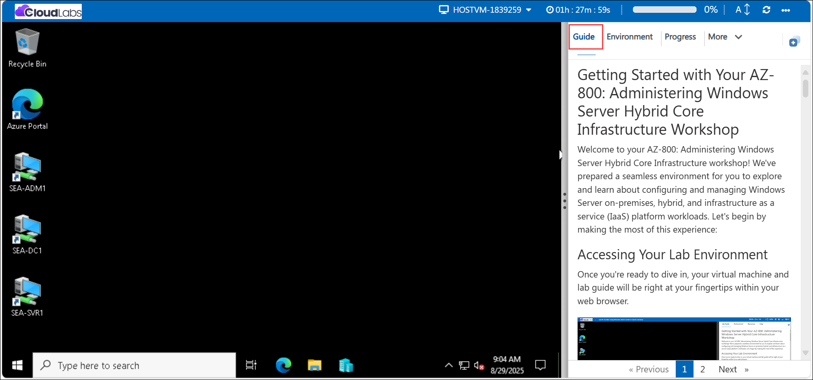
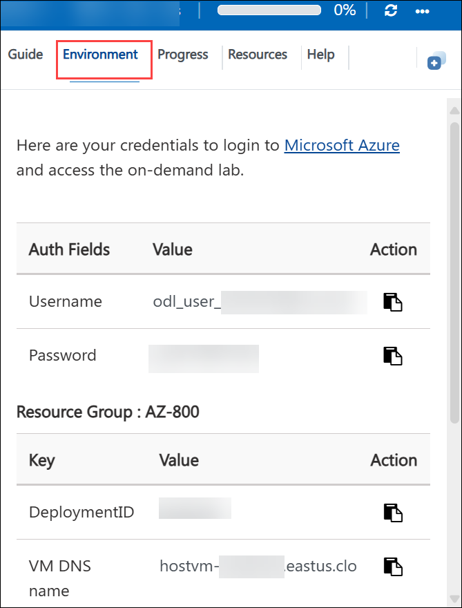
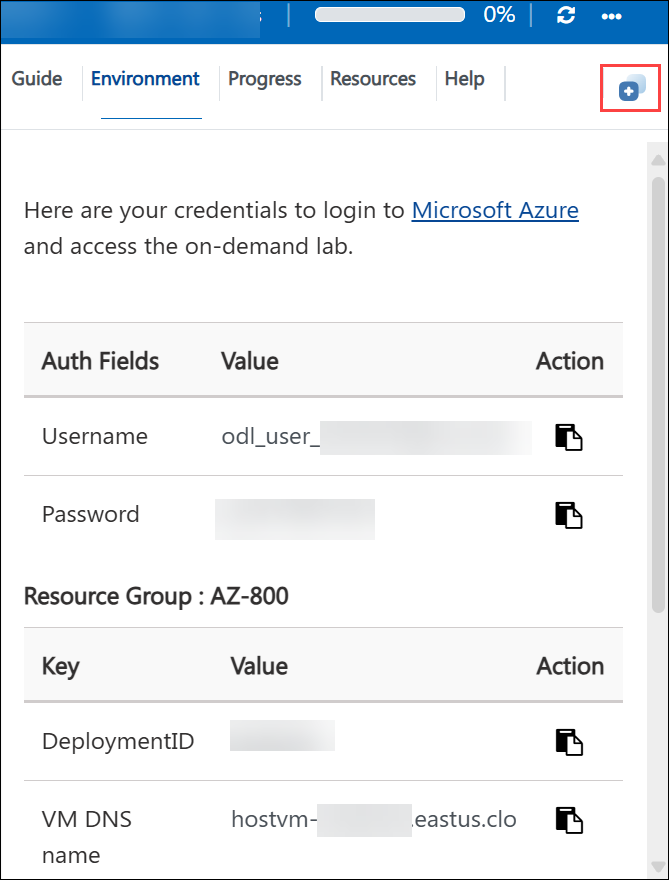
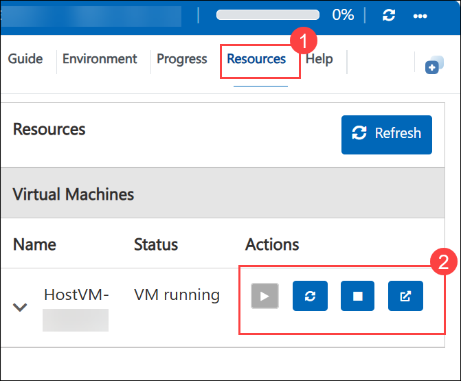
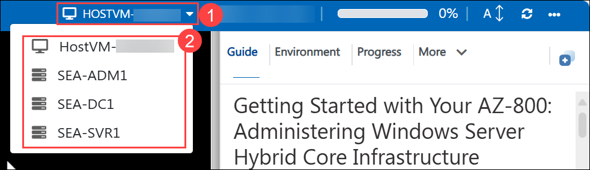
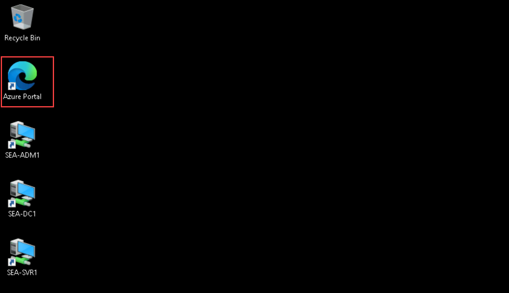
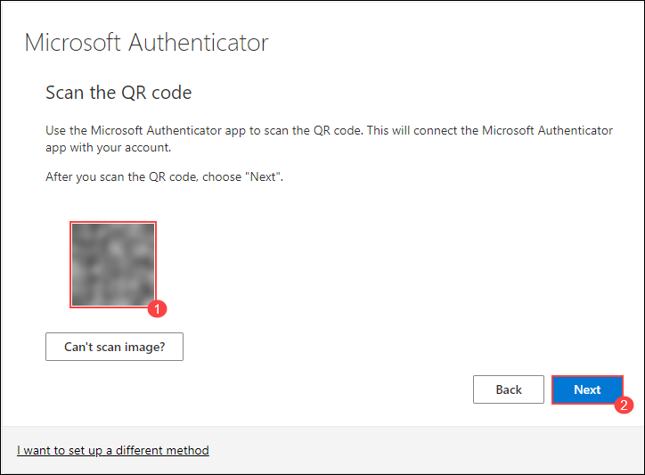

# Getting Started with Your AZ-800: Administering Windows Server Hybrid Core Infrastructure Workshop
 
Welcome to your AZ-800: Administering Windows Server Hybrid Core Infrastructure workshop! We've prepared a seamless environment for you to explore and learn about configuring and managing Windows Server on-premises, hybrid, and infrastructure as a service (IaaS) platform workloads. Let's begin by making the most of this experience:
 
## Accessing Your Lab Environment
 
Once you're ready to dive in, your virtual machine and **Guide** will be right at your fingertips within your web browser.
 

### Virtual Machine & Lab Guide
 
Your virtual machine is your workhorse throughout the workshop. The lab guide is your roadmap to success.
 
## Exploring Your Lab Resources
 
To get a better understanding of your lab resources and credentials, navigate to the **Environment** tab.
 

 
## Utilizing the Split Window Feature
 
For convenience, you can open the lab guide in a separate window by selecting the **Split Window** button from the Top right corner.
 

 
## Managing Your Virtual Machine
 
1. Feel free to **Start, Stop, or Restart (2)** your virtual machine as needed from the **Resources (1)** tab. Your experience is in your hands!
 
    

2. From the **HostVM drop-down (1)** at the top of the lab environment, select the required virtual machine such as **SEA-ADM1, SEA-DC1, or SEA-SVR1 (2)**.

    

3. When logging into the Hyper-V virtual machines, if a message appears stating **"Press Ctrl+Alt+Delete to unlock"**, navigate to the **Actions** menu in the Virtual Machine Connection window and select the **Ctrl+Alt+Delete** option, as shown in the image below.

    

4. If you face an issue while copying the content from the lab guide and pasting it into the Hyper-V virtual machines, navigate to the **Clipboard** option in the Virtual Machine Connection window and select **Type Clipboard Text (Ctrl + V)**.

    
  
## Lab Guide Zoom In/Zoom Out
 
1. To adjust the zoom level for the environment page, click the **A↕ : 100%** icon located next to the timer in the lab environment.

   

## Lab Duration Extension

1. To extend the duration of the lab, kindly click the **Hourglass** icon in the top right corner of the lab environment. 

    

    >**Note:** You will get the **Hourglass** icon when 10 minutes are remaining in the lab.

2. Click **OK** to extend your lab duration.
 
   

3. If you have not extended the duration prior to when the lab is about to end, a pop-up will appear, giving you the option to extend. Click  **OK** to proceed. 

## Workaround for Copying PowerShell Commands

If you encounter any difficulties with copy-pasting PowerShell commands directly, you can use the following workaround:

1. Open a text editor such as Notepad on your local machine.

2. Copy the PowerShell commands from the lab guide and paste them into the text editor.

3. Ensure that the formatting of the commands remains intact.

4. Copy the commands from the text editor and paste them into your virtual machine's terminal or PowerShell window.

By following this workaround, you can ensure accurate execution of the PowerShell commands in your lab environment.

## Let's Get Started with Azure Portal
 
1. On your virtual machine, click on the **Azure Portal** icon as shown below:
 
   
    
3. You'll see the **Sign into Microsoft Azure** tab. Here, enter your credentials:
 
   - **Email/Username:** <inject key="AzureAdUserEmail"></inject>
 
      
 
3. Next, provide your password:
 
   - **Password:** <inject key="AzureAdUserPassword"></inject>
 
      

4. If **Action required** pop-up window appears, click on **Ask later**

    
       
5. If prompted to **Stay signed in**, you can click **No.**
 
    

6. If a **Welcome to Microsoft Azure** pop-up window appears, simply click **Cancel**

    

## Steps to Proceed with MFA Setup if "Ask Later" Option is Not Visible

1. At the **"More information required"** prompt, select **Next**.

1. On the **"Keep your account secure"** page, select **Next** twice.

1. **Note:** If you don’t have the Microsoft Authenticator app installed on your mobile device:

   - Open **Google Play Store** (Android) or **App Store** (iOS).
   - Search for **Microsoft Authenticator** and tap **Install**.
   - Open the **Microsoft Authenticator** app, select **Add account**, then choose **Work or school account**.

1. A **QR code** will be displayed on your computer screen.

1. In the Authenticator app, select **Scan a QR code** and scan the code displayed on your screen.

1. After scanning, click **Next** to proceed.

    

1. On your phone, enter the number shown on your computer screen in the Authenticator app and select **Next**.
       
1. If prompted to **Stay signed in**, you can click **No.**
 
    
 
1. If a **Welcome to Microsoft Azure** pop-up window appears, simply click **Cancel**

    
 
## Support Contact
 
The CloudLabs support team is available 24/7, 365 days a year, via email and live chat to ensure seamless assistance at any time. We offer dedicated support channels tailored specifically for both learners and instructors, ensuring that all your needs are promptly and efficiently addressed.
 
Learner Support Contacts:
 
- Email Support: cloudlabs-support@spektrasystems.com
- Live Chat Support: https://cloudlabs.ai/labs-support
 
Click "Next" from the bottom right corner to embark on your Lab journey!
 
   .png)
 
Now you're all set to explore the powerful world of technology. Feel free to reach out if you have any questions along the way. Enjoy your workshop!

