# Lab 01: Implementing identity services and Group Policy

## Lab Scenario

You are working as an administrator at Contoso Ltd. The company is expanding its business with several new locations. The Active Directory Domain Services (AD DS) Administration team is currently evaluating methods available in Windows Server for a non-interactive, remote domain controller deployment. The team is also searching for a way to automate certain AD DS administrative tasks. Additionally, the team wants to establish configuration management based on Group Policy Objects (GPO).

## Lab Objectives

In this lab, you will perform:

- **Exercise 1:** Deploy a new domain controller on Server Core.
- **Exercise 2:** Configure Group Policy.

## Estimated time: 45 Minutes

## Architecture Diagram

     

## Exercise 1: Deploying a new domain controller on Server Core

In this exercise, you will install the Active Directory Domain Services (AD DS) role on a Server Core machine, promote it to a domain controller, and configure it for use in the Contoso.com domain. You will also manage Active Directory objects through PowerShell.

### Task 1: Deploy AD DS on a new Windows Server Core server

In this task, you will install the AD DS role on the SEA-SVR1 server using PowerShell and verify the installation.

1. On the **HOSTVM dropdown menu (1)**, select **SEA-ADM1 (2)** to connect to the administrator VM.  

    

1. On the **SEA-ADM1 login screen**, sign in as **CONTOSO\Administrator** with the password **Pa55w.rd**.  

    

1. On **SEA-ADM1**, right click **Start (1)**, and then select **Windows PowerShell (Admin) (2)**.

    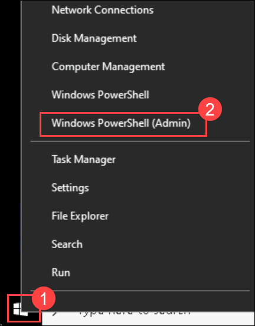

1. To install the AD DS server role, at the Windows PowerShell command prompt, enter the following command, and then press Enter:
	
   ```powershell
   Install-WindowsFeature -Name AD-Domain-Services -ComputerName SEA-SVR1
   ```
1. To verify that the AD DS role is installed on **SEA-SVR1**, enter the following command, and then press Enter:
	
   ```powershell
   Get-WindowsFeature -ComputerName SEA-SVR1
   ```
1. In the output of the previous command, search for the **Active Directory Domain Services** checkbox, and then verify that it is selected. Then, search for **Remote Server Administration Tools**. Notice the **Role Administration Tools** node below it, and then verify that the **AD DS and AD LDS Tools** node is also selected.

   > **Note**: Under the **AD DS and AD LDS Tools** node, only **Active Directory module for Windows PowerShell** has been installed and not the graphical tools, such as the Active Directory Administrative Center. If you centrally manage your servers, you will not usually need these on each server. If you want to install them, you must specify the AD DS tools by running the **Add-WindowsFeature** cmdlet with the **RSAT-ADDS** command.

   > **Note**: You might need to wait a brief time after the installation process is complete before verifying that the AD DS role has installed. If you do not observe the expected results from the **Get-WindowsFeature** command, you can try again after a few minutes.

### Task 2: Prepare the AD DS installation and promote a remote server

In this task, you will configure the SEA-SVR1 server to be promoted to a domain controller by using the Active Directory Domain Services Configuration Wizard and PowerShell scripting.

1. On **SEA-ADM1**, in the **Start** menu, type **Server Manager (1)** in the search box, and then select **Server Manager (2)** from the results.  

    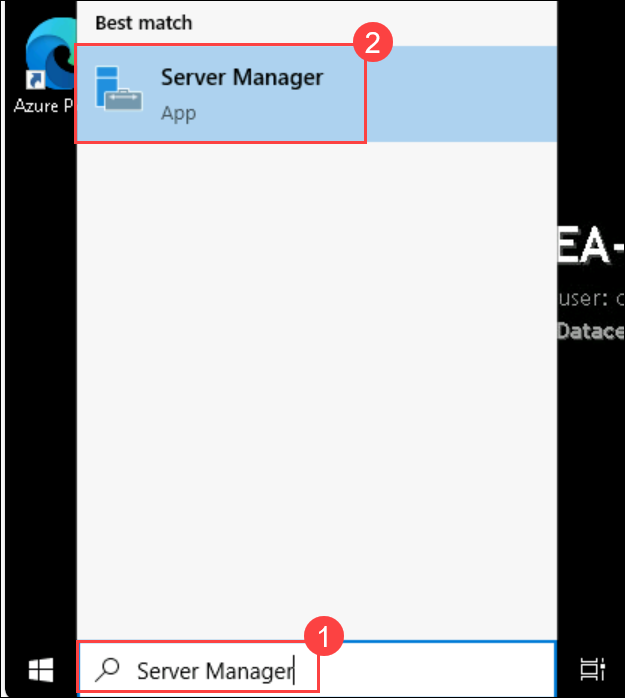

1. In **Server Manager**, select **All Servers (1)**. On the **Manage (2)** menu, select **Add Servers (3)**.  

    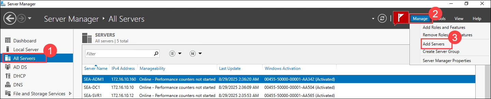

1. In the **Add Servers** dialog box, maintain the default settings, and then select **Find Now (1)**.

1. In the **Active Directory** list of servers, select **SEA-SVR1 (2)**, select the **arrow (3)** to add it to the **Selected** list, and then select **OK (4)**.

    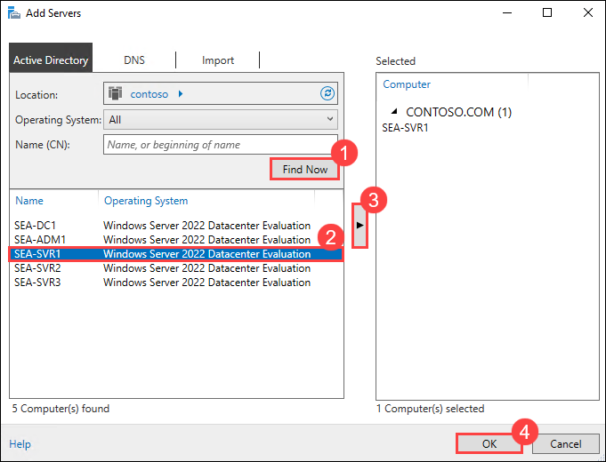

1. On **SEA-ADM1**, ensure that the installation of the **AD DS (1)** role on SEA-SRV1 is complete and that the server was added to **Server Manager**. Then select the **Notifications (2)** flag symbol.
   
   

1. Note the post-deployment configuration of **SEA-SVR1**, and then select the **Promote this server to a domain controller** link.
   
   

1. In the **Active Directory Domain Services Configuration Wizard**, on the **Deployment Configuration** page, under **Select the deployment operation**, verify that **Add a domain controller to an existing domain (1)** is selected.

1. Ensure that the `Contoso.com` **(2)** domain is specified, and then in the **Supply the credentials to perform this operation** section, select **Change (3)**.

   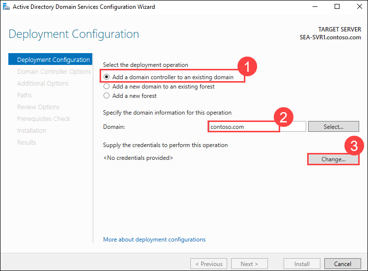

1. In the **Credentials for deployment operation** dialog box, in the **User name (1)** box, enter **CONTOSO\Administrator**, and then in the **Password (2)** box, enter **Pa55w.rd**.

1. Select **OK (3)**, and then select **Next**.

   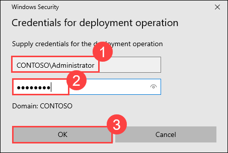

1. On the **Domain Controller Options** page, ensure that the **Domain Name System (DNS) server** and **Global Catalog (GC)** checkboxes are selected. Ensure that the **Read-only domain controller (RODC) (1)** checkbox is cleared.

1. In the **Type the Directory Services Restore Mode (DSRM) password** section, enter and confirm the password **Pa55w.rd (2)**, and then select **Next (3)**.

   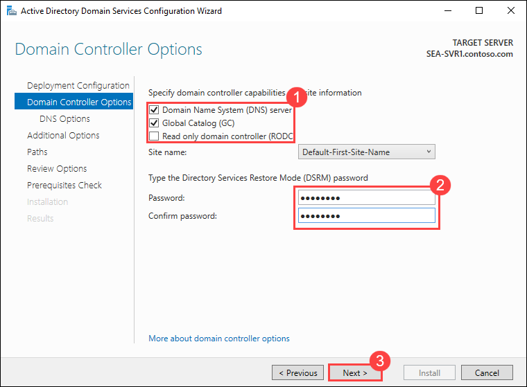

1. On the **DNS Options** page, select **Next**.

   

1. On the **Additional Options** page, select **Next**.

   

1. On the **Paths** page, keep the default path settings for the **Database** folder, **Log files** folder, and **SYSVOL** folder **(1)**, and then select **Next (2)**.

   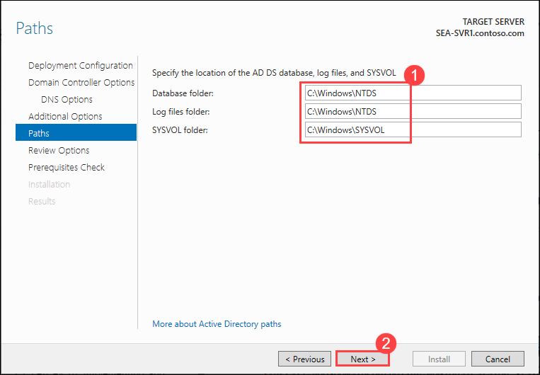

1. To open the generated Windows PowerShell script, on the **Review Options** page, select **View script**.

   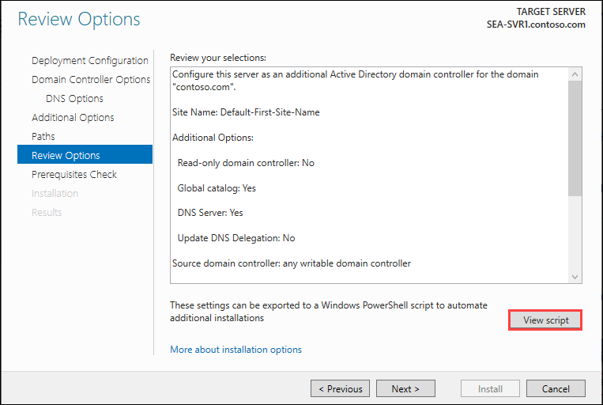

1. In Notepad, edit the generated Windows PowerShell script:

   - Delete the comment lines that begin with the number sign (**#**).
   - Remove the **Import-Module** line.
   - Remove the grave accents (**`**) at the end of each line.
   - Remove the line breaks.

     

1. Now the **Install-ADDSDomainController** command and all the parameters are on one line. Place the cursor in front of the line, and then, on the **Edit** menu, select **Select All** to select the whole line. On the menu, select **Edit**, and then select **Copy**.

1. Minimize the **Notepad**.

1. Back to **Review Options** page, select **Cancel (1)** and when prompted for confirmation, select **Yes (2)** to cancel the wizard.

   

1. At the Windows PowerShell command prompt, enter the following command:

   ```powershell
   Invoke-Command -ComputerName SEA-SVR1 { }
   ```

1. Place the cursor between the braces (**{ }**), and then paste the content of the copied script line from the clipboard. The complete command should have the following format:
	
   ```powershell
   Invoke-Command -ComputerName SEA-SVR1 {Install-ADDSDomainController -NoGlobalCatalog:$false -CreateDnsDelegation:$false -Credential (Get-Credential) -CriticalReplicationOnly:$false -DatabasePath "C:\Windows\NTDS" -DomainName "Contoso.com" -InstallDns:$true -LogPath "C:\Windows\NTDS" -NoRebootOnCompletion:$false -SiteName "Default-First-Site-Name" -SysvolPath "C:\Windows\SYSVOL" -Force:$true}
   ```

   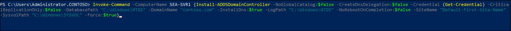

1. To invoke the command, press Enter.

1. In the **Windows PowerShell Credential Request** dialog box, enter **CONTOSO\Administrator (1)** in the **User name** box, enter **Pa55w.rd (2)** in the **Password** box, and then select **OK (3)**.

   

1. When prompted for the password, in the **SafeModeAdministratorPassword** text box, enter **Pa55w.rd**, and then press Enter.

1. When prompted for confirmation, in the **Confirm SafeModeAdministratorPassword** text box, enter **Pa55w.rd**, and then press Enter.

1. Wait until the command runs and the **Status Success** message is returned. The **SEA-SVR1** virtual machine restarts.

   

1. Close Notepad without saving the file.

1. After **SEA-SVR1** restarts, on **SEA-ADM1**, switch to **Server Manager**, and on the left side, select the **AD DS (1)** node. Note that **SEA-SVR1 (2)** has been added as a server and that the warning notification has disappeared.

   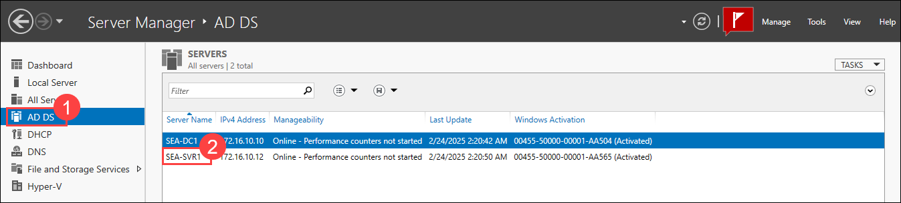

   > **Note**: You might have to select **Refresh**.

### Task 3: Manage objects in AD DS

In this task, you will create an Organizational Unit (OU) called Seattle, create a user account for Ty Carlson, add it to a group, and assign it to the local Administrators group. You will also use PowerShell to manage user accounts and group memberships.

1. Ensure that you are connected to the console session of **SEA-ADM1**.

1. Switch to **Windows PowerShell (Admin)**.

1. To create an Organizational Unit (OU) called **Seattle** in the Contoso AD DS domain, enter the following command, and then press Enter:

   ```powershell
   New-ADOrganizationalUnit -Name "Seattle" -Path "DC=contoso,DC=com" -ProtectedFromAccidentalDeletion $true -Server SEA-DC1.contoso.com
   ```
1. To create a user account for **Ty Carlson** in the **Seattle** OU, enter the following command, and then press Enter:

   ```powershell
   New-ADUser -Name Ty -DisplayName 'Ty Carlson' -GivenName Ty -Surname Carlson -Path 'OU=Seattle,DC=contoso,DC=com'
   ```
1. To set the password for the Ty's user account, enter the following command, and then press Enter:

   ```powershell
   Set-ADAccountPassword Ty
   ```
1. When you receive a prompt for the **current password**, press **Enter**.

1. When you receive a prompt for the **desired password**, enter **Pa55w.rd** and then press Enter.

1. When you receive a prompt to repeat the password, enter **Pa55w.rd** and then press Enter.

   

1. To enable the account, enter the following command, and then press Enter:

   ```powershell
   Enable-ADAccount Ty
   ```
1. To create a domain global group named **SeattleBranchUsers**, enter the following command, and then press Enter:

   ```powershell
   New-ADGroup SeattleBranchUsers -Path 'OU=Seattle,DC=contoso,DC=com' -GroupScope Global -GroupCategory Security
   ```
1. To add the **Ty** user account to the newly created group, enter the following command, and then press Enter:

   ```powershell
   Add-ADGroupMember -Identity SeattleBranchUsers -Members Ty
   ```
1. To confirm that the user is in the group, enter the following command, and then press Enter:

   ```powershell
   Get-ADGroupMember -Identity SeattleBranchUsers
   ```
1. To add the user to the local Administrators group, enter the following command, and then press Enter:

   ```powershell
   Add-LocalGroupMember -Group 'Administrators' -Member 'CONTOSO\Ty'
   ```

   > **Note**: This is necessary to allow sign in with the **CONTOSO\\Ty** user account to **SEA-ADM1**.


> **Results**: After this exercise, you should have successfully created a new domain controller and managed objects in AD DS.

## Exercise 2: Configuring Group Policy

In this exercise, you will create a Group Policy Object (GPO) called CONTOSO Standards, configure specific policies, and link the GPO to the Contoso.com domain. You will enforce settings for registry access and screen saver behavior.

### Task 1: Create and edit a GPO

In this task, you will create a new GPO named CONTOSO Standards, configure it to prevent access to registry editing tools, set a screen saver timeout, and enable password protection for the screen saver.

1. On **SEA-ADM1**, from Server Manager, select **Tools (1)**, and then select **Group Policy Management (2)**.

   

1. If necessary, switch to the **Group Policy Management** window.

1. In the **Group Policy Management** console, in the navigation pane, expand **Forest:Contoso.com**, **Domains**, and **Contoso.com**, and then select the **Group Policy Objects** container.

1. In the navigation pane, right-click or access the context menu for the **Group Policy Objects** container, and then select **New**.

   

1. In the **Name** text box, enter **CONTOSO Standards (1)**, and then select **OK (2)**.

   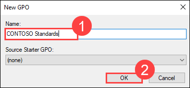

1. In the details pane, right-click or access the context menu for the **CONTOSO Standards (1)** Group Policy Object (GPO), and then select **Edit (2)**.

   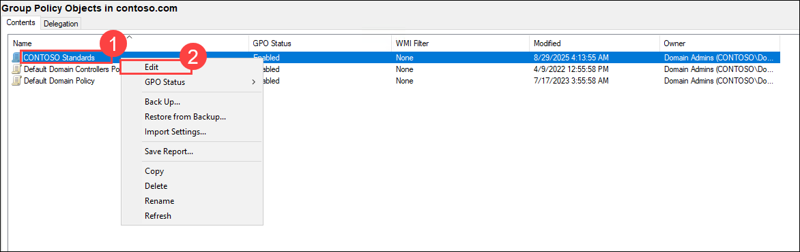

1. In the **Group Policy Management Editor** window, in the navigation pane, expand **User Configuration (1)**, expand **Policies (2)**, expand **Administrative Templates (3)**, and then select **System (4)**.

   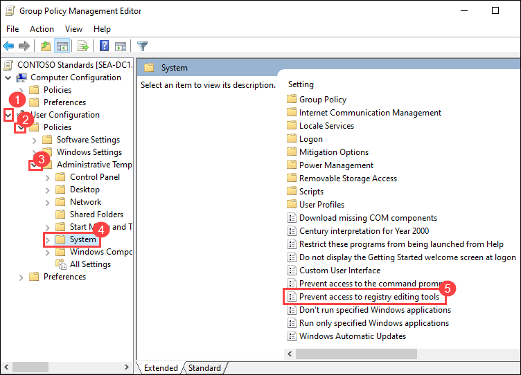

1. Double-click the **Prevent access to registry editing tools (5)** policy setting or select the setting, and then press Enter.

1. In the **Prevent access to registry editing tools** dialog box, select **Enabled (1)**, and then select **OK (2)**.

   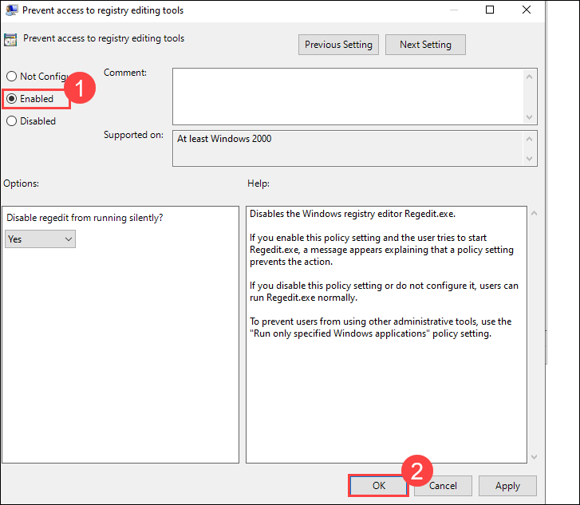

1. In the navigation pane, expand **User Configuration (1)**, expand **Policies (2)**, expand **Administrative Templates (3)**, expand **Control Panel (4)**, and then select **Personalization (5)**.

   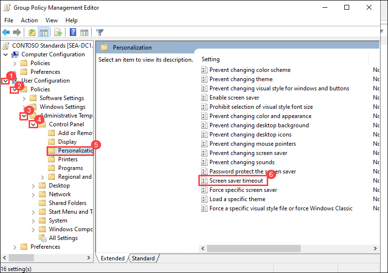

1. In the details pane, double-click or select the **Screen saver timeout (6)** policy setting, and then press Enter.

1. In the **Screen saver timeout** dialog box, select **Enabled (1)**. In the **Seconds** text box, enter **600 (2)**, and then select **OK (3)**.

   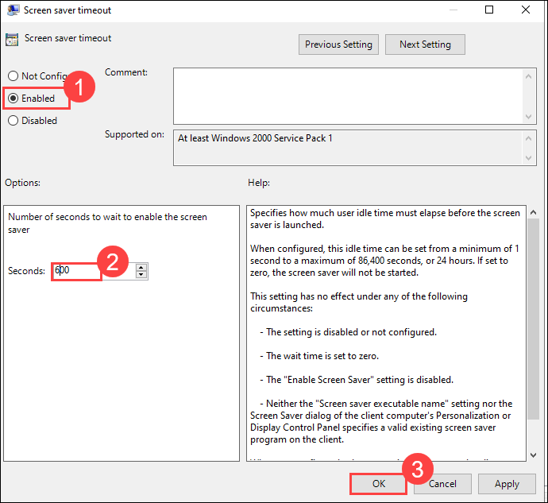

1. Double-click or select the **Password protect the screen saver** policy setting, and then press Enter.

   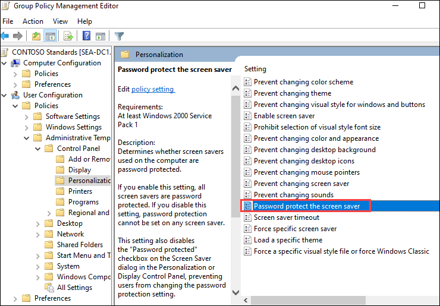

1. In the **Password protect the screen saver** dialog box, select **Enabled (1)**, and then select **OK (2)**.

   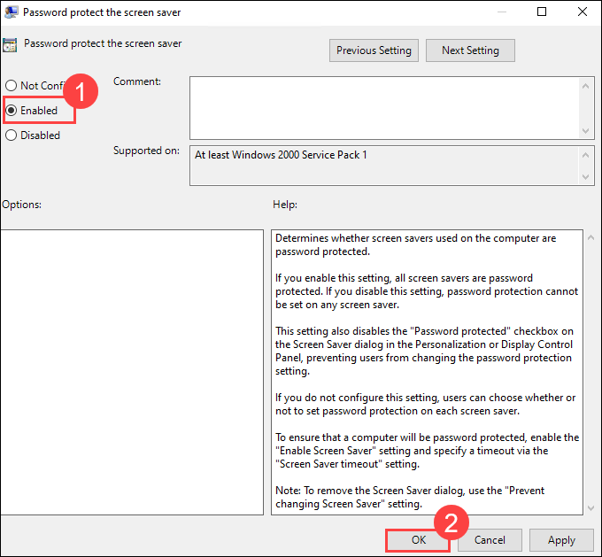

1. Close the **Group Policy Management Editor** window.

### Task 2: Link the GPO

In this task, you will link the CONTOSO Standards GPO to the Contoso.com domain to apply the configured settings across all domain users.

1. In the **Group Policy Management** window, in the navigation pane, right-click or access the context menu for the `Contoso.com` **(1)** domain, and then select **Link an Existing GPO (2)**.

   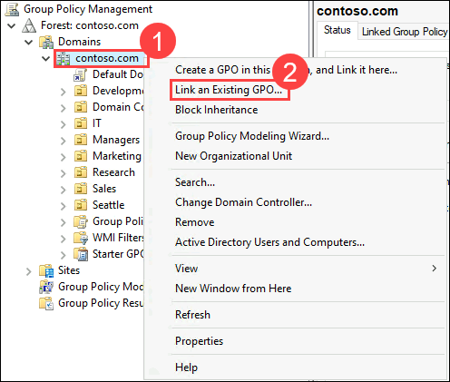

1. In the **Select GPO** dialog box, select **CONTOSO Standards**, and then select **OK**.

   

### Task 3: Review the effects of the GPO's settings

In this task, you will review the applied Group Policy settings on a client machine by checking the Control Panel and validating the settings for Remote Event Log Management. You will then log in as CONTOSO\Ty to see the effect of the policy changes.

1. On **SEA-ADM1**, in the search box on the taskbar, enter **Control Panel (1)**. 

1. In the **Best match** list, select **Control Panel (2)**.

    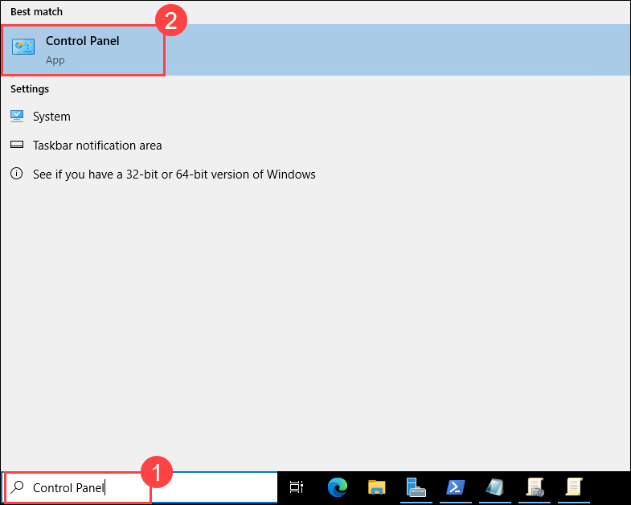

1. Select **System and Security (1)**, and under **Windows Defender Firewall**, select **Allow an app through Windows Firewall (2)**.

   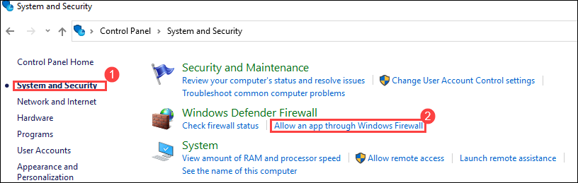

1. In the **Allowed apps and features** list, locate the **Remote Event Log Management (1)** entry, select the checkbox in the **Domain (2)** column, and then select **OK (3)**. 

   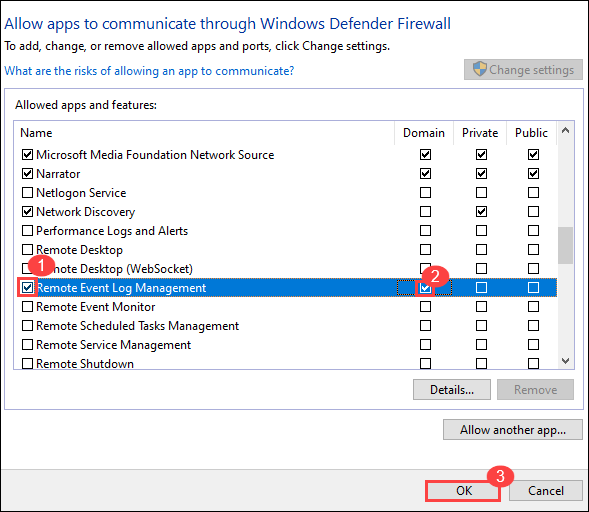
1. On the **Start menu (1)**, select the **Administrator account (2)** and then click **Sign out (3)**.  

    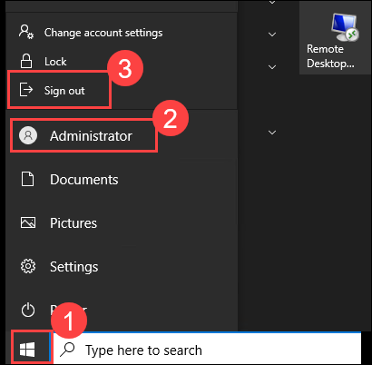

1. On the login screen, select **Other user (1)**. Enter **CONTOSO\\Ty (2)** as the username and the provided password  **Pa55w.rd(3)**.  

    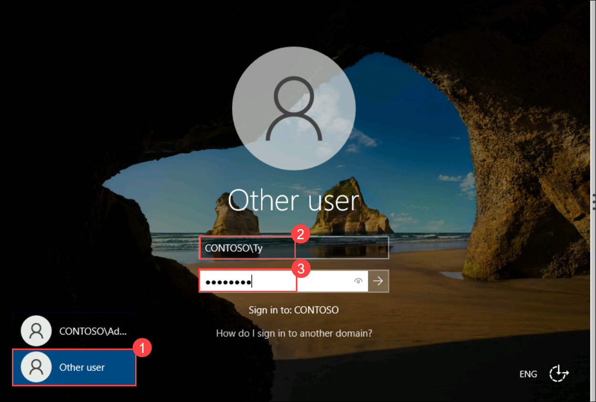

   > **Note:** while logging into the Hyper-V virtual machines, if a message appears stating **"Press Ctrl+Alt+Delete to unlock"**, navigate to the **Actions** menu in the Virtual Machine Connection window and select the **Ctrl+Alt+Delete** option, as shown in the image below and you will find the Other User option to Sign in
   
    

1. In the search box on the taskbar, enter **Control Panel**.

1. In the **Best match** list, select **Control Panel**.

    

1. In the search box in Control Panel, enter **screen saver**, and then select **Change screen saver**. (It might take a few minutes for the option to display.)

    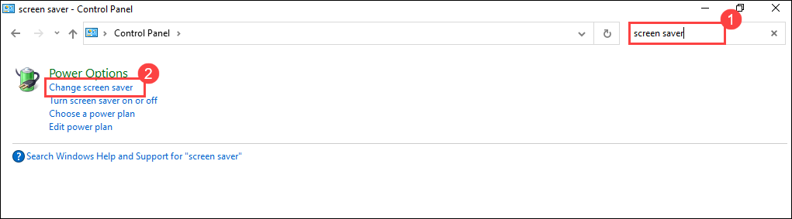

1. In the **Screen Saver Settings** dialog box, notice that the **Wait** option is dimmed. You cannot change the time-out. Notice that the **On resume, display logon screen** option is selected and dimmed and that you cannot change the settings.

   > **Note**: If the **On resume, display logon screen** option is not selected and dimmed, open a command prompt, run `gpupdate /force`, and repeat the preceding steps.

      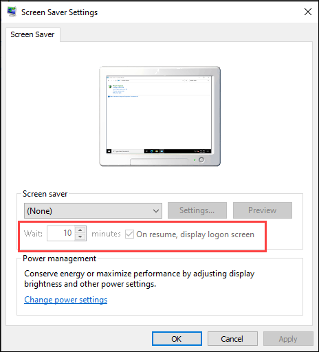

1. Right-click or access the context menu for **Start (1)**, and then select **Run (2)**.

    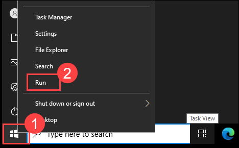

1. In the **Run** dialog box, in the **Open** text box, enter **regedit (1)**,click **OK (2)**, and then select **Yes**. Note the error message stating **Registry editing has been disabled by your administrator**.

      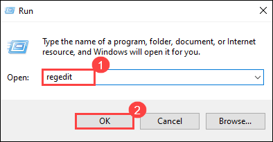

      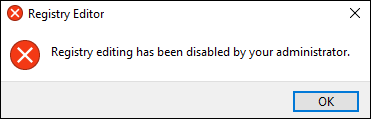

1. In the **Registry Editor** dialog box, select **OK**.

1. On the **Start menu (1)**, select the **Ty Carlson account (2)** and then click **Sign out (3)**.  

   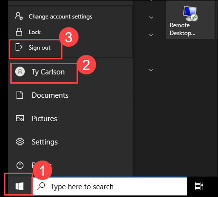

1. On the login screen, sign back in as **CONTOSO\Administrator** with the password **Pa55w.rd**. 

### Task 4: Create and link the required GPOs

In this task, you will create and link a Seattle Application Override Group Policy Object (GPO) to the Seattle organizational unit (OU) within the Contoso.com domain. This will involve configuring settings for screen saver timeout to disable it, ensuring that specific policy overrides are applied to the Seattle OU. This task will provide you with the foundation for managing application-related policies at the organizational level.

1. On **SEA-ADM1**, from Server Manager, select **Tools (1)**, and then select **Group Policy Management (2)**.

    

1. If necessary, switch to the **Group Policy Management** window.

1. In the **Group Policy Management** console, in the navigation pane, expand **Forest: Contoso.com**, **Domains**, and **Contoso.com**, and then select **Seattle**.

1. Right-click or access the context menu for the **Seattle (1)** organizational unit (OU), and then select **Create a GPO in this domain, and Link it here (2)**.

   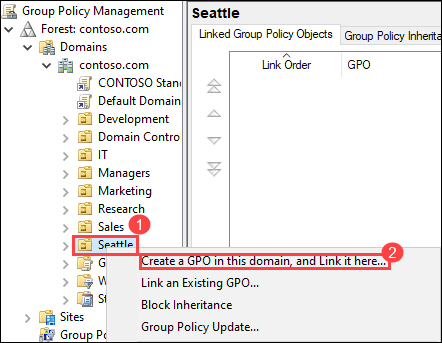

1. In the **New GPO** dialog box, in the **Name** text box, enter **Seattle Application Override**, and then select **OK**.

   

1. In the details pane, right-click or access the context menu for the **Seattle Application Override** GPO, and then select **Edit**.

1. In the **console** tree, expand **User Configuration (1)**, expand **Policies (2)**, expand **Administrative Templates (3)**, expand **Control Panel (4)**, and then select **Personalization (5)**.

1. Double-click the **Screen saver timeout (6)** policy setting or select the setting, and then press Enter.

   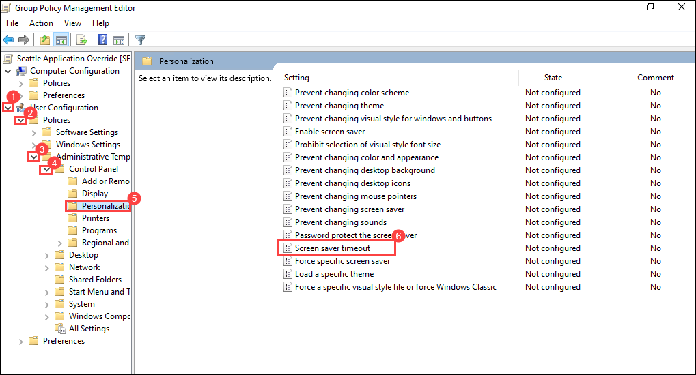

1. Select **Disabled**, and then select **OK**.

    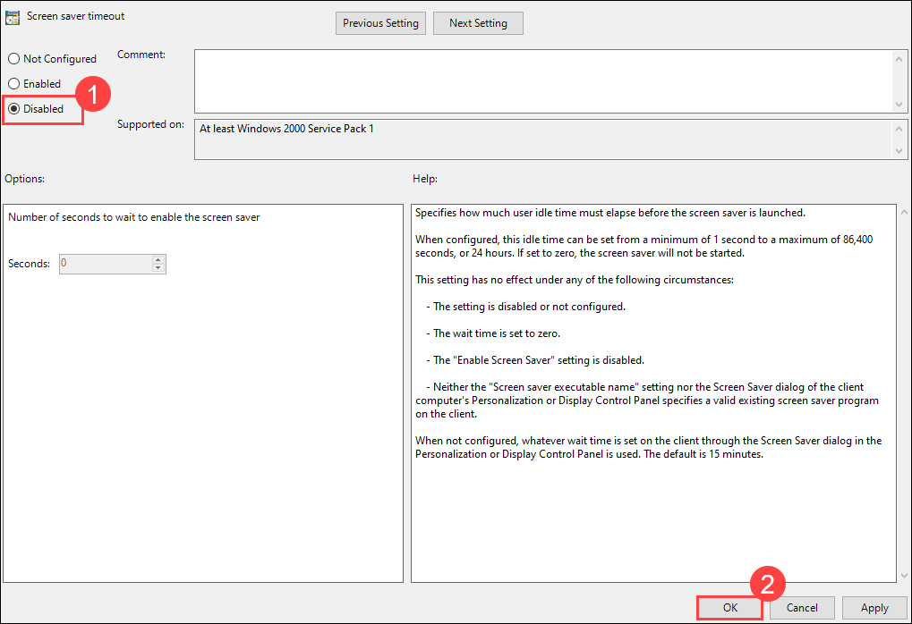

1. Close the **Group Policy Management Editor** window.

### Task 5: Verify the order of precedence

In this task, you will verify the order of precedence for Group Policy Objects (GPOs) in the Seattle OU. The Seattle Application Override GPO will have higher precedence over the CONTOSO Standards GPO, meaning that its settings, such as screen saver timeout, will overwrite the corresponding settings from the CONTOSO Standards GPO. By reviewing the Group Policy Inheritance tab, you will confirm how policies are applied and their impact on the Seattle OU.

1. Back in the **Group Policy Management Console** tree, ensure that the **Seattle** OU is selected.

1. Select the **Group Policy Inheritance** tab and review its content.

   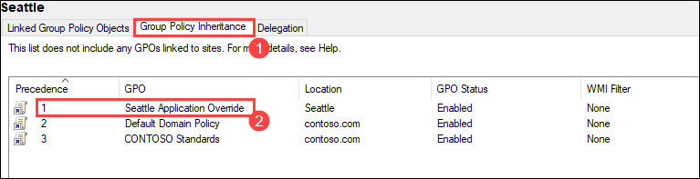

   > **Note**: The Seattle Application Override GPO has higher precedence than the CONTOSO Standards GPO. The screen saver time-out policy setting that you just configured in the Seattle Application Override GPO is applied after the setting in the CONTOSO Standards GPO. Therefore, the new setting will overwrite the CONTOSO Standards GPO setting. Screen saver time-out will be disabled for users within the scope of the Seattle Application Override GPO.

### Task 6: Configure the scope of a GPO with security filtering

In this task, you will configure the security filtering of the Seattle Application Override GPO. By modifying the security filtering, you will restrict the GPO’s scope to specific users and computers, ensuring that only the SeattleBranchUsers group and SEA-ADM1 computer are affected by the GPO. This task involves removing the default security filtering for Authenticated Users and adding the appropriate security group and computer for more targeted policy application.

1. On **SEA-ADM1**, in the **Group Policy Management** console, in the navigation pane, if necessary, expand the **Seattle (1)** OU, and then select the **Seattle Application Override (2)** GPO under the **Seattle** OU.

1. In the **Group Policy Management Console** dialog box, review the following message: **You have selected a link to a Group Policy Object (GPO). Except for changes to link properties, changes you make here are global to the GPO, and will impact all other locations where this GPO is linked.**

1. Select the **Do not show this message again (3)** checkbox, and then select **OK (4)**.

   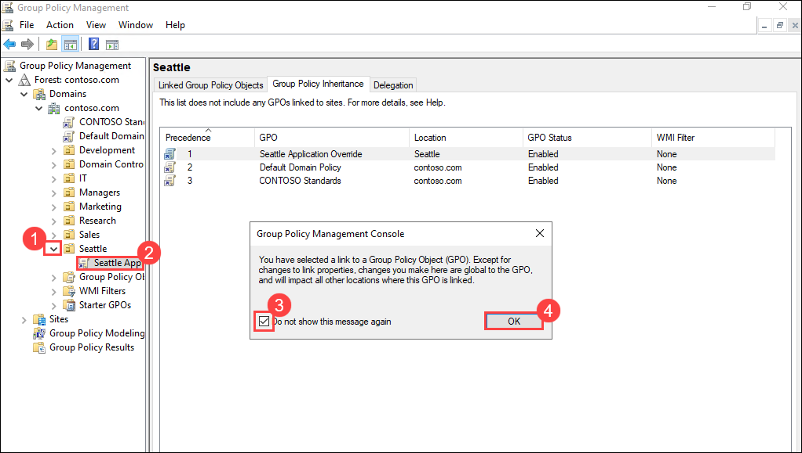

1. Review the **Security Filtering** section and note that the GPO applies by default to Authenticated Users.

1. In the **Security Filtering** section, select **Authenticated Users (1)**, and then select **Remove (2)**.

   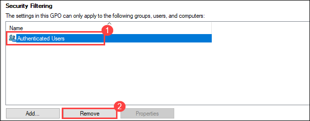

1. In the **Group Policy Management** dialog box, select **OK**, review the **Group Policy Management** warning, and then select **OK** again.

   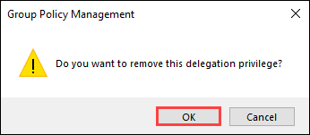

   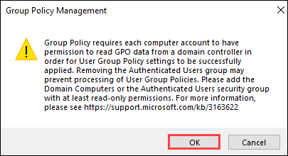

   > **Note**: Group Policy requires each computer account to have permissions to read GPO data from domain controllers to successfully apply the user GPO settings. You should keep it in mind when modifying security filtering settings of a GPO.

1. In the details pane, select **Add (1)**.

1. In the **Select User, Computer, or Group** dialog box, in the **Enter the object name to select (examples):** text box, enter **SeattleBranchUsers (2)**, and then select **OK (3)**.

   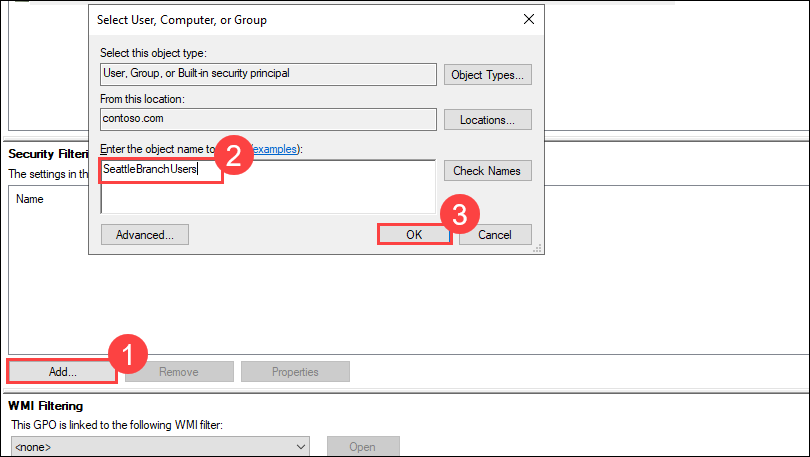

1. In the details pane, under **Security Filtering**, select **Add (1)**.

1. In the **Select User, Computer, or Group** dialog box, select **Object Types (2)**.

    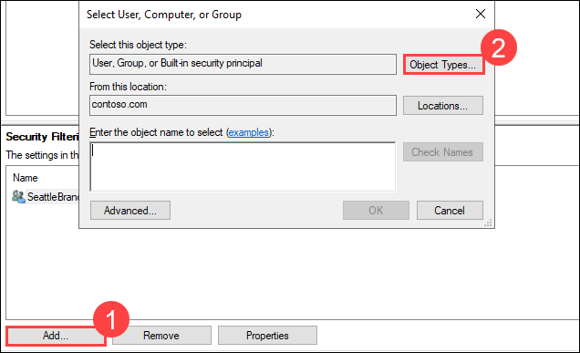

1. In the **Object Types** dialog box, select the **Computers** checkbox and then select **OK**.

   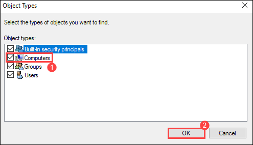

1. In the **Select User, Computer, or Group** dialog box, in the **Enter the object name to select (examples):** text box, enter **SEA-ADM1 (1)**, and then select **OK (2)**.

   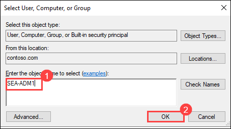

### Task 7: Verify the application of settings

In this task, you will use the Group Policy Modeling Wizard to simulate the application of GPOs to a specific user and computer. You will verify that the Seattle Application Override GPO's settings, such as the screen saver timeout, are correctly applied to the Ty user and SEA-ADM1 computer. This step involves confirming that the winning GPO is properly enforced through the modeling tool, ensuring that the policy settings are applied as expected.

1. In the navigation pane, in **Group Policy Management**, select **Group Policy Modeling**.

1. Right-click or access the context menu for **Group Policy Modeling (1)**, and then select **Group Policy Modeling Wizard (2)**.

    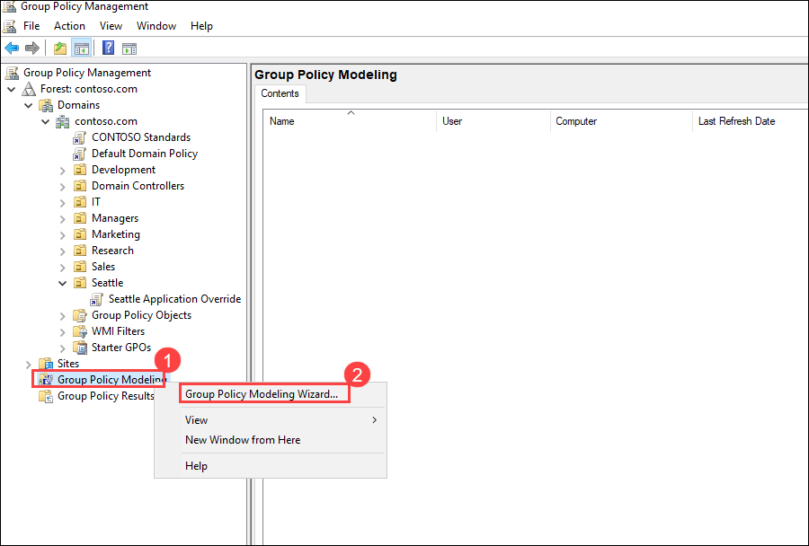

1. In **Group Policy Modeling Wizard**, select **Next**.

   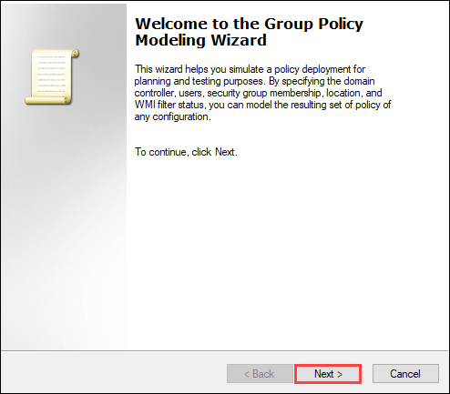

1. On the **Domain Controller Selection** page, accept the default settings, and then select **Next**.

   

1. On the **User and Computer Selection** page, in the **User information** section, select **User (1)**, and then, in the **User** text box, enter **CONTOSO\Ty (2)** or use the **Browse** command button to locate the **Ty** user account.

1. On the **User and Computer Selection** page, in the **Computer information** section, select **Computer**, and then, in the **Computer (3)** text box, enter **CONTOSO\SEA-ADM1 (4)** or use the **Browse** command button to locate the **SEA-ADM1** computer.

    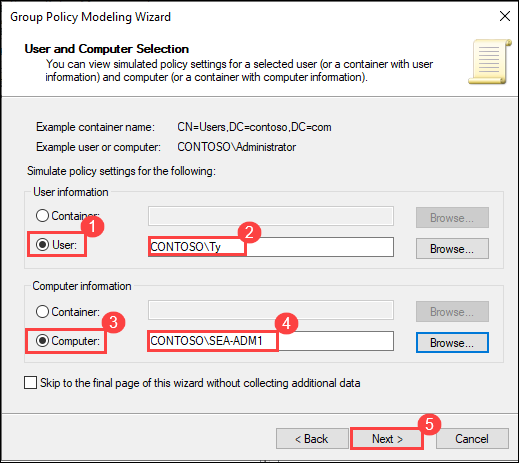

1. On the **User and Computer Selection** page, select **Next (5)**.

1. On the **Advanced Simulation Options** page, accept the default settings, and then select **Next**.

    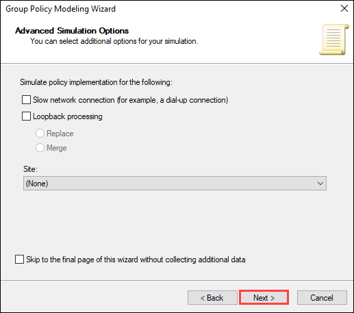

1. On the **Alternate Active Directory Paths** page, note the user and computer locations, and then select **Next**.

1. On the **User Security Groups** page, verify that the list of groups includes **CONTOSO\\SeattleBranchUsers (1)**, and then select **Next (2)**.

   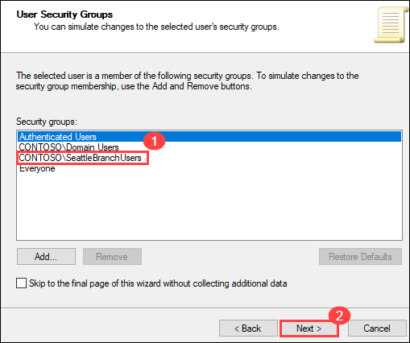

1. On the **Computer Security Groups** page, select **Next**.

1. On the **WMI Filters for Users** page, accept the default settings, and then select **Next**.

1. On the **WMI Filters for Computers** page, accept the default settings, and then select **Next**.

1. On the **Summary of Selections** page, select **Next**.

1. Select **Finish** when prompted.

    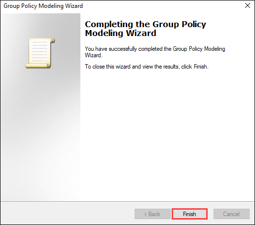

1. In the details pane, select the **Details** tab, and then select **show all**.

1. In the report, scroll down until you locate the **User Details** section, and then locate the **Control Panel/Personalization** section. Note that the **Screen saver timeout** settings are disabled and the winning GPO is set to Seattle Application Override GPO.

   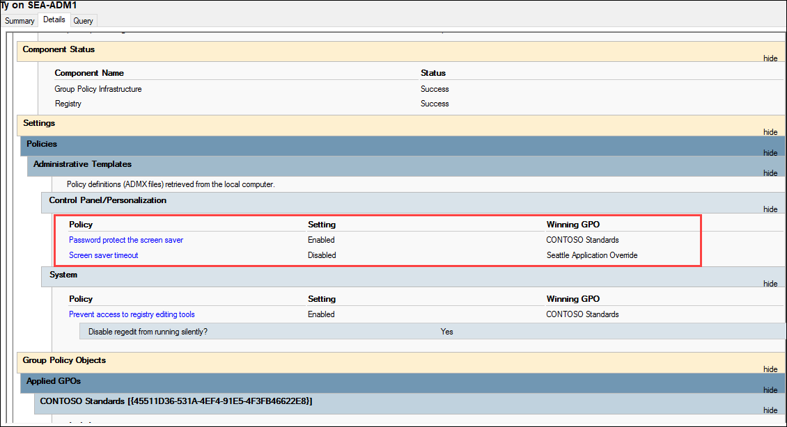

1. Close the **Group Policy Management** console.

> **Results**: After this exercise, you should have successfully created and configured GPOs.

### Review
In this lab, you have completed:
- Deploy AD DS on a new Windows Server Core server.
- Manage AD DS objects with GUI tools and with Windows PowerShell.
- Create and edit GPO settings.
- Apply and verify settings on the client computer.

## You have successfully completed this lab.

