# Lab 02: Implementing integration between AD DS and Microsoft Entra ID

## Lab Scenario

To address concerns regarding management and monitoring overhead resulting from using Microsoft Entra ID to authenticate and authorize access to Azure resources, you decide to test integration between on-premises Active Directory Domain Services (AD DS) and Entra ID to verify that this will address business concerns about managing multiple user accounts by using a mix of on-premises and cloud resources.

Additionally, you want to make sure that your approach addresses the Information Security team's concerns and preserves existing controls applied to Active Directory users, such as sign-in hours and password policies. Finally, you want to identify Azure AD integration features that allow you to further enhance on-premises Active Directory security and minimize its management overhead, including Microsoft Entra ID Password Protection for Windows Server Active Directory and Self-Service Password Reset (SSPR) with password writeback.

Your goal is to implement pass-through authentication between on-premises AD DS and Entra ID.

## Lab Objectives

In this lab, you will perform:

- **Exercise 1:** Prepare Entra ID for integration with on-premises AD DS, including adding and verifying a custom domain.
- **Exercise 2:** Prepare on-premises AD DS for integration with Entra ID, including running IdFix DirSync Error Remediation Tool.
- **Exercise 3:** Install and configure Microsoft Entra Connect.
- **Exercise 4:** Verify integration between AD DS and Entra ID by testing the synchronization process.
- **Exercise 5:** Implementing Entra ID integration features in Active Directory, including Entra ID Password Protection for Windows Server Active Directory and SSPR with password writeback.

## Estimated time: 60 Minutes

## Architecture Diagram

     

## Exercise 1: Preparing Microsoft Entra ID for AD DS integration

In this exercise, you will prepare Microsoft Entra ID for integration with on-premises AD DS. You will add and verify a custom domain, create a global administrator user, and ensure the account is secure by updating the password.

### Task 1: Create a custom domain in Azure

In this task, you will create a custom domain in Microsoft Entra ID (Azure AD) by connecting to the Azure portal and adding a domain name (e.g., contoso.com) to Entra ID. You will also familiarize yourself with the process of domain verification, though verification is skipped in this lab.

1. On the **HOSTVM dropdown menu (1)**, select **SEA-ADM1 (2)** to connect to the administrator VM.  

    

1. On the **SEA-ADM1 login screen**, sign in as **CONTOSO\Administrator** with the password **Pa55w.rd**.  

    

1. On **SEA-ADM1**, double-click on the **Azure portal**, and authenticate with your Azure credentials.

   - **Email/Username:** <inject key="AzureAdUserEmail"></inject>
 
     
 
3. Next, provide your password:
 
   - **Password:** <inject key="AzureAdUserPassword"></inject>
 
        

1. If you see the pop-up **Action Required**, click **Ask Later**.

    

   >**Note** : Please follow the steps outlined on page 1 to set up MFA if the **Ask Later** option is not visible. Once MFA setup is complete, please enter the number displayed on the screen in the Authenticator app and proceed. 

1. If prompted to **Stay signed in**, you can click **No**.

    

1. If a **Welcome to Microsoft Azure** pop-up window appears, simply click **Cancel** to skip the tour.

    

1. On the Azure portal, from the **Search resources, Services, and docs(G+/)** blade, search for **Microsoft Entra ID (1)** and select **Microsoft Entra ID (2)** from the services.

    

1. On the **Microsoft Entra ID** page, from the left-hand navigation pane, under **Manage** select **Custom domain names (1)** and then select **+ Add custom domain (2)**.

    

1. In the **Custom domain name** pane, in the **Custom domain name** text box, enter **contoso.com (1)**, and then select **Add domain (2)**.

   

1. On the `contoso.com` custom domain name page, review the Domain Name System (DNS) record types that you would use to verify the domain.

1. Close the pane without **verifying** the domain name.

1. Here you can see the created Custom domain.   

   

   > **Note**: While, in general, you would use DNS records to verify a domain, this lab doesn't require the use of a verified domain.

> **Congratulations** on completing the task! Now, it's time to validate it. Here are the steps:
> - Hit the Validate button for the corresponding task. If you receive a success message, you can proceed to the next task. 
> - If not, carefully read the error message and retry the step, following the instructions in the lab guide.
> - If you need any assistance, please contact us at cloudlabs-support@spektrasystems.com. We are available 24/7 to help

<validation step="b65ef28d-a185-42fd-a25f-5a18bb1b2903" /> 

### Task 2: Create a user with the Global Administrator role

In this task, you will create a new user account in Microsoft Entra ID and assign it the Global Administrator role. This user will be used to manage the integration and ensure you have sufficient permissions for the steps ahead.

1. On **SEA-ADM1**, navigate back to the **Microsoft Entra ID** page in the Azure portal, from the left-hand navigation pane select **Users**.

    

1. On the **Users** page, select **+ New User (1)** and in drop down select **Create new user (2)**

    

1. On the **Create new User** page, under **Basics** tab, provide the below details and then click on **Next: Properties> (4)**.

    - In the **User principal name (1)** and **Display Name (2)** text boxes, enter **admin1**.

      >**Note**: Ensure the domain name drop-down menu for the **User name** lists the default domain name ending with `onmicrosoft.com`.

    - Under **Password**, select the **Auto generate (3)** checkbox. Record the user name and password as you'll use it later in this lab.

      

      > **Note:** Copy **User principal name**  and **Password** and paste in Notepad for later use.

1. Under **settings** in the **Usage location** drop-down list, select **United States (1)** and then click on **Next: Assignments> (2)**.

    

1. Under **Assignments** tab , select **+ Add role** and on **Directory roles** page, from the list of roles, select **Global administrator (1)**, and then select **Select (2)**.
    
    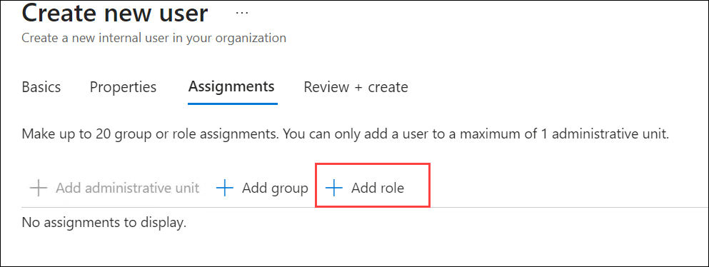
    
    

1. On the **Create new user** page, select **Next: Review + Create** and **Create**.

    

1. Once created you can see the created user in the **Users** page.

    

> **Congratulations** on completing the task! Now, it's time to validate it. Here are the steps:
> - Hit the Validate button for the corresponding task. If you receive a success message, you can proceed to the next task. 
> - If not, carefully read the error message and retry the step, following the instructions in the lab guide.
> - If you need any assistance, please contact us at cloudlabs-support@spektrasystems.com. We are available 24/7 to help

<validation step="4ea1ff7e-4b7b-4fc0-bb83-fec04f01bdf9" />

### Task 3: Change the password for the user with the Global Administrator role

In this task, you will change the password for the newly created Global Administrator. This task ensures the account is ready for use with more secure authentication settings.

1. On the Azure portal, select your user account, and then select **Sign out**.

    

1. On the **Pick an account** page, select **+ Use another account**.

    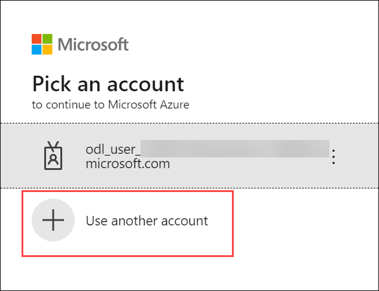

1. On the **Sign in** page, enter the fully-qualified username of the user account you previously created , and then select **Next**.

    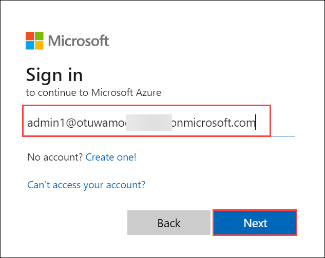

    >**Note**: It looks similar to **admin1@otuwamocXXXX.onmicrosoft.com**

1. Next, provide your password:

    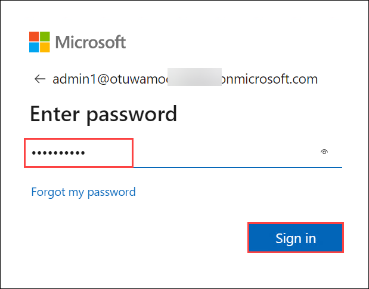

1. For the current password, use the password that you copied in the previous step.

1. It asks you to change current password, enter a complex password twice, and then select **Sign in**.

    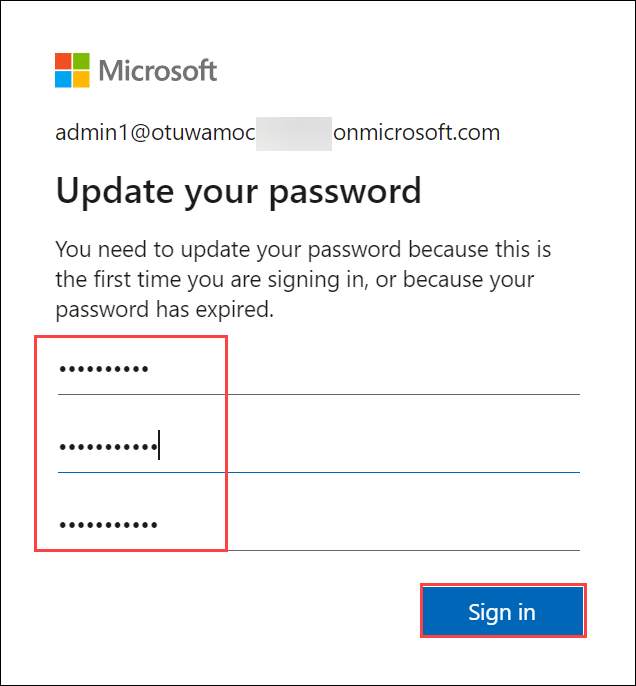

   >**Note**: Record the complex password you used as you'll use it later in this lab.

1. If you see the pop-up **Action Required**, click **Ask Later**.

   >**Note** : Please follow the steps outlined on page 1 to set up MFA if the **Ask Later** option is not visible. Once MFA setup is complete, please enter the number displayed on the screen in the Authenticator app and proceed. 
 
1. If prompted to stay signed in, you can click **No**.

1. If a **Welcome to Microsoft Azure** pop-up window appears, simply click **Cancel** to skip the tour.

## Exercise 2: Preparing on-premises AD DS for Microsoft Entra ID integration

In this exercise, you will prepare your on-premises AD DS for Microsoft Entra ID integration. This includes using the IdFix tool to identify and resolve synchronization issues before integration.

### Task 1: Install IdFix

In this task, you will download and install the IdFix DirSync Error Remediation Tool, which is used to identify and fix any directory synchronization issues between your on-premises AD DS and Microsoft Entra ID. This ensures that your environment is ready for the integration process.

1. On **SEA-ADM1**, open a new tab in Microsoft Edge, and then browse to **https://github.com/microsoft/idfix**.

1. On the **Github** page, you have to scroll down, and under **ClickOnce Launch**, select **launch**.

    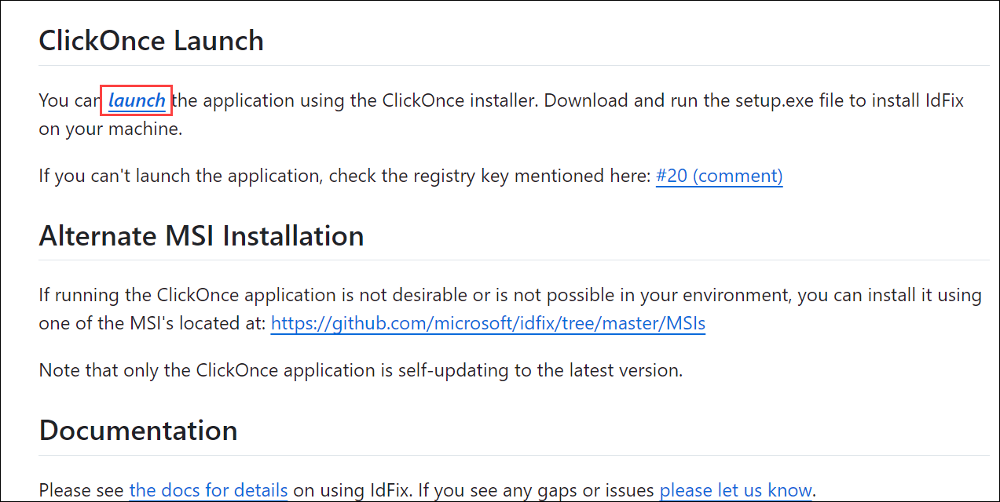

1. In the browser, click the **Downloads icon (1)** on the status bar and then click **Open file**.

    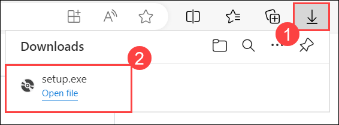

1. In the **Application Install - Security Warning** dialog box, select **Install**.

   

1. In the **IdFix Privacy Statement** dialog box, review the disclaimer, and then select **OK**.

    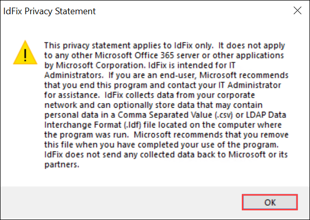

### Task 2: Run IdFix

In this task, you will run IdFix to detect and fix errors in Active Directory objects (e.g., missing attributes or invalid characters) that could cause synchronization issues when integrating with Entra ID.

1. In the **IdFix** window, select **Query**.

    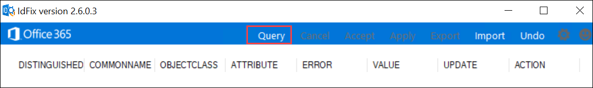

1. If presented with the **Schema Warning** dialog box, select **Yes**.

    

1. Review the list of objects from Microsoft Entra ID, and observe the **ERROR** and **ATTRIBUTE** columns. In this scenario, the value of **displayName** for **ContosoAdmin** is blank, and the tool's recommended new value appears in the **UPDATE** column.

    

1. In the **IdFix** window, from the **ACTION** drop-down menu **(1)**, select **Edit(2)**, and then select **Apply(3)** to automatically implement the recommended changes.

    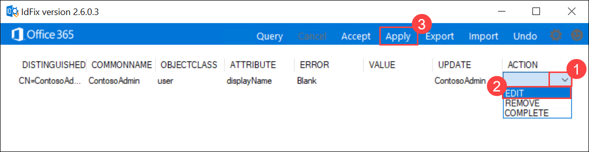

1. In the **Apply Pending** dialog box, select **Yes**(1).

   

1. Close the IdFix tool.

## Exercise 3: Downloading, installing, and configuring Microsoft Entra Connect

In this exercise, you will download, install, and configure Microsoft Entra Connect. This tool enables directory synchronization between on-premises AD DS and Microsoft Entra ID, with options tailored to your organization’s needs.

### Task 1: Install and configure Microsoft Entra Connect

In this task, you will download, install, and configure Microsoft Entra Connect, which is the tool used to synchronize on-premises Active Directory with Microsoft Entra ID. You will connect both environments and configure sync options to enable the integration process.

1. On **SEA-ADM1**, in the Microsoft Edge window displaying the Azure portal, browse to **Microsoft Entra ID**.

1. On the **Microsoft Entra ID** page, from the left-hand navigation pane, under the **Manage** select **Microsoft Entra Connect**.

   

1. On the  **Microsoft Entra Connect | Get started** Get Started page, select **Manage (1)** tab and under **Manage from on-premises: Connect Sync**, select **Download Connect Sync Agent (2)**.

   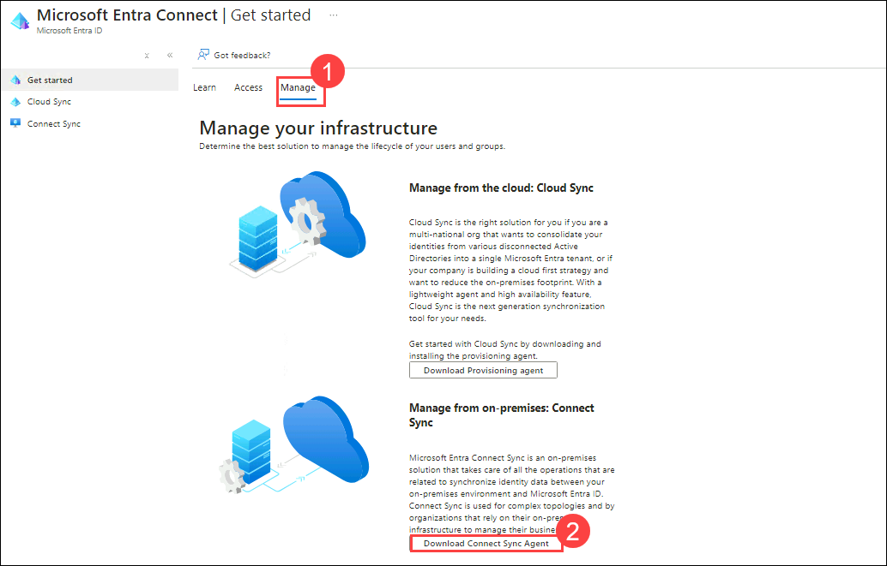

1. On the **Microsoft Entra Connect Agent** page, select **Accept terms & download**

1. On the status bar, select **Open file**.

1. On the **Welcome to Microsoft Microsoft Entra Connect Sync** page, select the **I agree to the license terms and privacy notice (1)** checkbox, and then select **Continue (2)**.

   

1. On the **Express Settings** page, select **Use express settings**.

    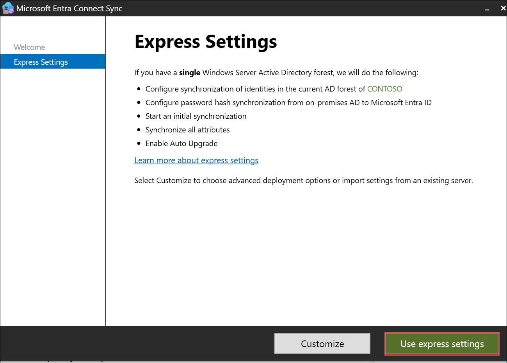

1. On the **Connect to Microsoft Entra ID** page, enter the username of the Microsoft Entra ID Global Administrator user account you created in exercise 1 **(1)**, and then select **Next (2)**.

   

   >**Note**: If a Microsoft Sign-in pop appears, please sign-in using admin1 user account credentials that you created in exercise 1.

1. On the **Connect to AD DS** page, enter the following credentials, and then select **Next (3)**:

   - Username: **CONTOSO\Administrator (1)**
   - Password: **Pa55w.rd (2)**
     
     

1. On the **Microsoft Entra sign-in configuration** page, note that the new domain you added is in the list of Active Directory UPN Suffixes, but its status is listed as **Not verified**.

   > **Note**: The domain name provided does not have to be a verified domain. While you typically would verify a domain prior to installing Microsoft Entra Connect, this lab doesn't require that verification step.

1. Select the **Continue without matching all UPN suffixes to verified domains (1)** checkbox, and then select **Next (2)**.

   

1. On the **Ready to configure** page, review the list of actions, and then select **Install**.

   

   >**Note:** Wait for the installation to get completed.

1. On the **Configuration complete** page, select **Exit**.

   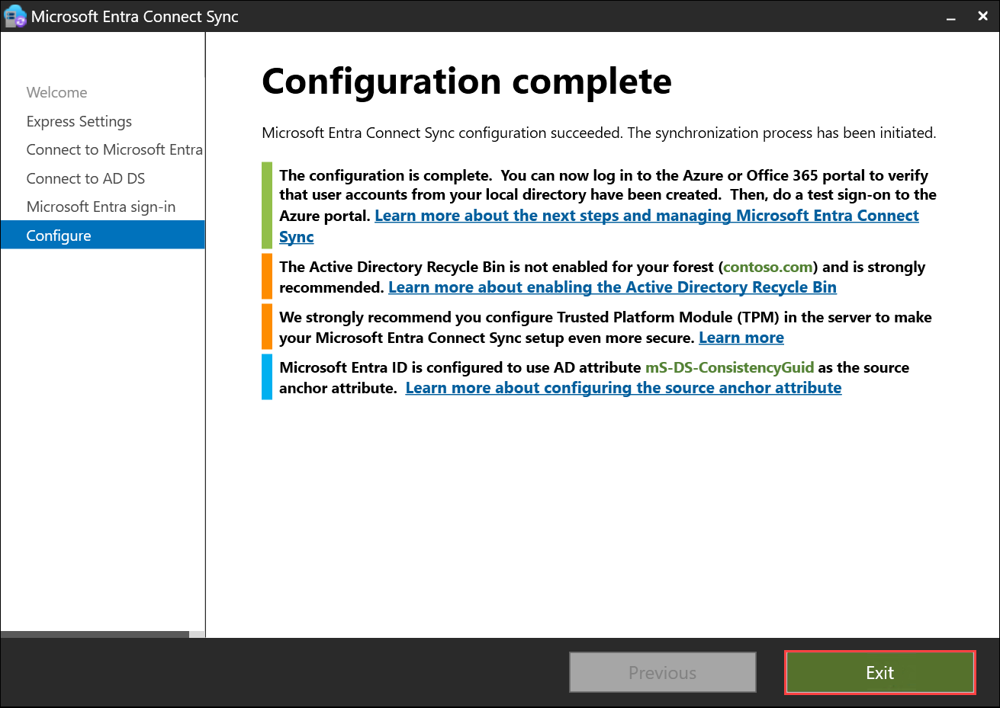

    >**Note:** If you encounter the message **Directory synchronization is enabled for this directory, but has not taken effect. Please wait untill directory synchronization is ready** in the configuration window, allow up to 30 minutes for the synchronization process to complete.      
 
## Exercise 4: Verifying integration between AD DS and Microsoft Entra ID

In this exercise, you will verify the integration between AD DS and Microsoft Entra ID. You will check synchronization status and ensure that changes to user accounts in AD DS are reflected in Microsoft Entra ID.

### Task 1: Verify synchronization in the Azure portal

In this task, you will verify the synchronization status in the Azure portal, ensuring that users and groups from your on-premises AD DS are successfully synced with Microsoft Entra ID.

1. On **SEA-ADM1**, switch to the Microsoft Edge window displaying the Azure portal. 

1. On the **Microsoft Entra ID** page, select **Users**.

1. Note that the user list includes users synced from Microsoft Entra ID.

   

   >**Note**: After the directory synchronization starts, it can take 15 minutes for Microsoft Entra ID objects to appear in the Microsoft Entra ID portal.

1. In Microsoft Edge, go back to the **Microsoft Entra ID** page.

1. On the **Microsoft Entra ID** page, select **Groups**.

   

1. Navigate to **All groups**, note the list of groups synced from Microsoft Entra ID.

   

### Task 2: Verify synchronization in the Synchronization Service Manager

In this task, you will use the Synchronization Service Manager to check the status of synchronization operations between your on-premises AD DS and Microsoft Entra ID, ensuring that the system is properly syncing data.

1. On **SEA-ADM1**, on the **Start (1)** menu, expand **Azure AD Connect (2)**, and then select **Synchronization Service (3)**.

   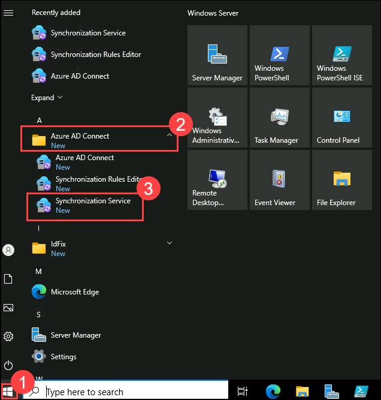
            
1. In the **Synchronization Service Manager** window, under the **Operations** tab, observe the tasks that were performed to sync the Microsoft Entra ID objects.

   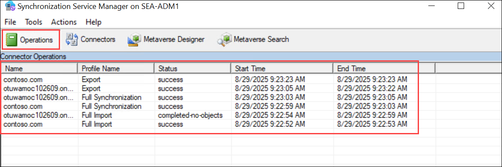

1. Select the **Connectors (1)** tab and note the two connectors **(2)**.

   >**Note**: One connector is for AD DS and the other is for the Microsoft Entra ID tenant.

   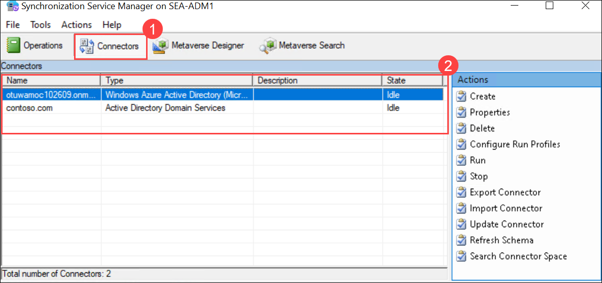

1. Close the **Synchronization Service Manager** window.

### Task 3: Update a user account in Active Directory

In this task, you will update an existing user account (e.g., Sumesh Rajan) in Active Directory and verify that the changes are synced with Microsoft Entra ID.

1. On **SEA-ADM1**, in the **Start** menu, type **Server Manager (1)** in the search box, and then select **Server Manager (2)** from the results.  

   

1. Click on the **Tools (1)** menu from top right, select **Active Directory Users and Computers (2)**.

   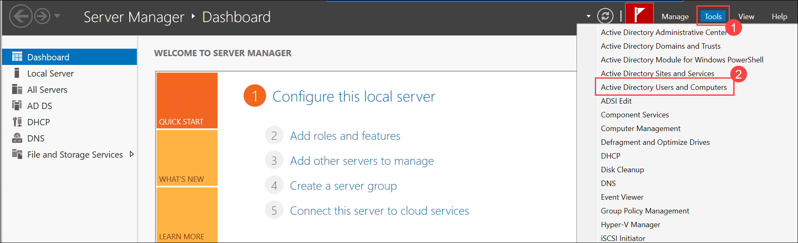 

1. In **Active Directory Users and Computers**, expand the **Sales (1)**, and then open the properties **(3)** for **Sumesh Rajan** by right clicking on the user **(2)**.

   

1. In the properties of the user, select the **Organization (1)** tab. In the **Job Title** text box, enter **Manager (2)**, and then select **OK (3)**.

   

### Task 4: Create a user account in Active Directory

In this task, you will create a new user account in Active Directory (e.g., Jordan Mitchell) and confirm that the account is synchronized to Microsoft Entra ID.

1. In **Active Directory Users and Computers**, right-click or access the context menu for the **Sales (1)**, select **New (2)**, and then select **User (3)**.

   

1. In the **New Object - User** window, enter the following user details for each field, and then select **Next > (4)**:

   - First name: **Jordan (1)**
   - Last name: **Mitchell (2)**
   - User logon name: **Jordan (3)**

     

1. In the **Password (1)** and **Confirm password (2)** fields, enter `Pa55w.rd`, and then select **Next > (3)**.

   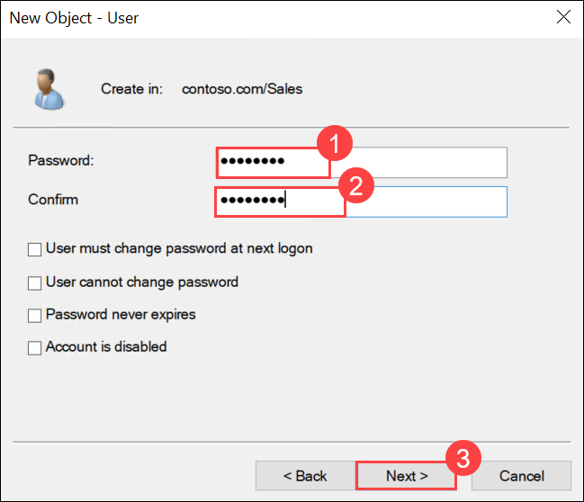

1. Select **Finish**.

    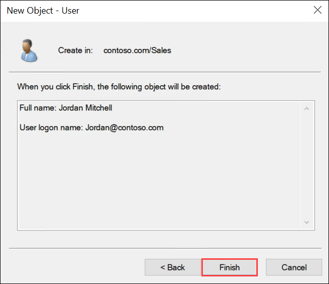

### Task 5: Sync changes to Microsoft Entra ID

In this task, you will Start the sync between On-premises and Entra ID.

1. On **SEA-ADM1**, in the **Start** menu, type **Windows PowerShell (1)** in the search box, and then select **Windows PowerShell (2)** from the results.  

   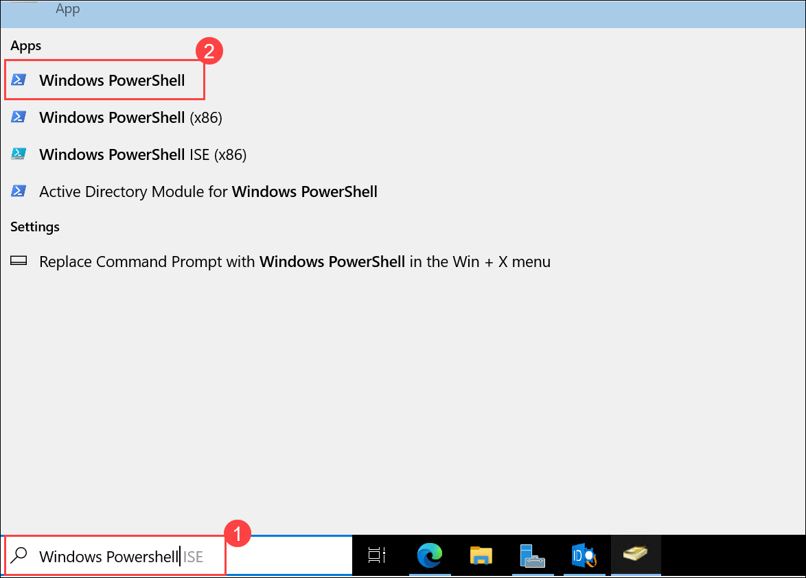

1. In the **Windows PowerShell** console, enter the following command, and then press Enter to trigger synchronization:

   ```powershell
   Start-ADSyncSyncCycle
   ```

   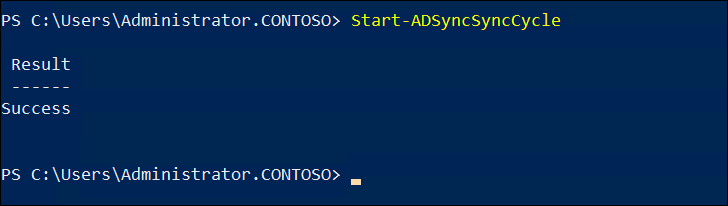   

   > **Note**: Once the synchronization cycle starts, it can take 15 minutes for Microsoft Entra ID objects to appear in the Microsoft Entra ID portal.

### Task 6: Verify changes in Microsoft Entra ID

In this task, you will verify the sync between On-premises and Entra ID

1. On **SEA-ADM1**, switch to the Microsoft Edge window displaying the Azure portal and go back to the **Microsoft Entra ID** page.

1. On the **Microsoft Entra ID** page, select **Users**.

1. On the **All Users (1)** page, search for the user **Sumesh (2)** and select **Sumesh (3)**.

   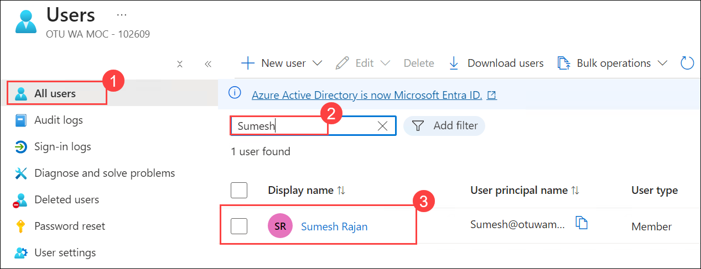  

1. Select the **Edit properties**.

      

1. Select **All (1)**, tab and then verify that the **Job title (2)** attribute has been synced from Microsoft Entra ID.

      

1. In Microsoft Edge, go back to the **All Users** page.

1. On the **All Users** page, search for the user **Jordan** and select it.

      

1. Select **Edit properties**, select **All (1)** tab, and review the attributes of the user account that was synced from Microsoft Entra ID **(2)**.

   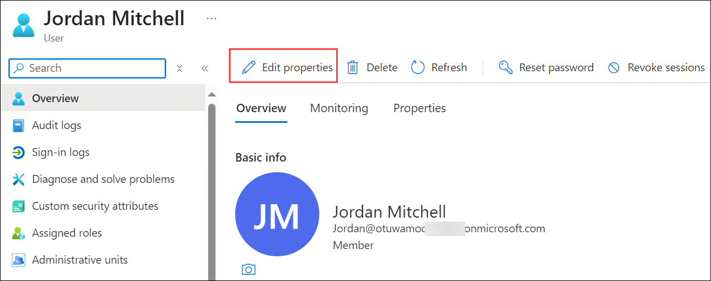  

      

> **Congratulations** on completing the task! Now, it's time to validate it. Here are the steps:
> - Hit the Validate button for the corresponding task. If you receive a success message, you can proceed to the next task. 
> - If not, carefully read the error message and retry the step, following the instructions in the lab guide.
> - If you need any assistance, please contact us at cloudlabs-support@spektrasystems.com. We are available 24/7 to help

<validation step="8e646bae-8cc0-4e44-8b11-fb2af82ffd89" />

## Exercise 5: Implementing Microsoft Entra ID integration features in AD DS (READ ONLY)

In this exercise, you will enable and configure several Microsoft Entra ID features in Active Directory Domain Services (AD DS), including password writeback, pass-through authentication, and password protection.

This exercise has been made **Read-only**, as synchronization may take up to 72 hours to fully take effect.

### Task 1: Enable password writeback in Microsoft Entra Connect

In this task, you will configure password writeback in Microsoft Entra Connect to enable Active Directory users to reset their passwords using Microsoft Entra ID. This process will allow changes to be synchronized between the two environments, ensuring users can reset their passwords in either system.

1. On **SEA-ADM1**, on the **Start** menu, expand **Azure AD Connect (1)**, and then select **Azure AD Connect (2)**.

      

1. In the **Welcome to Microsoft Entra Connect Sync** window, select **Configure**.

      

1. On the **Additional tasks** page, select **Customize synchronization options (1)**, and then select **Next (2)**.

   

1. On the **Connect to Microsoft Entra ID** page, enter the **Email/Username:** given below, and then select **Next**.
   
   - **Email/Username:** <inject key="AzureAdUserEmail"></inject>

     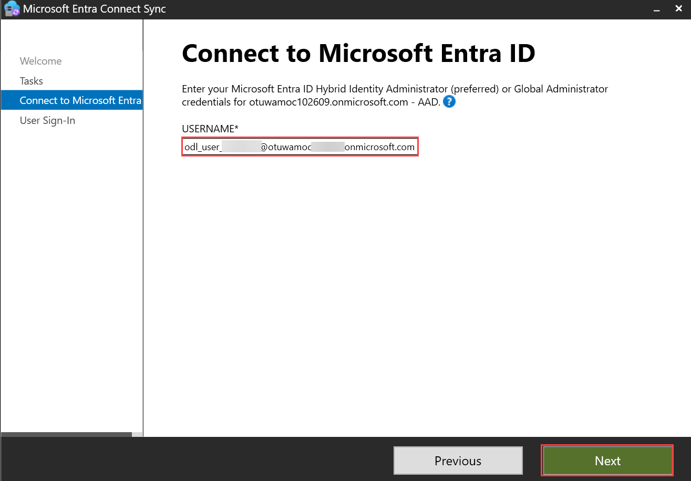      
   
   - **Password:** <inject key="AzureAdUserPassword"></inject>

     >**Note**: If a Microsoft Sign-in pop appears, please click on **+ Use another account** and sign-in using your credentials.

1. On the **Connect your directories** page, select **Next**.

   

1. On the **Domain and OU filtering** page, select **Next**.

   

1. On the **Optional features** page, select **Password writeback (1)**, and then select **Next (2)**.

   

   > **Note**: Password writeback is required for self-service password reset of Active Directory users. This allows passwords changed by users in Microsoft Entra ID to sync to the Active Directory.

1. On the **Ready to configure** page, review the list of actions to be performed, and then select **Configure**.

   

   >**Note:** Wait for the configurations to get completed.

1. On the **Configuration complete** page, select **Exit**.

   

    <!-- >**Note:** If you encounter the message **Directory synchronization is enabled for this directory, but has not taken effect. Please wait untill directory synchronization is ready** in the configuration window, allow up to 30 minutes for the synchronization process to complete.  -->

   <!-- >**Note:** If you still encounter the message "Directory synchronization is enabled for this directory, but has not taken effect. Please wait until directory synchronization is ready" in the configuration window, even after waiting 30 minutes, **do not proceed further** with the below tasks. This is a known issue with Microsoft, and synchronization may take up to 72 hours to complete. -->
   
### Task 2: Enable pass-through authentication in Microsoft Entra Connect

In this task, you will configure pass-through authentication (PTA) for seamless user sign-in between Microsoft Entra ID and your on-premises AD DS. PTA will ensure that user sign-ins are securely routed through your on-premises environment without the need for storing passwords in the cloud.

1. On **SEA-ADM1**, on the **Start** menu, expand **Azure AD Connect**, and then select **Azure AD Connect**.

1. In the **Welcome to Microsoft Entra Connect Sync** window, select **Configure**.

1. On the **Additional tasks** page, select **Change user sign-in (1)**, then select **Next (2)**.

   

1. On the **Connect to Microsoft Entra ID** page, enter the following credentials, and then select **Next**.

   - **Email/Username:** <inject key="AzureAdUserEmail"></inject>
   
   - **Password:** <inject key="AzureAdUserPassword"></inject>

     >**Note**: If a Microsoft Sign-in pop appears, please select the above account and sign-in using your credentials.

1. On the **User sign-in** page, select **Pass-through authentication (1)**. Verify that the **Enable single sign-on (2)** checkbox is selected, and then select **Next (3)**.

   

1. On the **Enable single sign-on** page, select **Enter credentials**.

   

1. In the **Forest credentials** dialog box, enter the following credentials, and then select **OK (3)**:

   - Username: **Administrator (1)**
   - Password: **Pa55w.rd (2)**

        

1. On the **Enable single sign-on** page, verify that there's a green check mark next to **Enter credentials (1)**, and then select **Next (2)**.

   

1. On the **Ready to configure** page, review the list of actions to be performed, and then select **Configure**.

   >**Note:** Wait for the configurations to get completed.

1. On the **Configuration complete** page, select **Exit**.

   

### Task 3: Verify pass-through authentication in Azure

In this task, you will verify that pass-through authentication has been successfully set up in your Azure environment. You will check the authentication settings in Microsoft Entra ID through the Azure portal, ensuring that the integration between on-premises AD DS and Microsoft Entra ID is functioning properly.

1. On **SEA-ADM1**, switch to the Microsoft Edge window displaying the Azure portal and go back to the **Microsoft Entra ID** page.

1. On the **Microsoft Entra ID** page in the Azure portal, select **Microsoft Entra Connect**.

1. On the **Microsoft Entra Connect** page, in left navigation pane select **Connect Sync (1)** and review the information under **User Sign-In**.
Under **User Sign-In**, select **Seamless single sign-on (2)**.

   

1. On the **Seamless single sign-on** page, note the on-premises domain name.

   

1. In Microsoft Edge, go back to the **Microsoft Entra Connect** page.

1. On the **Microsoft Entra Connect** page, select **Connect sync**, under **User Sign-In**, select **Pass-through authentication**.

   

1. On the **Passthrough Authentication** page, note the **SEA-ADM1** server name under **Authentication Agent**.

   

   > **Note**: If you're not able see on-premises domain name and **SEA-ADM1** server name, kindly sign-in to azure portal in private window and perform above steps.
   > **Note**: To install the Azure AD Authentication Agent on multiple servers in your environment, you can download its binaries from the **Pass-through authentication** page in the Azure portal. 

### Task 4: Install and register the Microsoft Entra ID Password Protection proxy service and DC agent

In this task, you will install the Microsoft Entra ID Password Protection proxy service on SEA-SVR1 and the DC agent on SEA-DC1. These components will allow Microsoft Entra ID password protection to be enforced within your on-premises Active Directory environment. This task includes downloading the necessary installers, installing the services, and registering the proxy service with Active Directory.

1. On **SEA-ADM1**, start Microsoft Edge, browse to the **[Azure AD Password Protection for Windows Server Active Directory](https://www.microsoft.com/en-us/download/details.aspx?id=57071)** page where you can download installers, and then select **Download**.

   

1. On the **Choose the download you want** page, select the **AzureADPasswordProtectionProxySetup.exe (1)** and the **AzureADPasswordProtectionDCAgentSetup.msi (2)** files, and then select **Download (3)**.

   

1. In the **Download multiple files** dialog box, select **Allow**.

   > **Note**: We recommend installing the proxy service on a server that isn't a domain controller. In addition, the proxy service should not be installed on the same server as the Microsoft Entra Connect agent. You will install the proxy service on **SEA-SVR1** and the Password Protection DC Agent on **SEA-DC1**.

1. On **SEA-ADM1**, switch to the **Windows PowerShell** console window.

   >**Note:** Run all these commands only in **SEA-ADM1**'s Windows PowerShell, do not switch to other VM's.

1. In the **Windows PowerShell** console, enter the following command, and then press Enter to remove the Zone.Identifier alternate data stream indicating that files have been downloaded from internet:

   ```powershell
   Get-ChildItem -Path "$env:USERPROFILE\Downloads" -File | Unblock-File
   ```
1. Run the following commands to create the **C:\Temp** directory on **SEA-SVR1**, copy the **AzureADPasswordProtectionProxySetup.exe** installer to that directory, and then invoke the installation:

   ```powershell
   New-Item -Type Directory -Path '\\SEA-SVR1.contoso.com\C$\Temp' -Force
   Copy-Item -Path "$env:USERPROFILE\Downloads\AzureADPasswordProtectionProxySetup.exe" -Destination '\\SEA-SVR1.contoso.com\C$\Temp\'
   Invoke-Command -ComputerName SEA-SVR1.contoso.com -ScriptBlock { Start-Process -FilePath C:\Temp\AzureADPasswordProtectionProxySetup.exe -ArgumentList '/quiet /log C:\Temp\AzureADPPProxyInstall.log' -Wait }
   ```
   
      

   >**Note:** If it shows errors then wait for sometime and again perform the step-6.

1. Run the following commands to create the **C:\Temp** directory on **SEA-DC1**, copy the **AzureADPasswordProtectionDCAgentSetup.msi** installer to that directory, invoke the installation, and restart the domain controller after the installation completes:

   ```powershell
   New-Item -Type Directory -Path '\\SEA-DC1.contoso.com\C$\Temp' -Force
   Copy-Item -Path "$env:USERPROFILE\Downloads\AzureADPasswordProtectionDCAgentSetup.msi" -Destination '\\SEA-DC1.contoso.com\C$\Temp\'
   Invoke-Command -ComputerName SEA-DC1.contoso.com -ScriptBlock { Start-Process msiexec.exe -ArgumentList '/i C:\Temp\AzureADPasswordProtectionDCAgentSetup.msi /quiet /qn /norestart /log C:\Temp\AzureADPPInstall.log' -Wait }
   Restart-Computer -ComputerName SEA-DC1.contoso.com -Force
   ```

   

1. Run the following commands to validate that the installations resulted in the creation of services necessary to implement Azure AD Password Protection:

   ```powershell
   Get-Service -Computer SEA-SVR1 -Name AzureADPasswordProtectionProxy | fl
   Get-Service -Computer SEA-DC1 -Name AzureADPasswordProtectionDCAgent | fl
   ```

      

   > **Note**: Verify that each service has the **Running** status.

   >**Note:** If you encounter any error, please re run the command.

1. In the **Windows PowerShell** console, enter the following command and press Enter to start a PowerShell Remoting session to **SEA-SVR1**:

   ```powershell
   Enter-PSSession -ComputerName SEA-SVR1
   ```

      

1. From the **[SEA-SVR1]** prompt, enter the following command and press Enter to register the proxy service with Active Directory (replace the `<Azure_AD_Global_Admin>` placeholder with the following 
   credential):

   - **Email/Username:** <inject key="AzureAdUserEmail"></inject>

   ```powershell
   Register-AzureADPasswordProtectionProxy -AccountUpn <Azure_AD_Global_Admin> -AuthenticateUsingDeviceCode
   ```

      

   >**Note:** If you encounter any error, please re run the command.

1. As instructed, open another Microsoft Edge window, browse to **https://microsoft.com/devicelogin** and when prompted, enter the code included in the message displayed in the PowerShell Remoting session. 

   

1. When prompted, authenticate by using following credentials, and then select **Continue**.

   - **Email/Username:** <inject key="AzureAdUserEmail"></inject>

   - **Password:** <inject key="AzureAdUserPassword"></inject>

1. When prompted **Are you trying to sign in to Microsoft Azure Powershell**, click on **Continue**.   

1. Switch back to the PowerShell Remoting session, enter the following command and press Enter to exit the PowerShell Remoting session to **SEA-SVR1**:

   ```powershell
   Exit-PSsession
   ```

1. In the **Windows PowerShell** console, enter the following command and press Enter to start a PowerShell Remoting session to **SEA-DC1**:

   ```powershell
   Enter-PSSession -ComputerName SEA-DC1
   ```

1. From the **[SEA-DC1]** prompt, enter the following command and press Enter to register the proxy service with Active Directory (replace the `<Azure_AD_Global_Admin>` placeholder with the following 
   credential):

   - **Email/Username:** <inject key="AzureAdUserEmail"></inject>
   

   ```powershell
   Register-AzureADPasswordProtectionForest -AccountUpn <Azure_AD_Global_Admin> -AuthenticateUsingDeviceCode
   ```

1. As instructed, open another Microsoft Edge window, browse to **https://microsoft.com/devicelogin** and when prompted, enter the code included in the message displayed in the PowerShell Remoting session. 

1. When prompted, authenticate by using the following credentials, and then select **Continue**.

   - **Email/Username:** <inject key="AzureAdUserEmail"></inject>

   - **Password:** <inject key="AzureAdUserPassword"></inject>

1. When prompted **Are you trying to sign in to Microsoft Azure Powershell**, click on **Continue**.   

1. Switch back to the PowerShell Remoting session, enter the following command, and then press Enter to exit the PowerShell Remoting session to **SEA-DC1**:

   ```powershell
   Exit-PSsession
   ```

### Task 5: Enable password protection in Azure

In this task, you will configure password protection settings in Microsoft Entra ID via the Azure portal. You will enable password protection for Windows Server Active Directory, enforce custom banned password lists, and set the mode to "Audit." This feature helps ensure that weak or commonly used passwords are prevented within your organization's environment.

1. On **SEA-ADM1**, switch to the Microsoft Edge window displaying the Azure portal, go back to the **Microsoft Entra ID** page, and then, on the **Microsoft Entra ID** page, under **Manage** section, select **Security**.

   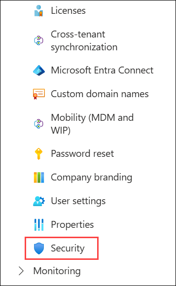

1. On the **Security** page, under **Manage (1)** section, select **Authentication methods (2)**.

   

1. On the **Authentication methods** page, under **Manage (1)** section, select **Password protection (2)**.

   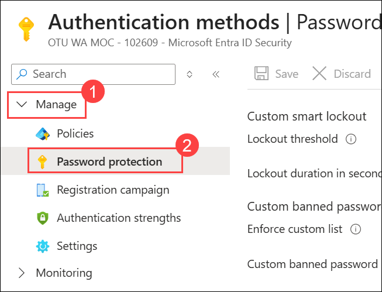

1. On the **Password protection** page, 

   - Change the slider for **Enforce custom list** to **Yes (1)**.

   - In the **Custom banned password list** text box, enter the following words (one per line): **(2)**
 
      - **Contoso**
      - **London**

        > **Note**: The list of banned passwords should be words that are relevant to your organization.

   - Verify that the slider for **Enable password protection on Windows Server Active Directory** is set to **Yes (3)**.

   - Verify that the slider for **Mode** is set to **Audit (4)**, and then select **Save (5)**.

     


### Review
In this lab, you have completed:
- Preparing Microsoft Entra ID for AD DS integration
- Preparing on-premises AD DS for Microsoft Entra ID integration
- Downloading, installing, and configuring Microsoft Entra Connect
- Verifying integration between AD DS and Microsoft Entra ID
- Implementing Azure AD integration features in AD DS

## You have successfully completed this lab.
