# Lab 03: Managing Windows Server

## Lab Scenario

Contoso, Ltd. wants to implement several new servers in their environment, and they have decided to use Server Core. They also want to implement Windows Admin Center for remote management of both these servers and other servers in the organization.

## Lab Objective
In this lab, you will perform:

  - Task 1: Install Windows Admin Center
  - Task 2: Add servers for remote administration
  - Task 3: Configure Windows Admin Center extensions
  - Task 4: Verify remote administration
  - Task 5:Administer servers with Remote PowerShell

## Estimated time: 45 Minutes

## Architecture Diagram

     

## Exercise 1: Implementing and using remote server administration

In this exercise, you will learn how to install and configure Windows Admin Center for remote server management. This will involve adding servers for remote administration, configuring extensions for added functionality, and verifying your remote administration setup. You'll also work with Remote PowerShell to manage servers remotely and perform administrative tasks.

### Task 1: Install Windows Admin Center

In this task, you will install Windows Admin Center on SEA-ADM1. You will download the installation package, run the installer using PowerShell, and configure the necessary settings during installation. After installation, you will troubleshoot any potential connection issues and restart the system to complete the setup.

1. On the **HOSTVM dropdown menu (1)**, select **SEA-ADM1 (2)** to connect to the administrator VM.  

    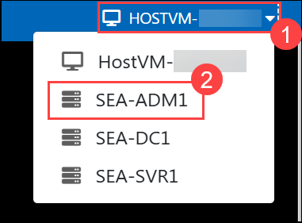

1. On the **SEA-ADM1 login screen**, sign in as **CONTOSO\Administrator** with the password **Pa55w.rd**.  

    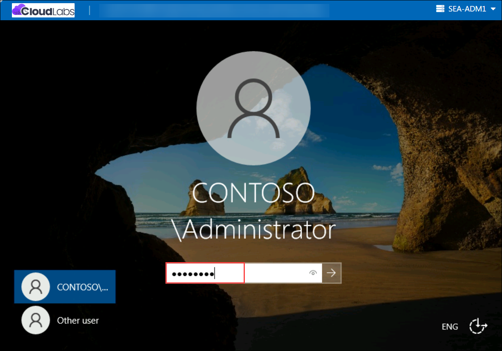

1. On **SEA-ADM1**, select **Start (1)**, and then right click on **Windows PowerShell (2)** and select **Run as Administrator (3)**.

   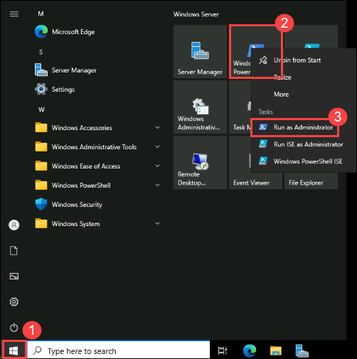

1. In the **Windows PowerShell** console, enter the following command, and then press Enter to download the latest version of Windows Admin Center:
	
   ```powershell
   Start-BitsTransfer -Source https://aka.ms/WACDownload -Destination "$env:USERPROFILE\Downloads\WindowsAdminCenter.msi"
   ```
1. Enter the following command, and then press Enter to install Windows Admin Center:
	
   ```powershell
   Start-Process msiexec.exe -Wait -ArgumentList "/i $env:USERPROFILE\Downloads\WindowsAdminCenter.msi /qn /L*v log.txt REGISTRY_REDIRECT_PORT_80=1 SME_PORT=443 SSL_CERTIFICATE_OPTION=generate"
   ```

   > **Note**: Wait until the installation completes. This should take about 2 minutes.
   
   > **Note**: After installation completes, you may encounter the error message 'ERR_Connection_Refused'. If this occurs, restart SEA-ADM1 to correct the issue.

### Task 2: Add servers for remote administration

In this task, you will use Windows Admin Center to add SEA-DC1 for remote administration. You will configure the connection by entering the necessary credentials and verifying the connection status. If any issues occur, you will handle the error by reconfiguring the settings to ensure successful remote management.

1. On **SEA-ADM1**, start Microsoft Edge, and then go to `https://SEA-ADM1.contoso.com`.

    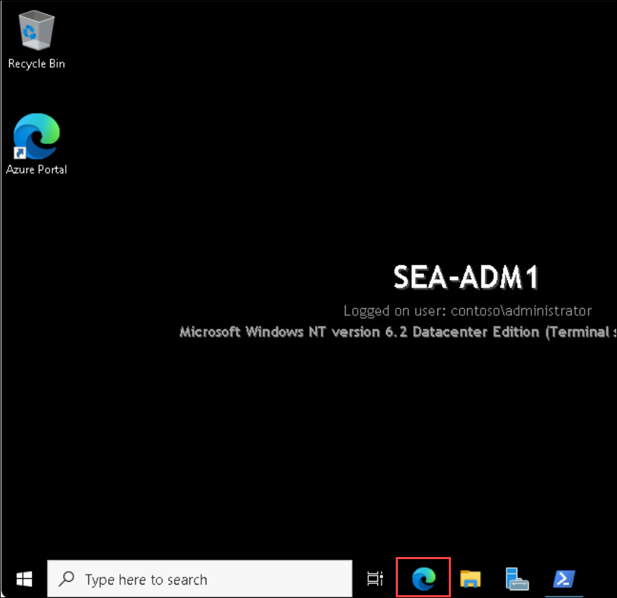

   >**Note**: If the link does not work, on **SEA-ADM1**, open File Explorer, select Downloads folder, in the Downloads folder select **WindowsAdminCenter.msi** file and install manually. After the install completes, refresh Microsoft Edge.

   >**Note**: If you get **NET::ERR_CERT_DATE_INVALID** error, select **Advanced** on the Edge browser page, at the bottom of page select **Continue to sea-adm1-contoso.com (unsafe)**.

   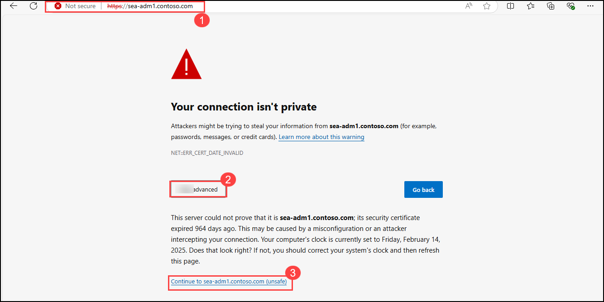

2. When prompted, in the **Windows Security** dialog box, enter the following credentials, and then select **OK (3)**:

   - Username: **CONTOSO\Administrator (1)**
   - Password: **Pa55w.rd (2)**

   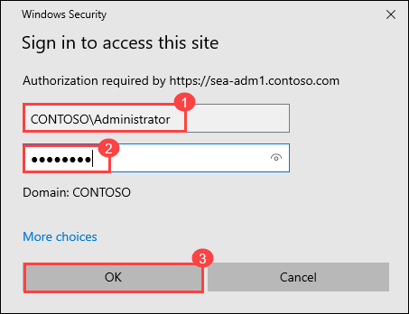

3. Review the **New in this release** pop-up window and select **Close** in its upper-right corner.

4. Review the **All connections** page and note that it includes the **sea-adm1.contoso.com** entry. 

5. On the **All connections** page, select **+ Add (1)**. 

   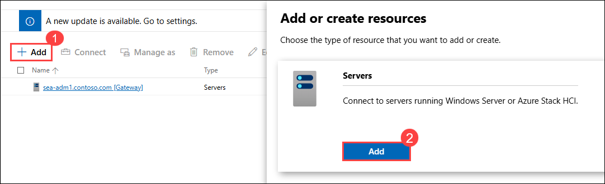

6. In the Add or create resources pane, on the **Servers** tile, select **Add (2)**.

7. In the **Server name** text box, enter **sea-dc1.contoso.com (1)**  and click on **Add** (2).  


   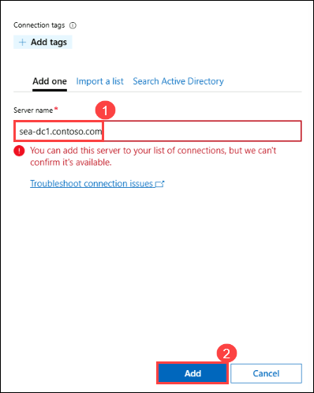  

   > **Note**: While performing step 7, if you see an error message stating, **"You can add this server to your list of connections, but we can't confirm it's available."**, select **Add**.  

   - In the **All Connections** pane, select **sea-dc1.contoso.com** **(1)** and then click on **Manage as** **(2)**.  
   - In the **Specify your credentials** dialog box:  
     - Ensure that **Use another account for this connection** **(3)** is selected.  
     - Enter the Administrator credentials:  
       - **Username**: **CONTOSO\Administrator** **(4)**  
       - **Password**: **Pa55w.rd** **(5)**  
     - Check the **Use this credential for all connections** checkbox **(6)**.  
     - Click **Continue** **(7)**.  

      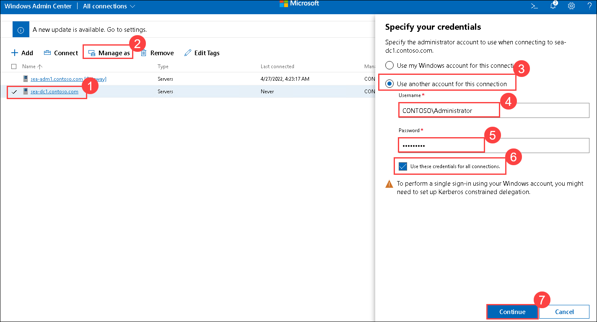 

### Task 3: Configure Windows Admin Center extensions

In this task, you will configure extensions in Windows Admin Center to enhance its functionality. You will install the Security (Preview) extension, review installed extensions, and configure the DNS tools on SEA-DC1. This will allow you to manage and monitor additional aspects of your servers, such as DNS records.

1. On **SEA-ADM1**, in the upper-right corner of the Microsoft Edge window displaying Windows Admin Center, select the **Settings (1)** icon (the cog wheel).

1. In the left pane, under **Gateway** section, select **Extensions (2)**. Review the available extensions.

   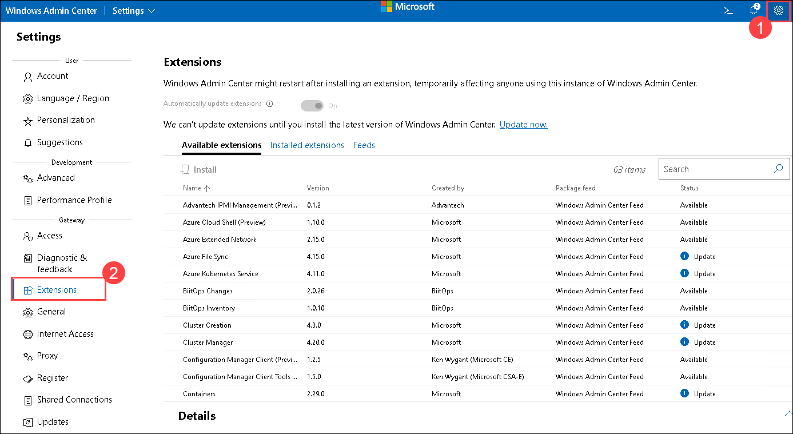 

1. Select the **Security (Preview)** **(1)** extension, then click on **Install** **(2)**. The extension will install and Windows Admin Center will refresh.

   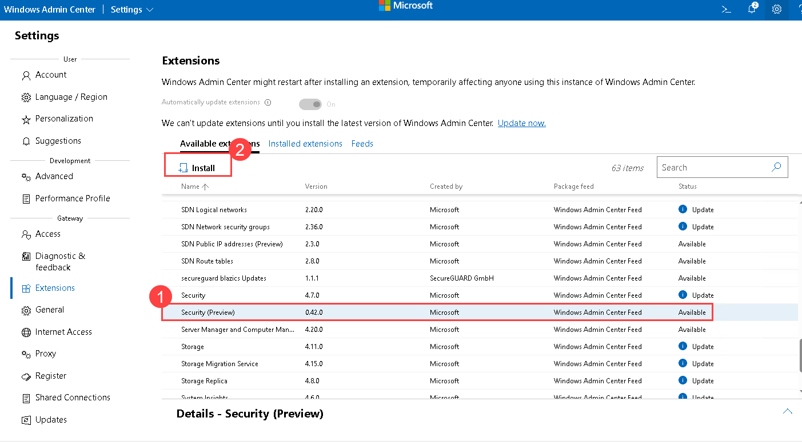  

   > **Note**: If the **Security (Preview)** extension is not available, choose another Microsoft extension.

1. In the details pane, select **Installed extensions** **(1)** and verify that the list includes the **Security (Preview) (2)** extension you just installed, and another extension named **DNS** as shown below:

   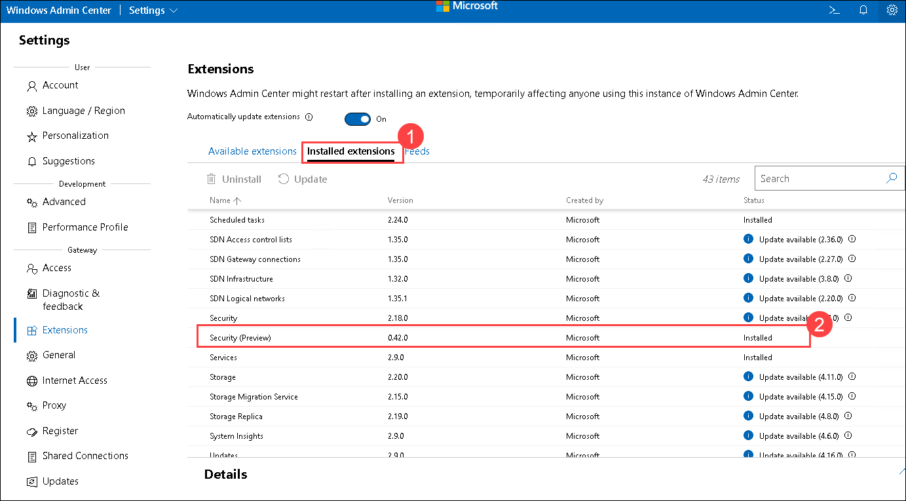  

   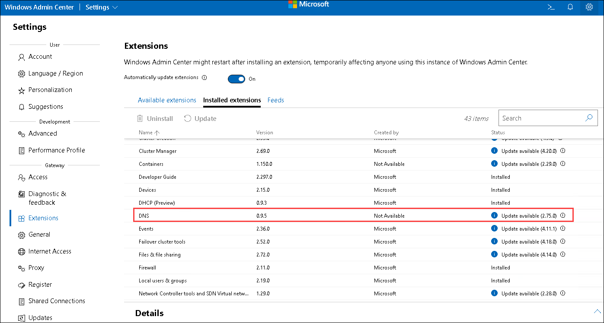   

1. On the top menu, next to **Settings (1)**, select the drop-down arrow, and then select **Server Manager (2)**.

   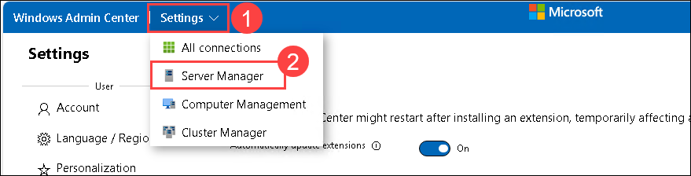  

1. On the **Server connections** page, select the **sea-dc1.contoso.com** link.

    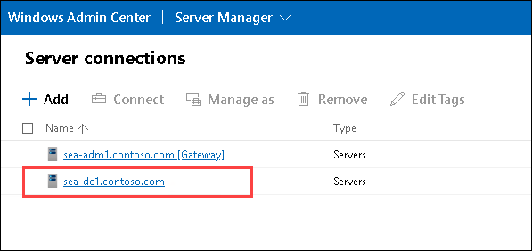  

1. If prompted for credentials, ensure that **Use another account for this connection** option is selected, select the **Use these credentials for all connections**, enter the following credentials, and then select **Continue**:

   - Username: **CONTOSO\Administrator**
   - Password: **Pa55w.rd**

1. To install the DNS PowerShell tools, in the left pane, in the list of **Tools**, select **DNS (1)**, and then select **Install (2)**. The tools will take less than a minute to install.

    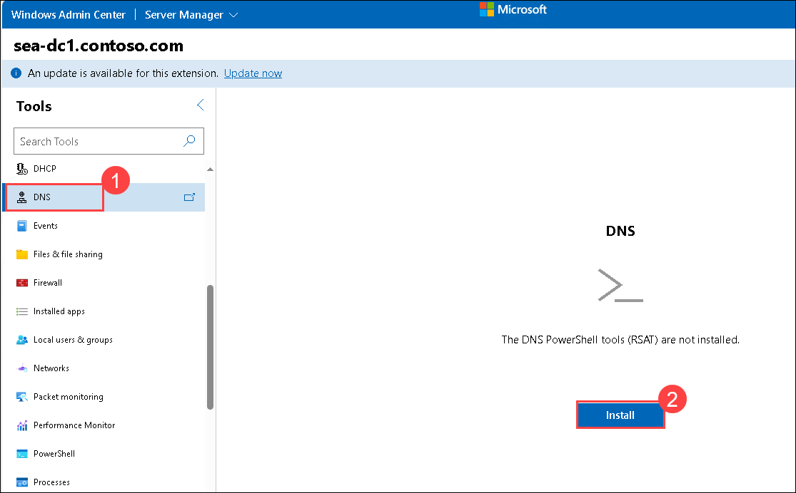  

1. Select the **Contoso.com** **(3)** zone and review the list of its DNS records.

    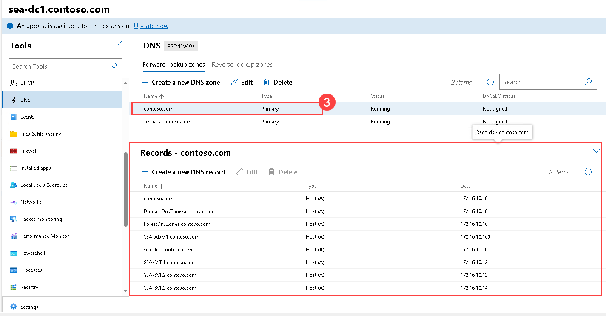  

### Task 4: Verify remote administration

In this task, you will verify that remote administration is working correctly through Windows Admin Center. You will review server information, install roles and features (like Telnet Client), and enable Remote Desktop on SEA-DC1. You will then use the Remote Desktop tool to connect to SEA-DC1 and confirm the connection is successful.

1. On **SEA-ADM1**, in Windows Admin Center, in the left pane, in the list of **Tools**, select **Overview**. Note that the details pane of Windows Admin Center displays basic server information and performance monitoring.

    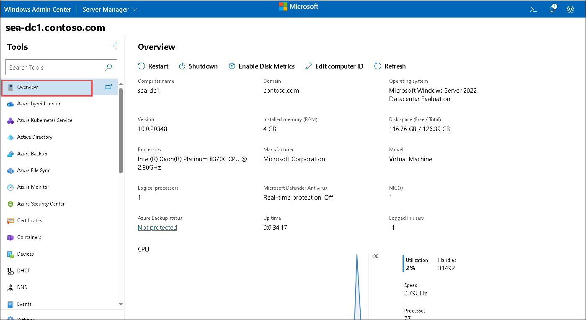  

1. In the left pane, in the list of **Tools**, scroll down and review the basic administration tools available. Select **Roles & features (1)** and note which roles and features are listed as installed and which ones are available to install. Scroll down, select the **Telnet Client (2)** checkbox, and then select **+ Install (3)** at the top of the pane.

    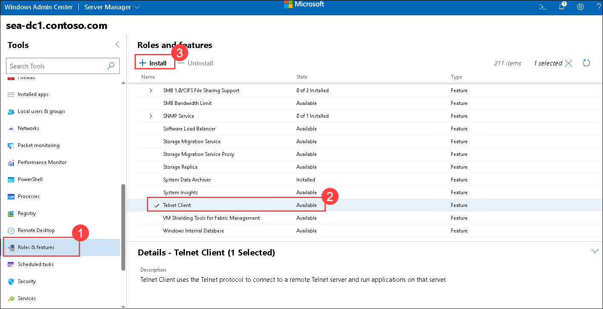  

1. In the **Install Roles and Features** pane, select **Yes** and wait for the message confirming that Telnet Client was installed successfully.

   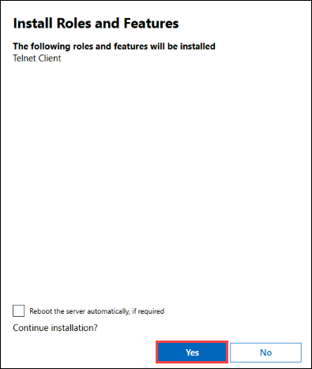  

1. On the left pane, below the  **Overview**, select **Settings (1)**.

1. In the **Settings** section , select **Remote Desktop (2)**.

1. In the **Remote Desktop** section, select the option **Allow remote connections to this computer (3)** checkbox, and then select **Save (4)**.

     

1. In the left pane, in the list of **Tools**, select **Remote Desktop (1)**.

1. In the Remote Desktop pane, select the **Automatically connect with the certificate presented by this machine (2)** checkbox, and then select **Connect**.

   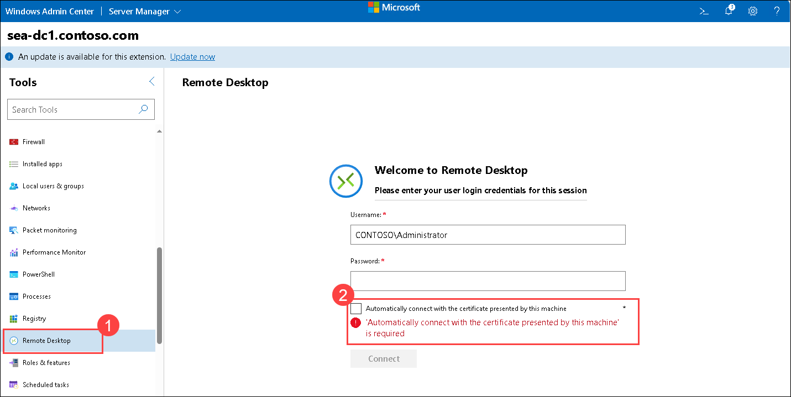   

1. When prompted, select **Confirm**, and enter Password: **Pa55w.rd (1)** then select **Connect (2)**.

   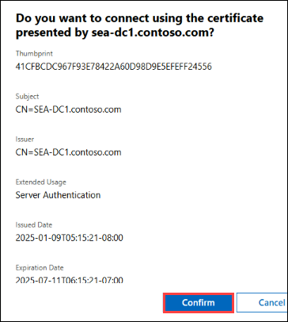  

     

1. Verify that you successfully connected via Remote Desktop to **SEA-DC1** within the Windows Admin Center interface.

1. Select **Disconnect**.

   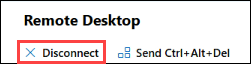  

1. Close the Microsoft Edge window.

### Task 5: Administer servers with Remote PowerShell

In this task, you will use PowerShell Remoting to administer SEA-DC1. You will start a PowerShell session on SEA-ADM1, remotely connect to SEA-DC1, and then check and manage the status of the Application Identity service. This task will help you practice performing administrative tasks remotely using PowerShell.

1. On **SEA-ADM1**, switch to the **PowerShell** console session. 

1. In the **Windows PowerShell** console, enter the following command, and then press Enter to start a PowerShell Remoting session to **SEA-DC1**:

   ```powershell
   Enter-PSSession -ComputerName SEA-DC1
   ```

1. From the **[SEA-DC1]** prompt, enter the following command and press Enter to display the status of the Application Identity service (AppIDSvc):

   ```powershell
   Get-Service -Name AppIDSvc
   ```

   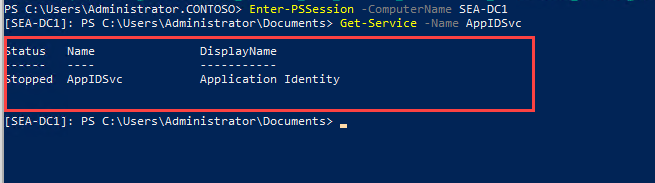  

   > **Note**: Verify that the service is currently stopped.

1. From the **[SEA-DC1]** prompt, enter the following command and press Enter to start the Application Identity service:

   ```powershell
   Start-Service -Name AppIDSvc
   ```
1. From the **[SEA-DC1]** prompt, enter the following command and press Enter to display the status of the Application Identity service (AppIDSvc):

   ```powershell
   Get-Service -Name AppIDSvc
   ```

   > **Note**: Verify that the service is currently running.

   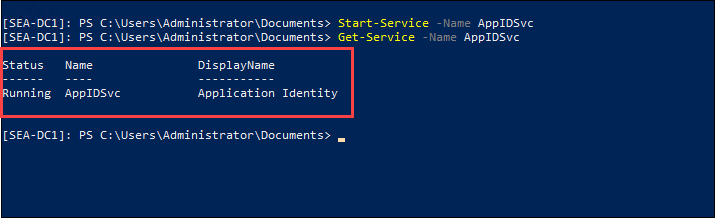  

### Results

After completing this exercise, you will have installed Windows Admin Center and connected it to the servers in your lab environment. You performed a number of remote management tasks including installing a feature as well as enabling and testing Remote Desktop connectivity. Finally, you used PowerShell Remoting to check the status of a service and then to start it.

### Review
In this lab, you have completed:
- Install Windows Admin Center
- Add servers for remote administration
- Configure Windows Admin Center extensions
- Verify remote administration
- Administer servers with Remote PowerShell

## You have successfully completed this lab.
