# Lab 4: Using Windows Admin Center in hybrid scenarios

## Lab scenario

To address concerns regarding the consistent operational and management model, regardless of the location of managed systems, you'll test the capabilities of Windows Admin Center in the hybrid environment containing different versions of the Windows Server operating system running on-premises and in Microsoft Azure virtual machines (VMs).

Your goal is to verify that Windows Admin Center can be used in a consistent manner regardless of the location of managed systems.

## Lab objectives
In this lab, you will perform:

- Exercise 1:  Provisioning Azure VMs running Windows Server
- Exercise 2: Implementing hybrid connectivity by using the Azure Network Adapter
- Exercise 3: Deploying Windows Admin Center gateway in Azure
- Exercise 4: Verifying functionality of the Windows Admin Center gateway in Azure

## Estimated time: 90 minutes

## Architecture Diagram

    

## Exercise 1: Provisioning Azure VMs running Windows Server

In this exercise, you will provision Azure VMs running Windows Server using Azure Resource Manager (ARM) templates. This will involve creating a resource group and deploying the VM using predefined ARM templates. You will also configure the virtual network to support Azure VMs.

### Task 1: Create an Azure resource group by using an Azure Resource Manager template

In this task, you will create an Azure resource group using an ARM template. This resource group will be used to organize the resources provisioned in this lab, ensuring a structured approach to managing resources within Azure.

1. Connect to **SEA-ADM1**, and if needed, sign in as **CONTOSO\Administrator** with a password of **Pa55w.rd**.

1. On **SEA-ADM1**, start Microsoft Edge, go to the [Azure portal](https://portal.azure.com), and sign in by using the following credentials : 

   - **Email/Username:** <inject key="AzureAdUserEmail"></inject>
   - **Password:** <inject key="AzureAdUserPassword"></inject>

1. In the Azure portal, open the **Cloud Shell** pane by selecting the toolbar icon directly next to the search text box.

   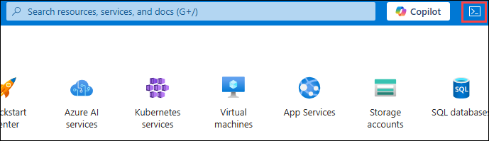  

1. If prompted to select either **Bash** or **PowerShell**, select **PowerShell**.

   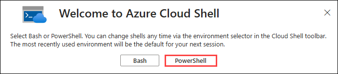  

1. If this is the first time you are starting Cloud Shell and you are presented with the **Getting started** page, select **No storage account required (1)**, select the **default (2)** subscription you are using in this lab, then select **Apply (3)**.

   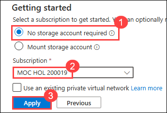 

1. In the toolbar of the Cloud Shell pane, select the **Manage Files** icon, in the drop-down menu, select **Upload**, and then upload the **C:\Labfiles\AZ-800-Administering-Windows-Server-Hybrid-Core-Infrastructure-master\Allfiles\Labfiles\Lab04\L04-sub_template.json** file to the Cloud Shell home directory.

   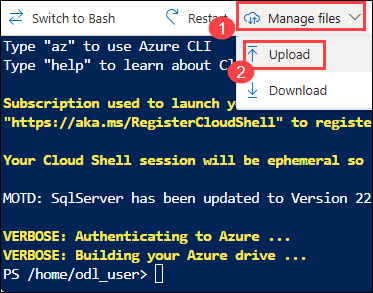 

   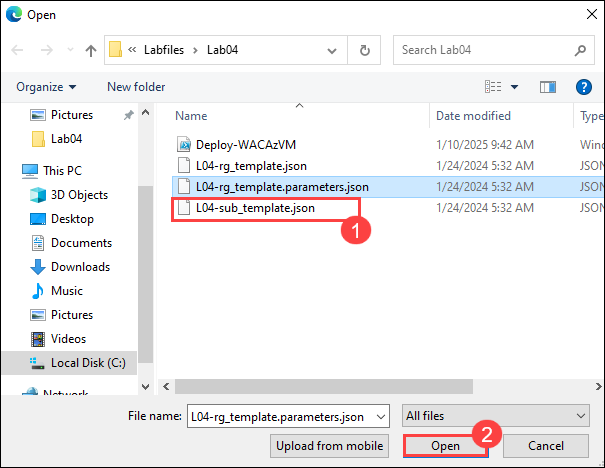 

1. From the Cloud Shell pane, run the following commands to create a resource group that will contain the resources you provision in this lab.

   ```powershell
   $location = 'eastus'
   $rgName = 'AZ800-L0401-RG'
   New-AzSubscriptionDeployment `
     -Location $location `
     -Name az800l04subDeployment `
     -TemplateFile $HOME/L04-sub_template.json `
     -rgLocation $location `
     -rgName $rgName
   ```

   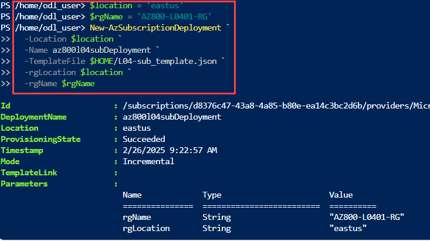 

### Task 2: Create an Azure VM by using an Azure Resource Manager template

In this task, you will deploy an Azure VM using an ARM template. This Azure VM will be running Windows Server and will be used for managing the system in later exercises.

1. From the Cloud Shell pane, upload an Azure Resource Manager template **C:\Labfiles\AZ-800-Administering-Windows-Server-Hybrid-Core-Infrastructure-master\Allfiles\Labfiles\Lab04\L04-rg_template.json** and the corresponding Azure Resource Manager parameter file **C:\Labfiles\AZ-800-Administering-Windows-Server-Hybrid-Core-Infrastructure-master\Allfiles\Labfiles\Lab04\L04-rg_template.parameters.json**.

1. From the Cloud Shell pane, run the following command to deploy an Azure VM running Windows Server that you'll be using in this lab:

   ```powershell
   New-AzResourceGroupDeployment `
     -Name az800l04rgDeployment `
     -ResourceGroupName $rgName `
     -TemplateFile $HOME/L04-rg_template.json `
     -TemplateParameterFile $HOME/L04-rg_template.parameters.json
   ```

   >**Note**: Wait for the deployment to complete before you proceed to the next exercise. The deployment should take about 5 minutes.

1. In the Azure portal, close the Cloud Shell pane.

1. In the Azure portal, in the **Search resources, services, and docs** text box in the toolbar, search for and select the **az800l04-vnet** virtual network.

   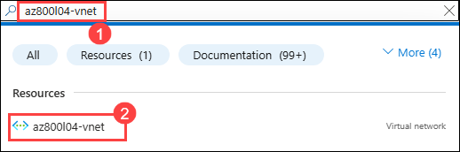 

1. On the **az800l04-vnet** page, under **Settings** section, select **Subnets (1)**, and then, on the Subnets page, select **+ subnet (2)**.

1. On the Add subnet page, settings pane, specify the following settings, and then select **Add (5)** (leave others with their default values):

   |Setting| Value|
   |---------|------|
   |Subnet purpose |	**Virtual Network Gateway (3)** |
   |Starting address |	**10.4.3.224/27 (4)** |

   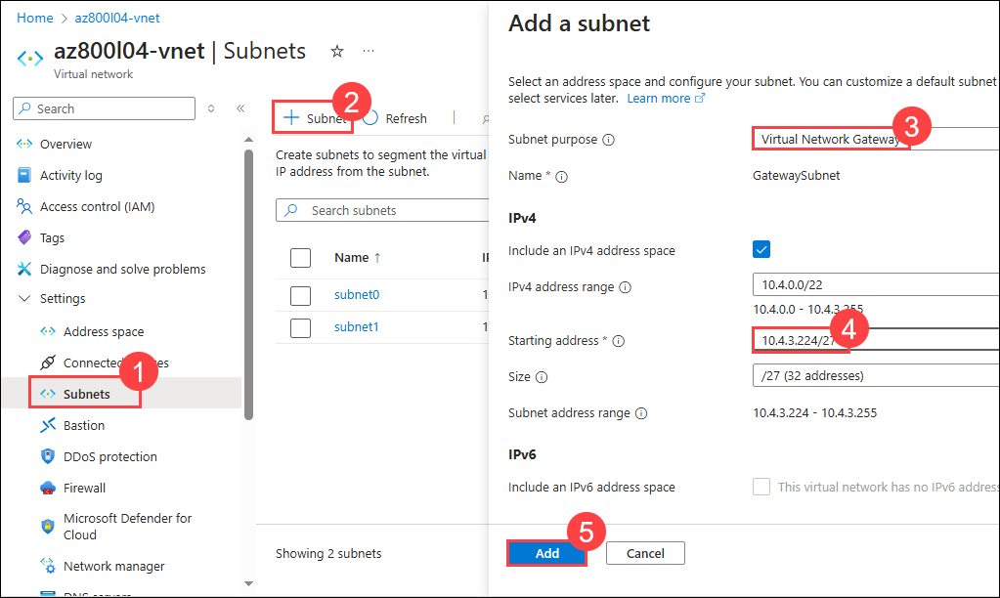 

> **Congratulations** on completing the task! Now, it's time to validate it. Here are the steps:
> - Hit the Validate button for the corresponding task. If you receive a success message, you can proceed to the next task. 
> - If not, carefully read the error message and retry the step, following the instructions in the lab guide.
> - If you need any assistance, please contact us at labs-support@spektrasystems.com. We are available 24/7 to help.
 
<validation step="f7861d50-4d57-462e-9da5-c570cc410428" />

## Exercise 2: Implementing hybrid connectivity by using the Azure Network Adapter

In this exercise, you will implement hybrid connectivity using the Azure Network Adapter.

### Task 1: Register Windows Admin Center with Azure

In this task, you will register Windows Admin center with Azure.

In this task, you will register windows admin center with Azure.

1. On **SEA-ADM1**, start Microsoft Edge, and then browse to `https://SEA-ADM1.contoso.com`.

   >**Note**: If you get **NET::ERR_CERT_DATE_INVALID** error, select **Advanced** on the Edge browser page, at the bottom of page select **Continue to sea-adm1-contoso.com (unsafe)**. 

    

1. If prompted, in the **Windows Security** dialog box, enter the following credentials, and then select **OK (3)**:

   - Username: **CONTOSO\Administrator (1)**
   - Password: **Pa55w.rd (2)**

    

1. On the **All connections** page, select the **sea-adm1.contoso.com** entry. 
1. In Windows Admin Center, select **Networks (1)**, and then select **+ Add Azure Network Adapter (Preview) (2)**.

   > **Note**: Depending on the screen resolution, you might need to select the **ellipsis** icon if the **Actions** menu is not available.

1. When prompted, in the **Add Azure Network Adapter** window, select **Register Windows Admin Center to Azure (3)**.

   >**Note**: This will automatically display the Azure pane on the **Settings** page within Windows Admin Center.

    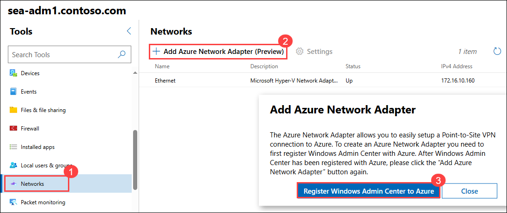

1. In Windows Admin Center, in the Azure pane, on the **Settings** page, select **Register**.

   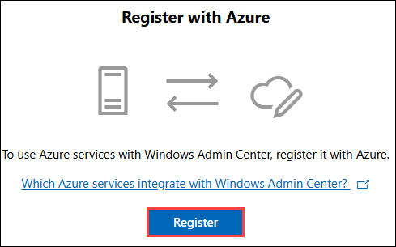

1. In the **Get started with Azure in Windows Admin Center** pane, select **Copy (1)** to copy the code displayed in the listing of the steps of the registration procedure. 

1. In the listing of step of the registration procedure, select the **Enter the code (2)** link.

   >**Note**: This will open another tab in the Microsoft Edge window displaying the **Enter code** page.

   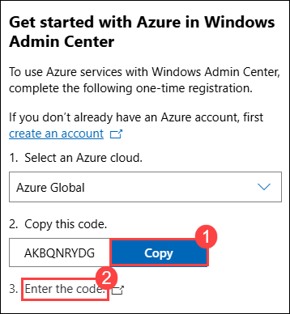

1. In the **Enter code** text box, paste the code you copied into Clipboard, and then select **Next**.

   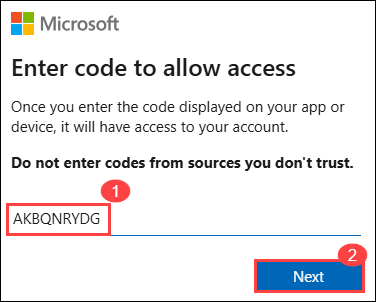

1. On a **Pick an account** page, select the same user account provided in the environment tab.

   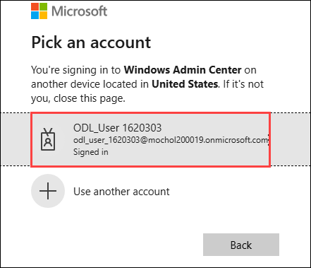

1. When prompted **Are you trying to sign in to Windows Admin Center?**, select **Continue**.

   

1. In Windows Admin Center, verify that the sign in was successful and close the newly opened tab of the Microsoft Edge window.

1. In the **Get started with Azure in Windows Admin Center** pane, ensure that **Azure Active Directory application(Microsoft Entra application)** is set to **Create new (1)**, and then select **Connect (2)**.

   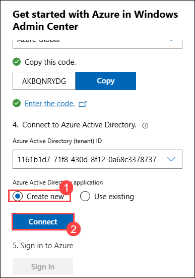

1. In the listing of the steps of the registration procedure, select **Sign in**. This will open a pop-up window labeled **Permissions requested**.

   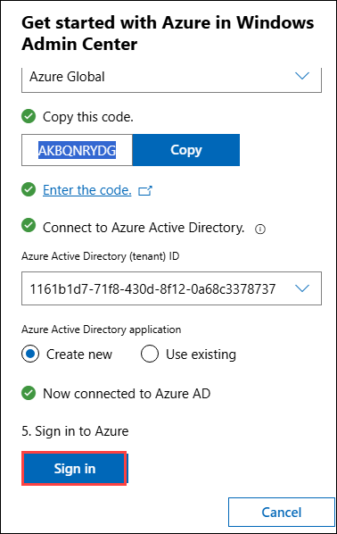

   >Note: If you get an error message when signing in, try refreshing the page in previous step.

1. In the **Permissions requested** pop-up window, if prompted, select Consent on behalf of your organization, then click **Accept**.

   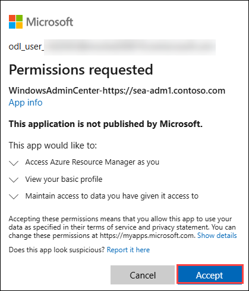

### Task 2: Create an Azure Network Adapter

>**Note**: Due to recent changes in the WAC console, this step is currently unavailable to execute.

## Exercise 3: Deploying Windows Admin Center gateway in Azure

In this exercise, you will deploy Windows Admin Center (WAC) in Azure to enable management of Azure VMs. You will run a provisioning script to deploy the WAC gateway, set up necessary networking components, and configure SSL for secure connections.

### Task 1: Install Windows Admin Center gateway in Azure

In this task, you will install windows admin center gateway in Azure.

1. On **SEA-ADM1**, switch to the Windows Powershell(Admin)

1. Run the below command to download **Deploy-WACAzVM.ps1**

   ```Powershell
    Invoke-WebRequest -Uri "https://raw.githubusercontent.com/MicrosoftLearning/AZ-800-Administering-Windows-Server-Hybrid-Core-Infrastructure/master/Allfiles/Labfiles/Lab04/Deploy-WACAzVM.ps1" -OutFile "C:\Users\Administrator.CONTOSO\Downloads\Deploy-WACAzVM.ps1" -UseBasicParsing 
   ```

   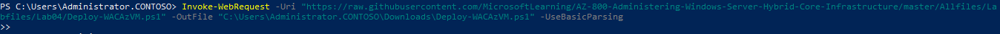

1. On **SEA-ADM1**, switch to the browser window displaying the Azure portal.

1. Back in the Azure portal, open the Cloud Shell pane by selecting the **Cloud Shell** icon.

1. In the toolbar of the Cloud Shell pane, select the **Upload/Download files** icon, in the drop-down menu, select **Upload**, and then upload the **C:\Users\Administrator.CONTOSO\Downloads\Deploy-WACAzVM.ps1** file into the Cloud Shell home directory.

1. From the Cloud Shell pane, run the following command to enable the compatibility for the **AzureRm** PowerShell cmdlets that are used by the Windows Admin Center provisioning script:

   ```powershell
   Enable-AzureRmAlias -Scope Process
   ```

1. From the Cloud Shell pane, run the following commands to set the values of variables necessary to run the Windows Admin Center provisioning script:

   ```powershell
   $rgName = 'AZ800-L0401-RG'
   $vnetName = 'az800l04-vnet'
   $nsgName = 'az800l04-web-nsg'
   $subnetName = 'subnet1'
   $location = 'eastus'
   $pipName = 'wac-public-ip'
   $size = 'Standard_D2s_v3'
   ```

1. From the Cloud Shell pane, run the following commands to set the script parameters variable:

   ```powershell
   $scriptParams = @{
     ResourceGroupName = $rgName
     Name = 'az800l04-vmwac'
     VirtualNetworkName = $vnetName
     SubnetName = $subnetName
     GenerateSslCert = $true
     size = $size
     PublicIPAddressName = $pipName
     SecurityGroupName = $nsgName
   }
   ```

1. From the Cloud Shell pane, run the following commands to disable certificate verification for PowerShell remoting (when prompted to confirm the installation from an untrusted repository, enter **A** and press Enter):

   ```powershell
   Install-Module -Name pswsman
   ```

   ```powershell
   Disable-WSManCertVerification -All
   ```

1. From the Cloud Shell pane, run the following command to launch the provisioning script:

   ```powershell
   ./Deploy-WACAzVM.ps1 @scriptParams
   ```

1. When prompted to provide the name for the local Administrator account, enter the **Student**.

1. When prompted to provide the password for the local Administrator account, enter the **Pa55w.rd1234**.

   >**Note**: Wait for the provisioning script to complete. This might take about 5 minutes.
   
1. Close the Cloud Shell pane.

1. In the Azure portal, in the **Search resources, services, and docs** text box in the toolbar, search for and select **Virtual Machines**, and then, on the **Virtual Machines** page, select the **az800l04-vmwac** entry.

   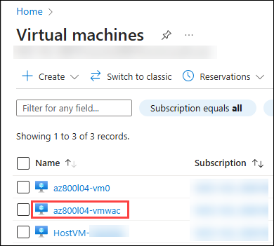

1. Under the **Connect (1)** section, select **Connect (2)** and then select **Download RDP file (3)**.

   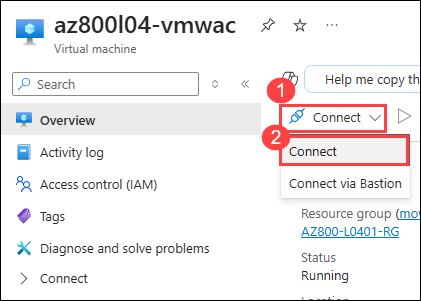

   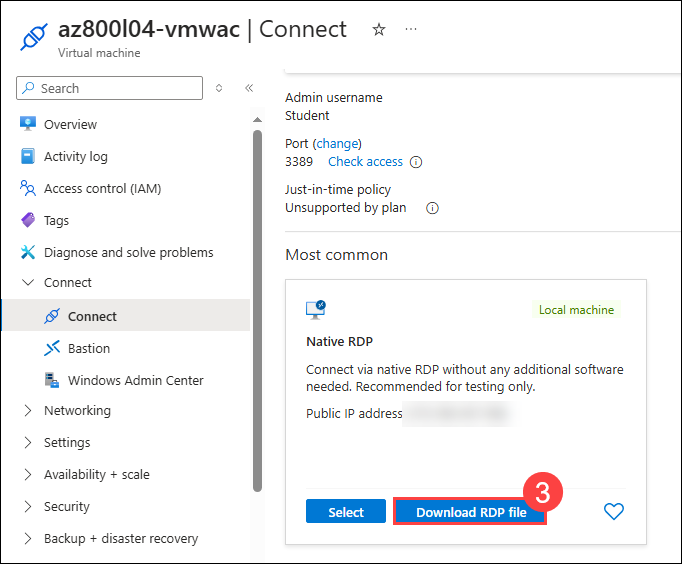

1. When prompted, use the below credentials

    - Username - Student
    - Password - Pa55w.rd1234

1. Within the Remote Desktop session to **az800l04-vmwac** vm, select **Start**, and then select **Windows PowerShell (Admin)**.

1. In the **Windows PowerShell** console, enter the following command, and then press Enter to download the latest version of Windows Admin Center:
	
   ```powershell
   Start-BitsTransfer -Source https://aka.ms/WACDownload -Destination "$env:USERPROFILE\Downloads\WindowsAdminCenter.exe"
   ```
1. Open a file explorer, navigate to the **Downloads** folder, and run the **WindowsAdminCenter.exe** file. This will start the **Windows Admin Center (v2) Installer** wizard.

1. On the **Welcome to the Windows Admin Center setup wizard** page, select **Next**.

   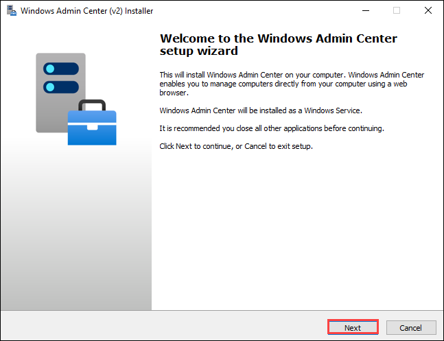

1. On the **License Terms and Privacy Statement** page, **accept the terms (1)** and select **Next (2)**.

   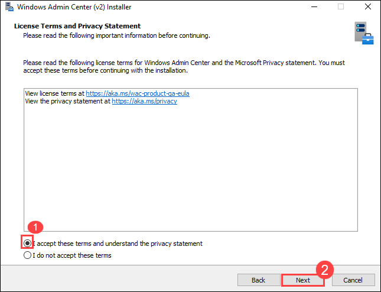

1. On the **Select installation mode** page, ensure **Express setup (1)** is selected, and select **Next (2)**.

   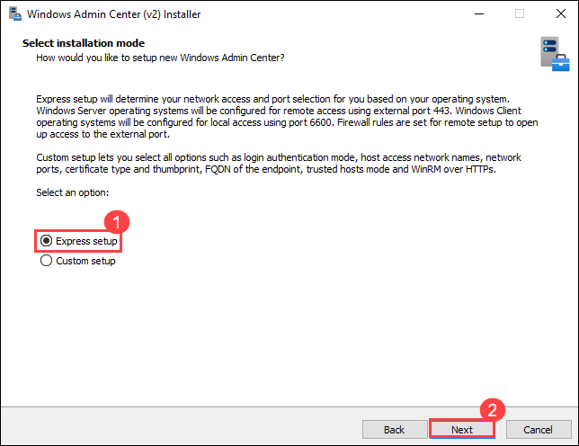

1. On the **Select TLS certificate** page, ensure **Generate a self-signed certificate (expires in 60 days) (1)** is selected, and select **Next (2)**.

   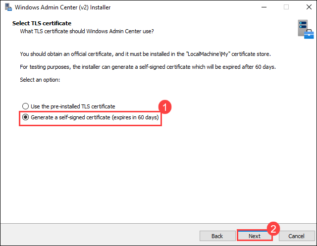

1. On the **Automatic updates** page, select **Notify me of available updates without downloading or installing them (1)**, and select **Next (2)**.

   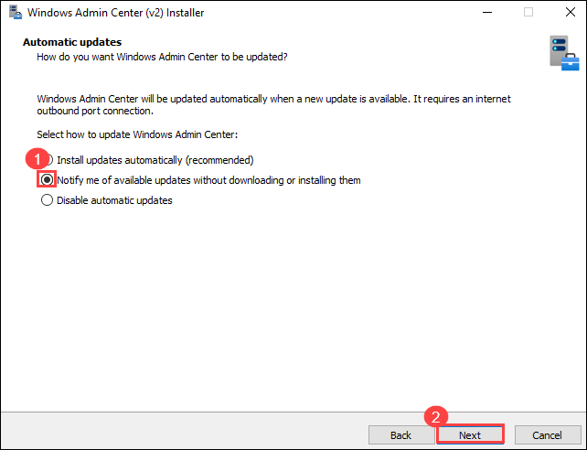

1. On the **Send diagnostic data to Microsoft** page, ensure **Required diagnostic data (1)** is selected, and select **Next (2)**.

   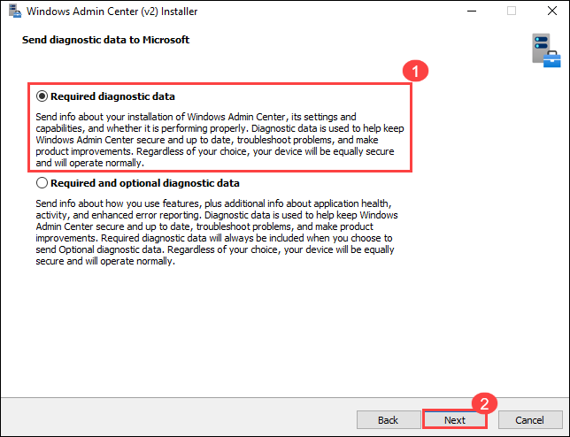

1. Select **Install**, and when the installation is complete, ensure the **Start Windows Admin Center: `https://az800l04-vmwac:443`** box is selected, and select **Finish**.

   >**Note**: The installation may take up to 5 minutes.

   

   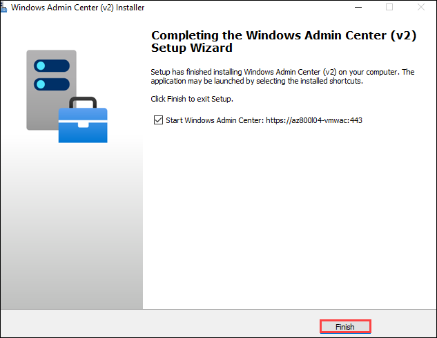   

## Exercise 4: Verifying functionality of the Windows Admin Center gateway in Azure

In this exercise, you will verify functionality of the WAC gateway in Azure.

### Task 1: Connect to the Windows Admin Center gateway running in Azure VM

In this task, you will connect to the WAC gateway running in Azure VM.

1. On **SEA-ADM1**, on the **az800l04-vmwac** page, select the **Overview** entry on the left menu and copy the **DNS Name**.

1. On **SEA-ADM1**, start Microsoft Edge and paste the **DNS Name** in the `https://` format.

1. In Microsoft Edge window, disregard the message **Your connection isn't private**, select **Advanced**, and then select the link starting with the text **Continue to**.

     

1. When prompted, in the **Sign in to access this site** dialog box, sign in with the below credentials

    - Username - Student
    - Password - Pa55w.rd1234

   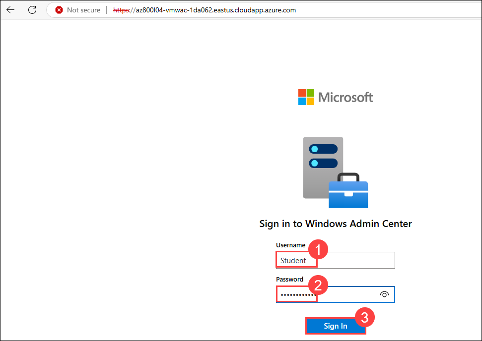  

1. On the **All connections** page of Windows Admin Center, select **az800l04-vmwac [Gateway]**.

1. Examine the Overview pane of Windows Admin Center.

   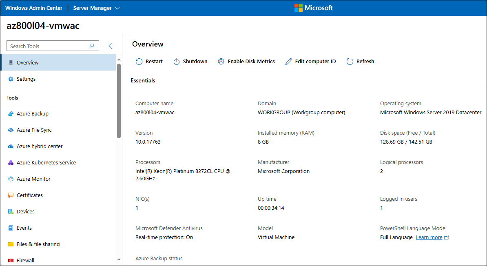  

### Task 2: Enable PowerShell Remoting on an Azure VM

In this task, you will enable powershell remoting on an Azure VM.

1. On **SEA-ADM1**, switch to the Microsoft Edge window displaying the Azure portal, and then, in the **Search resources, services, and docs** text box in the toolbar, search for and select **Virtual machines**.
1. On the **Virtual machines** page, select **az800l04-vm0 (1)**.
1. On the **az800l04-vm0** page, in the **Operations** section, select **Run command (2)**, and then select **RunPowerShellScript (3)**.

   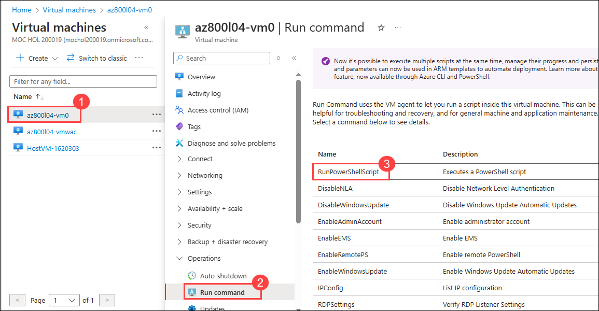  

1. If Windows Remote Management is disabled, on the **Run Command Script** page, in the **PowerShell Script** section, enter the following command (1), and then select **Run (2)** to enable it.

   ```powershell
   winrm quickconfig -quiet
   ```
   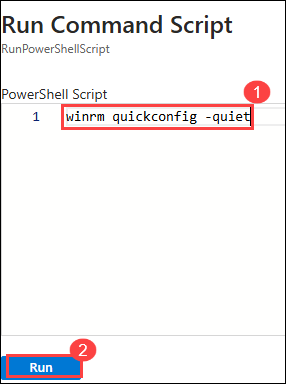 

1. In the **PowerShell Script** section, replace the text you entered in the previous step with the following command, and then select **Run** to open the Windows Remote Management inbound port:

   ```powershell
   Set-NetFirewallRule -Name WINRM-HTTP-In-TCP-PUBLIC -RemoteAddress Any
   ```

1. In the **PowerShell Script** section, replace the text you entered in the previous step with the following command, and then select **Run** to enable PowerShell Remoting:

   ```powershell
   Enable-PSRemoting -Force -SkipNetworkProfileCheck
   ```

### Task 3: Connect to an Azure VM by using the Windows Admin Center gateway running in Azure VM

In this task, you will connect to an Azure VM using WAC gateway running in Azure VM.

1. On **SEA-ADM1**, in the Microsoft Edge window displaying the interface of the Windows Admin Center gateway running on the **az800l04-vmwac** Azure VM, select **Windows Admin Center**.

1. On the **All connections** page, select **+ Add (1)**.

1. On the **Add or create resources** page, in the **Servers** section, select **Add (2)**.

   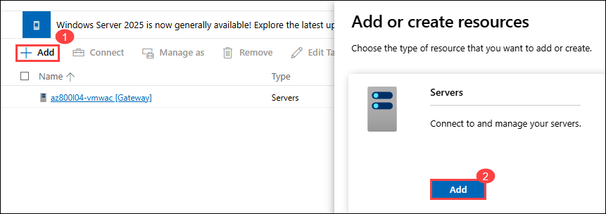 

1. In the **Server name** text box, enter **az800l04-vm0 (1)**. and click on **Add (2)**

   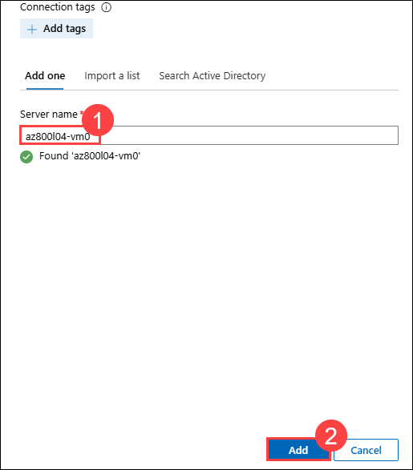 

1. In the list of connections, select **az800l04-vm0**

1. After successfully connecting to the Azure VM, examine the Overview pane of the **az800l04-vm0** Azure VM in Windows Admin Center.

   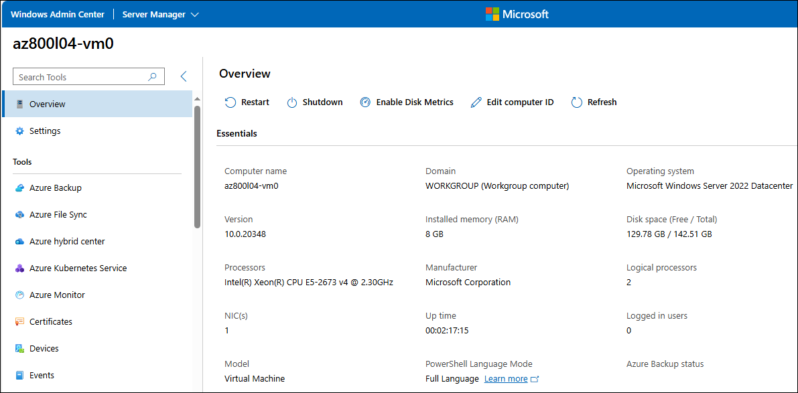 

### Review

In this lab, you have completed:

- Provisioning Azure VMs running Windows Server
- Implementing hybrid connectivity by using the Azure Network Adapter
- Deploying Windows Admin Center gateway in Azure
- Verifying functionality of the Windows Admin Center gateway in Azure

 ## You have successfully completed this lab
