# Lab 05: Implementing and configuring virtualization in Windows Server

In this Hands-On-Lab, you will learn how to implement and configure virtualization in Windows Server. You will set up and manage Hyper-V, create and configure virtual machines, and optimize virtual environments to improve performance and security.

## Lab scenario

Contoso is a global engineering and manufacturing company with its head office in Seattle, USA. An IT office and data center are in Seattle to support the Seattle location and other locations. Contoso recently deployed a Windows Server server and client infrastructure. 

Because of many physical servers being currently underutilized, the company plans to expand virtualization to optimize the environment. Because of this, you decide to perform a proof of concept to validate how Hyper-V can be used to manage a virtual machine environment. Also, the Contoso DevOps team wants to explore container technology to determine whether they can help reduce deployment times for new applications and to simplify moving applications to the cloud. You plan to work with the team to evaluate Windows Server containers and to consider providing Internet Information Services (Web services) in a container.

**Note:** An **[interactive lab simulation](https://mslabs.cloudguides.com/guides/AZ-800%20Lab%20Simulation%20-%20Implementing%20and%20configuring%20virtualization%20in%20Windows%20Server)** is available that allows you to click through this lab at your own pace. You may find slight differences between the interactive simulation and the hosted lab, but the core concepts and ideas being demonstrated are the same. 

## Lab objectives

In this lab, you will perform:

- Exercise 1: Creating and configuring VMs.
- Exercise 2: Installing and configuring containers.

## Estimated time: 60 minutes

## Architecture Diagram

     

## Exercise 1: Creating and configuring VMs
In this exercise, you will install and configure the Hyper-V role on a Windows Server. You will ensure that the required hardware and software prerequisites are met and verify that Hyper-V is running correctly.

### Task 1: Create a Hyper-V virtual switch
In this task, you will install the Hyper-V role on a Windows Server machine using Server Manager and PowerShell.

1. Connect to **SEA-ADM1** and, if needed, sign in as **CONTOSO\Administrator** with a password of **Pa55w.rd**.

1. On **SEA-ADM1**, select **Start (1)**, and then select **Server Manager (2)**.

    

1. In Server Manager, select **All Servers (1)**.

   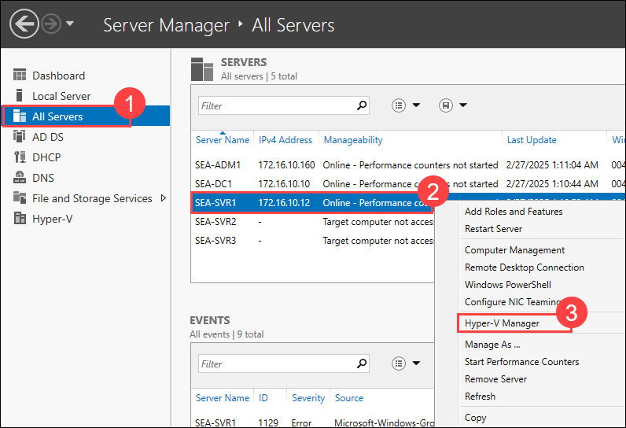 

1. In the Servers list, select the **SEA-SVR1 (2)** entry, display its context menu, right click and select **Hyper-V Manager (3)**.

1. In Hyper-V Manager, ensure that **SEA-SVR1.CONTOSO.COM (1)** is selected.

   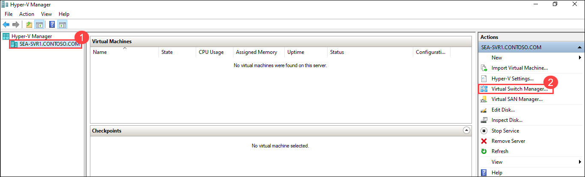 

1. In the Actions pane, select **Virtual Switch Manager (2)**.

1. In the **Virtual Switch Manager**, in the **Create virtual switch** pane, select **Private (1)**, and then select **Create Virtual Switch (2)**.

   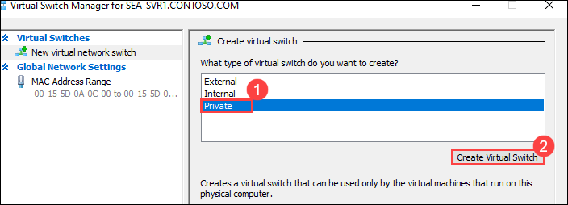 

1. In the **Virtual Switch Properties** box, specify the following settings, and then select **OK (3)**:

   - Name: **Contoso Private Switch (1)**
   - Connection type: **Private network (2)**

   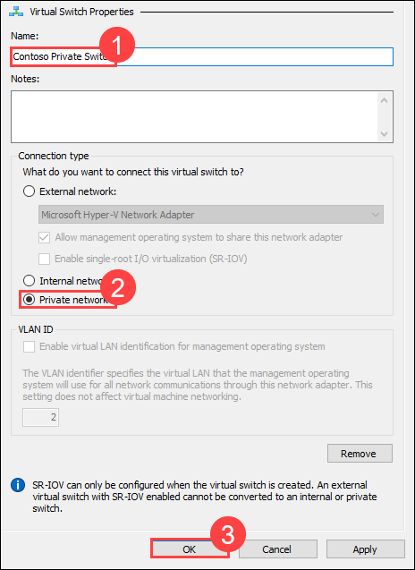 

### Task 2: Create a virtual hard disk
In this task, you will configure essential Hyper-V settings, including virtual switch configuration, VM storage locations, and resource allocation.

1. On **SEA-ADM1**, in Hyper-V Manager connected to **SEA-SVR1**, under **Action (1)** pane, select **New (2)**, and then select **Hard Disk (3)**. The **New Virtual Hard Disk Wizard** starts.

   

1. On the **Before You Begin** page, select **Next >**.

   

1. On the **Choose Disk Format** page, select **VHD (1)** and then select **Next > (2)**.

   

1. On the **Choose Disk Type** page, select **Differencing (1)**, and then select **Next > (2)**.

   

1. On the **Specify Name and Location** page, specify the following settings, and then select **Next > (3)**:

   - Name: **SEA-VM1 (1)**
   - Location: **C:\Base (2)**

   

1. On the **Configure Disk** page, in the **Location** box, enter **C:\Base\BaseImage.vhd (1)**, and then select **Next > (2)**.

   

1. On the **Summary** page, select **Finish**.

    

### Task 3: Create a virtual machine
In this task, you will create a new virtual machine using Hyper-V Manager and PowerShell, selecting appropriate hardware and storage configurations.

1. On **SEA-ADM1**, in Hyper-V Manager,under **Action (1)** pane, select **New (2)**, and then select **Virtual Machine (3)**. The **New Virtual Machine Wizard** starts.

   

1. On the **Before You Begin** page, select **Next >**.

   

1. On the **Specify Name and Location** page, enter **SEA-VM1 (1)**, and then select the check box next to **Store the virtual machine in a different location (2)**.

1. In the **Location** box, enter **C:\Base (3)**, and then select **Next > (4)**.

   

1. On the **Specify Generation** page, select **Generation 1 (1)**, and then select **Next > (2)**.

   

1. On the **Assign Memory** page, enter **4096 (1)**, and then select **Next > (2)**.

   

1. On the **Configure Networking** page, select the Connection drop-down menu, select **Contoso Private Switch (1)**, and then select **Next > (2)**.

   

1. On the **Connect Virtual Hard Disk** page, select **Use an existing virtual hard disk (1)**, and then select **Browse (2)**.

   

1. Browse to **C:\Base**, select **SEA-VM1.vhd (1)**, select **Open (2)**, and then select **Next >**.

   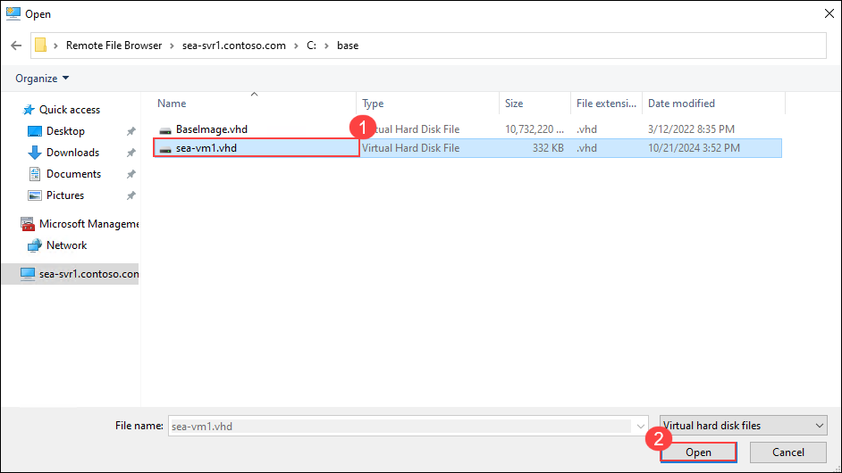

   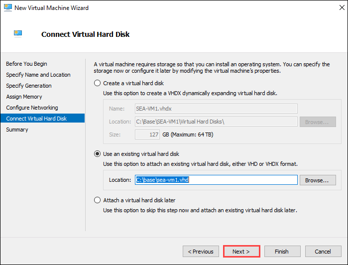

1. On the **Summary** page, select **Finish**. Notice that **SEA-VM1** displays in the Virtual Machines list.

   

   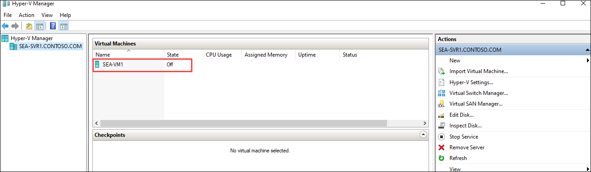

1. Select **SEA-VM1 (1)**, and then in the Actions pane, under **SEA-VM1**, select **Settings (2)**.

   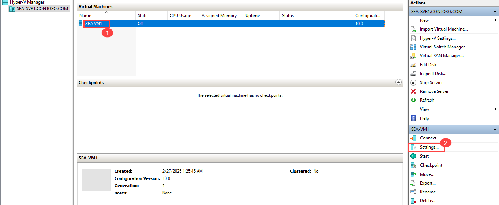

1. In the **Hardware** list, select **Memory**.

   

1. In the **Dynamic Memory** section, select the check box next to **Enable Dynamic Memory (1)**. Next to **Maximum RAM**, enter **4096 (2)**, and then select **OK (3)**.

   

1. Close Hyper-V Manager.

### Task 4: Manage Virtual Machines using Windows Admin Center

In this task, you will manage virtual machines using Windows Admin Center

1. On **SEA-ADM1**, start Microsoft Edge, and then browse to `https://SEA-ADM1.contoso.com`.
 
   >**Note**: If you get **NET::ERR_CERT_DATE_INVALID** error, select **Advanced** on the Edge browser page, at the bottom of page select **Continue to sea-adm1-contoso.com (unsafe)**.

   
   
1. If prompted, in the **Windows Security** dialog box, enter the following credentials, and then select **OK (3)**:

   - Username: **CONTOSO\Administrator (1)**
   - Password: **Pa55w.rd (2)**

   

1. In the All connections pane, select **+ Add (1)**.

   

1. In the Add or create resources pane, on the **Servers** tile, select **Add (2)**.

1. In the **Server name** text box, enter **sea-svr1.contoso.com** (1) and click on **Add** (2).  

   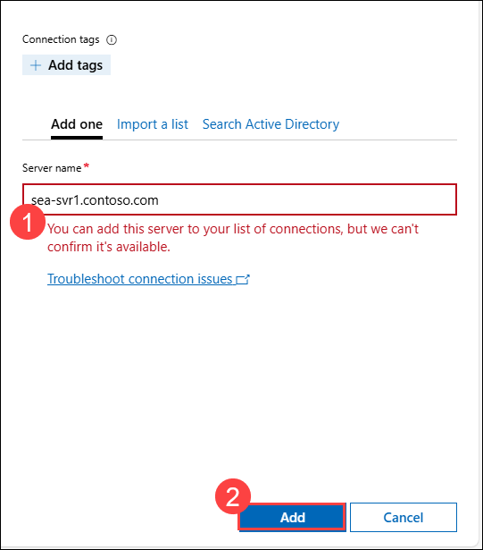  

   > **Note**: While performing above step, if you see an error message stating, **"You can add this server to your list of connections, but we can't confirm it's available."**, select **Add**.  

   - In the **All Connections** pane, select **sea-svr1.contoso.com** (1) and then click on **Manage as** (2).  
   - In the **Specify your credentials** dialog box:  
     - Ensure that **Use another account for this connection** (3) is selected.  
     - Enter the Administrator credentials:  
       - **Username**: **CONTOSO\Administrator** (4)  
       - **Password**: **Pa55w.rd** (5)  
     - Check the **Use this credential for all connections** checkbox (6).  
     - Click **Continue** (7).  

   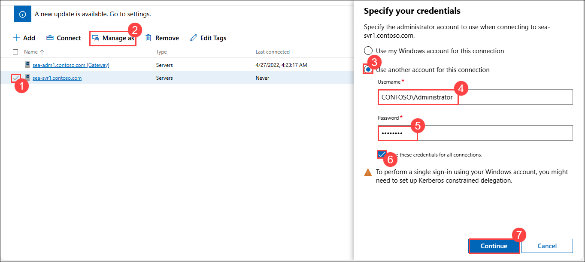

1. Select **sea-svr1.contoso.com**, from the left navigation menu, in the **Tools** list, select **Virtual machines (1)**, select the **Summary (2)** tab, and then review its content.

   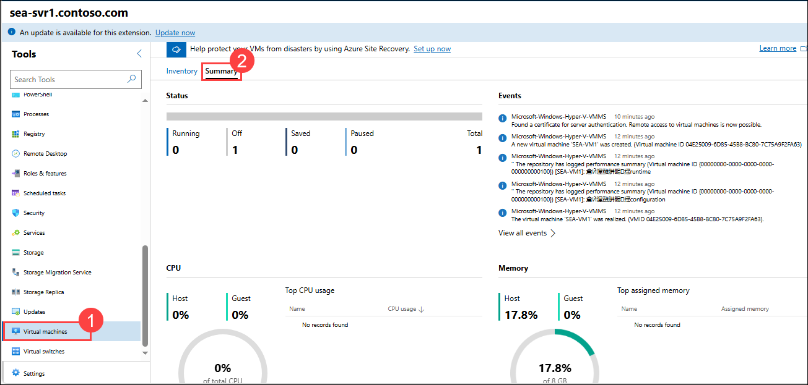

1. Select the **Inventory (1)** tab and verify that it contains **SEA-VM1(2)**.

   

1.  Select **SEA-VM1** and review its Properties pane.

    

1. Select **Settings**, and then select **Disks (1)**.

1. Scroll to the bottom of the pane and select **+ Add disk (2)**.

   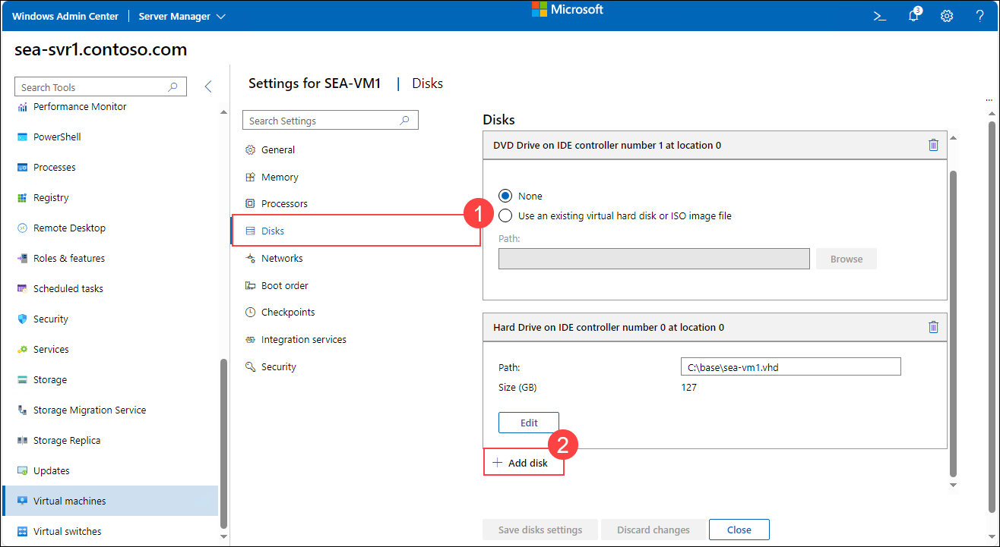

1. Select **New Virtual Hard Disk**.

1. On the **New Virtual Hard Disk** pane,Change the disk type to **fixed size(1)** and in the **Size (GB)** text box, type **5**(2) , leave other settings with their default values, and then select **Create (3)**.

   

1. Select **Save disks settings**, and then select **Close**.

    >**Note:** If you face an error as "Couldn't save disk settings", then updating the Windows admin center should resolve this issue. In the Windows admin center go to **Settings (1) > Updates (2) > Install Updates (3)**

     >   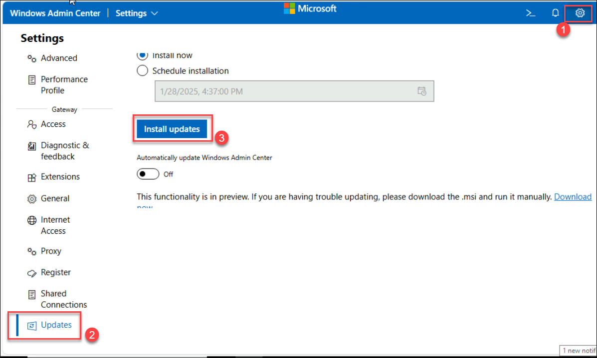

1. Back on the **Inventory** page, select **SEA-VM1**.

1. On the **Properties** pane of **SEA-VM1**, select **Power**, and then select **Start** to start **SEA-VM1**.

   

1. Scroll down and display the statistics for the running VM.

1. Refresh the page, select **Power (1)**, select **Shut down (2)**, and then select **Yes (3)** to confirm.

   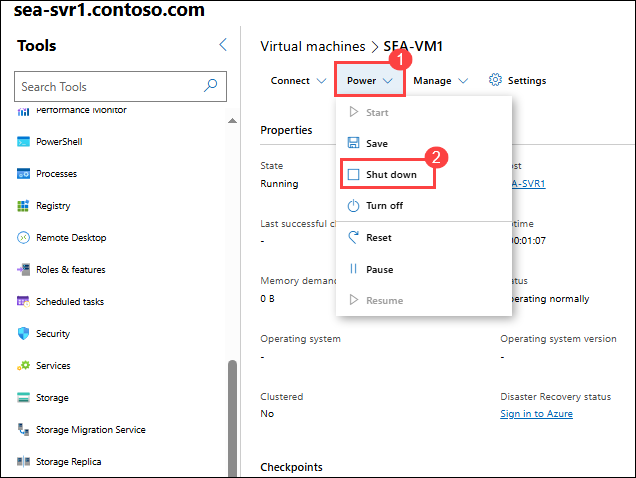

   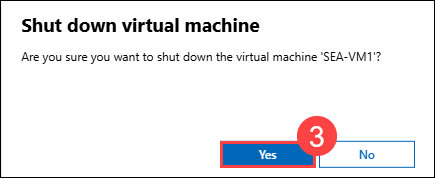

1. From the lefy navigation menu, in the **Tools** list, select **Virtual switches (1)** and identify the **existing switches (2)**.

   


## Exercise 2: Installing and configuring containers

In this Exercise, you will install and configure containers in the server machine.

### Task 1: Install Docker on Windows Server

In this task, you will install Docker on Windows Server machine

1. On **SEA-ADM1**, select **Start**, and then select **Windows PowerShell (Admin)**.

1. In the **Windows PowerShell** console, enter the following command to establish remote powershell session on SEA-SVR1:
   ```powershell
    Enter-PSSession -ComputerName SEA-SVR1
   ```
1. In the **Windows PowerShell** console, enter the following commands, and then press Enter to force the use of TLS 1.2 and install the PowerShellGet module:

   ```powershell
   [Net.ServicePointManager]::SecurityProtocol = [Net.ServicePointManager]::SecurityProtocol -bor [Net.SecurityProtocolType]::Tls12
   Install-PackageProvider -Name NuGet -Force
   ```
1. When prompted to install NuGet, press the **Y** key, and then press Enter.

   ```powershell
   Install-Module PowerShellGet -RequiredVersion 2.2.4 -SkipPublisherCheck
   ```
1. When prompted to confirm the installation of modules from an untrusted repository, press the **A** key, and then press Enter.

1. After the installation completes, enter the following command, and then press Enter to restart **SEA-SVR1**:

   ```powershell
   Restart-Computer -Force
   ```
1. After **SEA-SVR1** restarts, use the **PowerShell** tool again to establish a new PowerShell Remoting session to **SEA-SVR1**.

   ```powershell
    Enter-PSSession -ComputerName SEA-SVR1
   ```  
   
1. In the **Windows PowerShell** console, enter the following command, and then press Enter to install the Docker Microsoft PackageManagement provider on **SEA-SVR1**:

   ```powershell
   Install-Module -Name DockerProvider -Repository PSGallery -Force
   ```
1. At the NuGet Provider prompt, press the **Y** key, and then press Enter.
1. In the **Windows PowerShell** console, enter the following command, and then press Enter to install the Docker runtime on **SEA-SVR1**:

   ```powershell
   Install-Package -Name docker -ProviderName DockerProvider
   ```
1. When prompted to confirm, press the **A** key, and then press Enter.

1. After the installation completes, enter the following commands, and then press Enter to restart **SEA-SVR1**:

   ```powershell
   Restart-Computer -Force
   ```

### Task 2: Install and run a Windows container

In this task, you will install and run windows container inside server machine.


1. Wait for sometime until **SEA-SVR1** restarts, use the below PowerShell command again to establish a new PowerShell Remoting session to **SEA-SVR1**.
   
   ```powershell
    Enter-PSSession -ComputerName SEA-SVR1
   ```

1. In the **Windows PowerShell** console, enter the following command, and then press Enter to verify the installed version of Docker:

   ```powershell
   Get-Package -Name Docker -ProviderName DockerProvider
   ```
1. Enter the following command, and then press Enter to identify Docker images currently present on **SEA-SVR1**: 

   ```powershell
   docker images
   ```
   > **Note**: Verify that there are no images in the local repository store.

1. Enter the following command, and then press Enter to download a Servercore image containing an Internet Information Services (IIS) installation:

   ```powershell
   docker pull nanoserver/iis
   ```

   > **Note**: The time it takes to complete the download will depend on the available bandwidth of the network connection from the lab VM to the Microsoft container registry.

1. Enter the following command, and then press Enter to verify that the Docker image has been successfully downloaded:

   ```powershell
   docker images
   ```
1. Enter the following command, and then press Enter to launch a container based on the downloaded image:

   ```powershell
   docker run --isolation=hyperv -d -t --name nano -p 80:80 nanoserver/iis 
   ```

   > **Note**: The docker command starts a container in the Hyper-V isolation mode (which addresses any host operating system incompatibility issues) as a background service (`-d`) and configures networking such that port 80 of the container host maps to port 80 of the container. 

1. Enter the following command, and then press Enter to retrieve the IP address information of the container host:

   ```powershell
   ipconfig
   ```

   > **Note**: Identify the IPv4 address of the Ethernet adapter named vEthernet (nat). This is the address of the new container. Next, identify the IPv4 address of the Ethernet adapter named **Ethernet**. This is the IP address of the host (**SEA-SVR1**) and is set to **172.16.10.12**.

1. On **SEA-ADM1**, switch to the Microsoft Edge window, open another tab and go to **http://172.16.10.12**. Verify that the browser displays the default IIS page.

   

1. On **SEA-ADM1**, switch back to the PowerShell Remoting session to **SEA-SVR1**, and then, in the **Windows PowerShell** console, enter the following command, and then press Enter to list running containers:

   ```powershell
   docker ps
   ```
   > **Note**: This command provides information on the container that is currently running on **SEA-SVR1**. Record the container ID because you will use it to stop the container. 

1. Enter the following command, and then press Enter to stop the running container (replace the `<ContainerID>` placeholder with the container ID you identified in the previous step): 

   ```powershell
   docker stop <ContainerID>
   ```
1. Enter the following command, and then press Enter to verify that the container has stopped:

   ```powershell
   docker ps
   ```

### Task 3: Use Windows Admin Center to manage containers

In this task, you will use Windows Admin Center to manage containers.

1. On **SEA-ADM1**, in the Windows Admin Center, in the Tools menu of **sea-svr1.contoso.com**, select **Containers**. 

   >**Note:** If prompted to close the **PowerShell** session, select **Continue**.

1. In the Containers pane, browse through the **Overview**, **Containers**, **Images**, **Networks**, and **Volumes** tabs.

   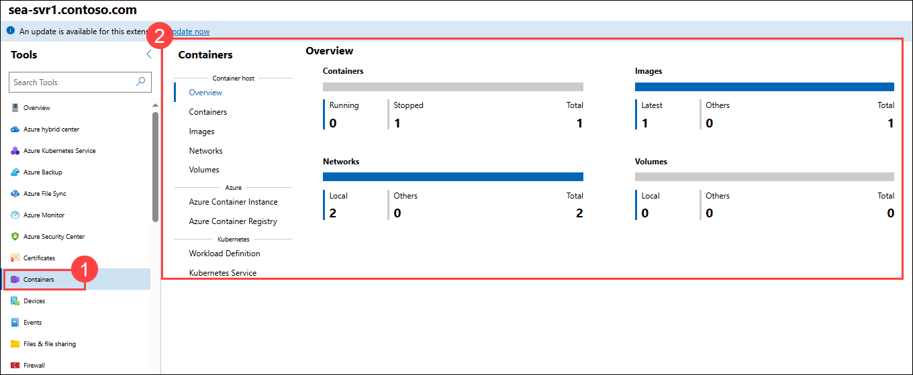

### Review
In this lab, you have completed:
- Create a Hyper-V virtual switch
- Create a virtual hard disk and virtual machine
- Manage virtual machines using Windows Admin Center
- Install Docker on Windows Server and run a Windows container
- Use Windows Admin Center to manage containers

### You have successfully completed the lab
