# Lab 06: Deploying and configuring Windows Server on Azure VMs

## Lab scenario

You need to address concerns regarding your current infrastructure. You have an outdated operational model, a limited use of automation, and Information Security team concerns regarding additional controls that should be applied to Azure VMs running Windows Server-based workloads. You have decided to develop and implement an automated deployment and configuration process for Azure VMs running Windows Server.

The process will involve Azure Resource Manager (ARM) templates and OS configuration through Azure VM extensions. It will also incorporate additional security protection mechanisms beyond those already applied to on-premises systems, such as application allow lists through AppLocker, file integrity checks, and adaptive network/DDoS protection. You will also leverage JIT functionality to restrict administrative access to Azure VMs to public IP address ranges associated with the London headquarters.

Your goal is to deploy and configure Azure VMs running Windows Server in the manner that satisfies manageability and security requirements.

## Lab objectives

In this lab, you will perform:

- Author ARM templates for an Azure VM deployment
- Modify ARM templates to include VM extension-based configuration
- Deploy Azure VMs running Windows Server by using ARM templates
- Configure administrative access to Azure VMs running Windows Server
- Configure Windows Server security in Azure VMs

## Estimated time: 90 Minutes

## Architecture Diagram

     

## Exercise 1: Authoring Azure Resource Manager (ARM) templates for Azure VM deployment

### Task 1: Connect to your Azure subscription and enable enhanced security of Microsoft Defender for Cloud

In this task, you will connect to your Azure subscription and enable enhanced security features of Microsoft Defender for Cloud.

1. On the **HOSTVM dropdown menu (1)**, select **SEA-ADM1 (2)** to connect to the administrator VM.  

    

1. On the **SEA-ADM1 login screen**, sign in as **CONTOSO\Administrator** with the password **Pa55w.rd**.  

    

1. On **SEA-ADM1**, start Microsoft Edge, go to the [Azure portal](https://portal.azure.com).

1. In the **Sign in** dialog box, copy and paste  **Email/Username (1)**: <inject key="AzureAdUserEmail"></inject> and then select **Next (2)**.

   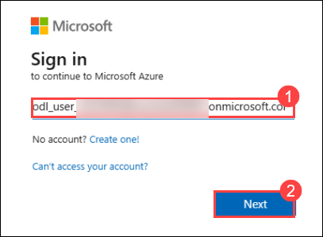

1. In the **Enter password** dialog box, copy and paste **Password (1)**: <inject key="AzureAdUserPassword"></inject> and then select **Sign in (2)**.

   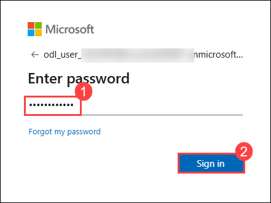

1. If you see the pop-up **Action Required**, click **Ask Later**.

    

   >**Note:** Please follow the steps outlined on page 1 to set up MFA if the **Ask Later** option is not visible. Once MFA setup is complete, please enter the number displayed on the screen in the Authenticator app and proceed. 

1. On the **Stay signed in?** dialog box, select the Don’t show this again check box and then select **No**.

    

   >**Note:** Skip the remaining steps in this task and proceed directly to the next one if you have already enabled Microsoft Defender for Cloud in your Azure subscription.

3. In the Azure portal, in the **Search resources, services, and docs** text box, on the toolbar, search for and select **Microsoft Defender for Cloud**.

   

4. On the **Microsoft Defender for Cloud \| Getting started** page, select **Upgrade**.

   >**Note**: Your subscription may already have the enhanced security of Defender for Cloud enabled, in which case there is no need to upgrade, and you can continue on to the next task.

### Task 2: Generate an ARM template and parameters files by using the Azure portal

In this task, you will use the Azure portal to create resource groups and create a disk in the resource group.

1. On **SEA-ADM1**, in the Azure portal, in the **Search resources, services, and docs** text box, on the toolbar, search for **Virtual machines (1)** and select **Virtual machines (2)** from services.

   

1. In the **Virtual machines** page, select **+ Create (1)**, and then select **Virtual machine (2)**.

   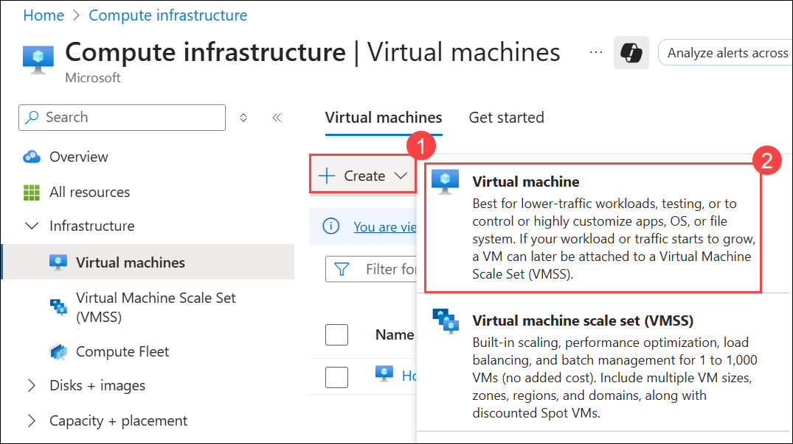

1. In the **Create a virtual machine** page, on the **Basics** tab, specify the following settings and leave all other settings with their default values, but do not deploy it:

   |Setting|Value|
   |---|---|
   |Subscription|Leave the default subscription|
   |Resource group|select the resource group **AZ800-L0601-RG (1)** from the drop-down|
   |Virtual machine name|**az800l06-vm0 (2)**|
   |Region|Leave the default region **(3)**|
   |Availability options|No infrastructure redundancy required **(4)**|
   |Security type|**Standard (5)**|
   |Image|**Windows Server 2022 Datacenter: Azure Edition - x64 Gen2 (6)**|
   |Run with Azure Spot discount|**No (7)**|
   |Size|**Standard_D2s_v3 (8)**|
   |Username|**Student** **(9)**|
   |Password|**Pa55w.rd1234** **(10)**|
   |Confirm Password|**Pa55w.rd1234** **(11)**|
   |Public inbound ports|None **(12)**|
   |Would you like to use an existing Windows Server license|Off **(13)**|

   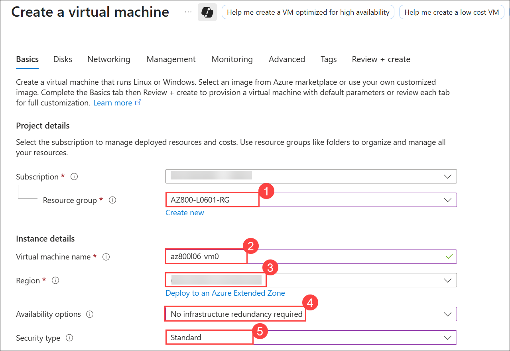

   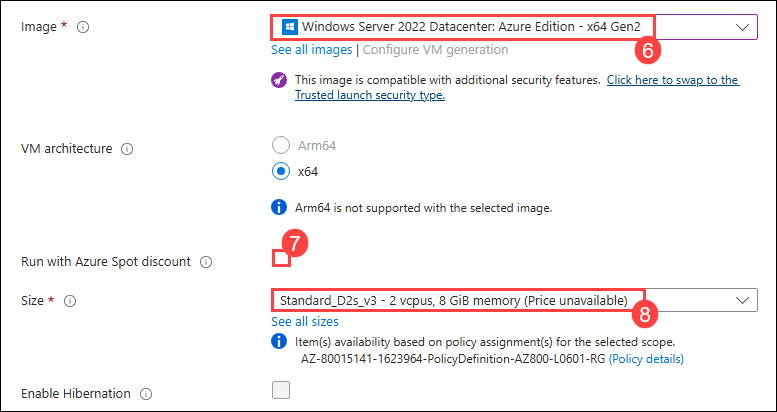

   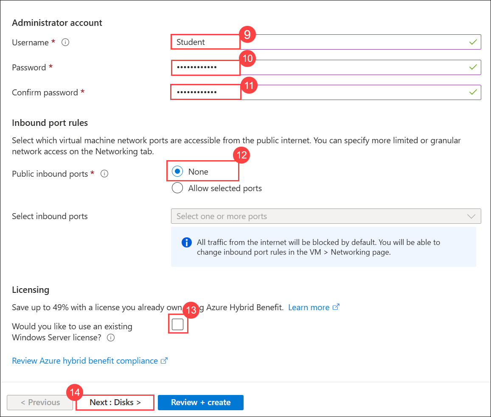

1. Select **Next: Disks > (14)**, and then on the **Create a virtual machine** page, on the **Disks** tab, specify the following settings, leaving all other settings with their default values:

   |Setting|Value|
   |---|---|
   |OS disk type|**Standard HDD (1)**|

   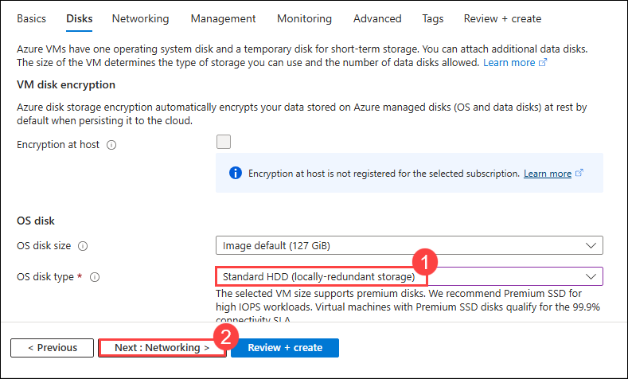

1. Select **Next: Networking > (2)**, and in the **Create a virtual machine** page, on the **Networking** tab, select the **Edit virtual network** hyper link that follows the **Virtual network** text box.

    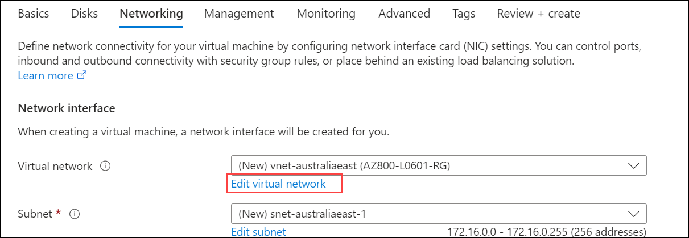

1. On the **Virtual network** page, specify the following settings, leaving all other settings with their default values, and then select **Save (7)**:

   - Enter **az800l06-vnet (1)** in the **Name** field.  
   - In the **Address range** field, specify **10.60.0.0/20 (2)**.  
   - Click the **Edit (3)** icon under Subnets.  
   - In the **Name** field, type **subnet0 (4)**.  
   - In the **Size** drop-down, select **/24 (256 addresses) (5)**.  
   - Click **Save (6)** on the subnet blade.  

     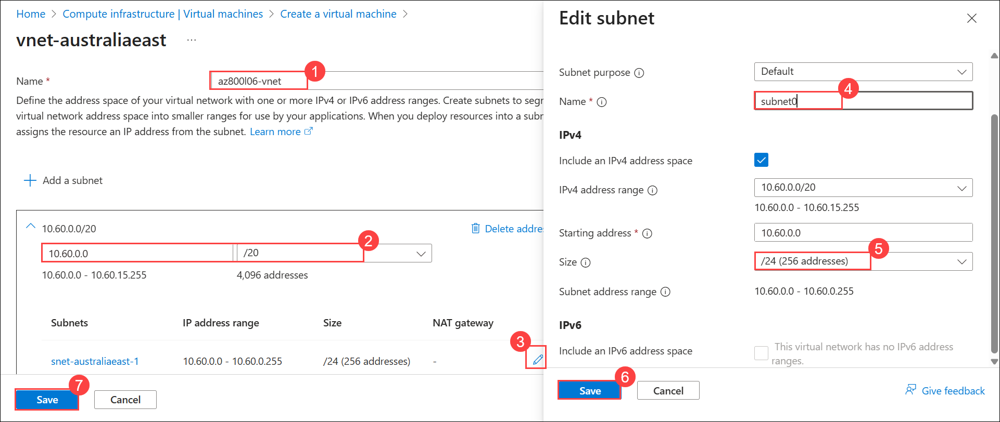

1. Back on the **Create a virtual machine** page, on the **Networking** tab, specify the following settings, leaving all other settings with their default values:

   |Setting|Value|
   |---|---|
   |Public IP|None **(1)**|
   |NIC network security group|None **(2)**|
   |Enable accelerated networking|Off **(3)**|
   |Load balancing options|None **(4)**| 

   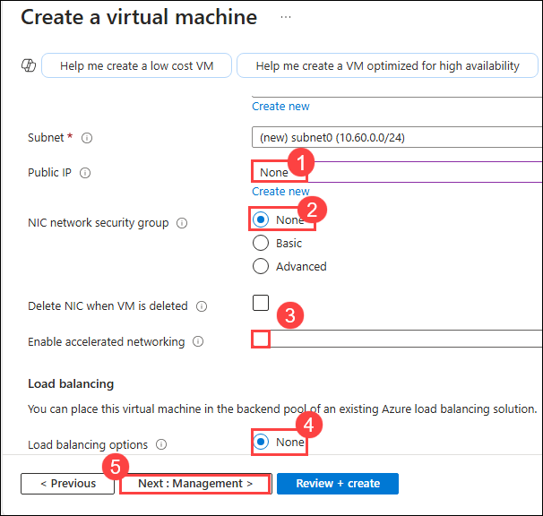

1. Select **Next: Management > (5)**, leaving all settings with their default values.

     

1. Select **Next: Monitoring >**, and on the **Create a virtual machine** page, on the **Monitoring** tab, specify the following settings, leaving all other settings with their default values:

   |Setting|Value|
   |---|---|
   |Boot diagnostics|**Enable with managed storage account (recommended) (1)**|

   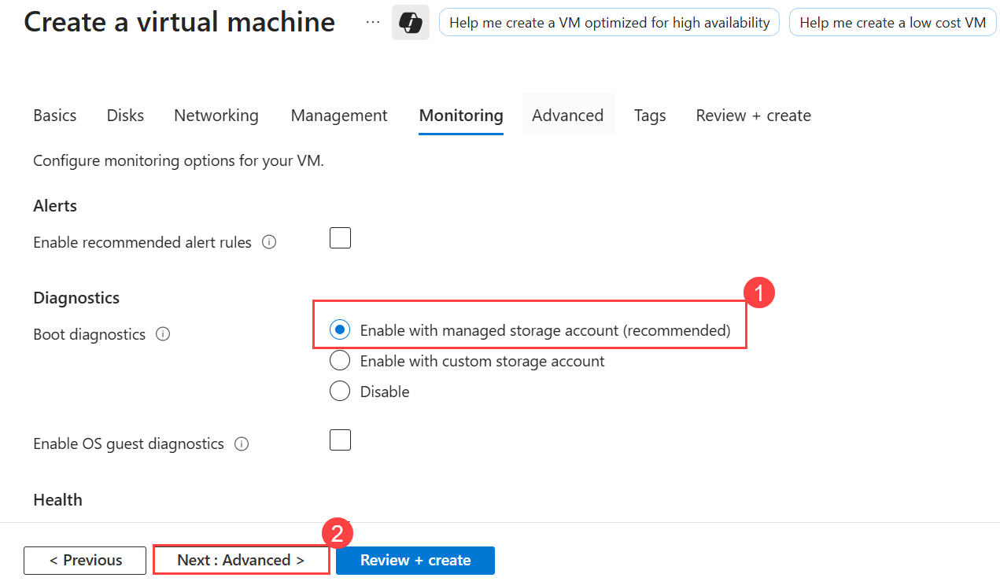 
   
1. Select **Next: Advanced > (2)**, on the **Advanced** tab of the **Create a virtual machine** page, review the available settings without modifying any of them, and then select **Review + create**.

   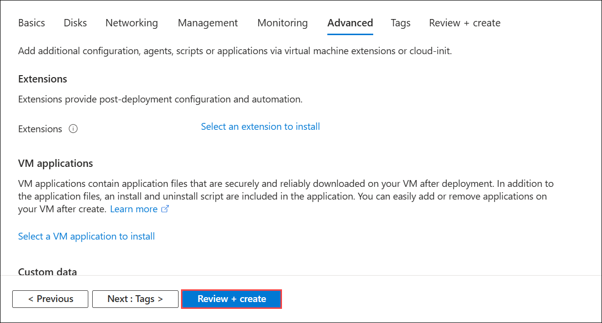

1. **Do not click** on **Create**

   >**Note**: Do not create the virtual machine. Instead, utilize the autogenerated template provided for this purpose.

### Task 3: Download the ARM template and parameters files from the Azure portal

1. In the Azure portal, on the **Create a virtual machine** page, select **Download a template for automation** from the bottom right corner.

    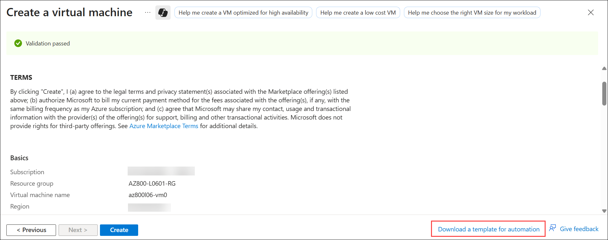

1. On the **Template** page, select **Download**.

    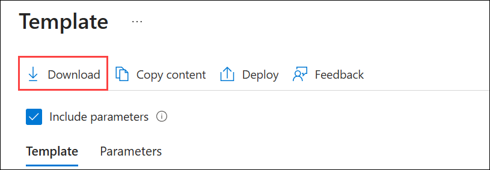

1. Select the ellipsis button next to the **template.zip**, and then in the pop-up menu, select **Show in folder**. This will automatically open File Explorer displaying the content of the **Downloads** folder.

1. In File Explorer, copy **template.zip** to the **C:\Labfiles\AZ-800-Administering-Windows-Server-Hybrid-Core-Infrastructure-master\Allfiles\Labfiles\Lab06** folder on **SEA-ADM1** (create a new folder **Lab06** if needed).

1. From the **Template** page, browse back to the **Create a virtual machine** page, and close it without completing the deployment.

## Exercise 2: Modifying ARM templates to include VM extension-based configuration

### Task 1: Review the ARM template and parameters files for Azure VM deployment

1. On **SEA-ADM1**, start File Explorer, and then browse to the **C:\Labfiles\AZ-800-Administering-Windows-Server-Hybrid-Core-Infrastructure-master\Allfiles\Labfiles\Lab06** folder.

1. Extract the content of the **template.zip** file into the same folder.

   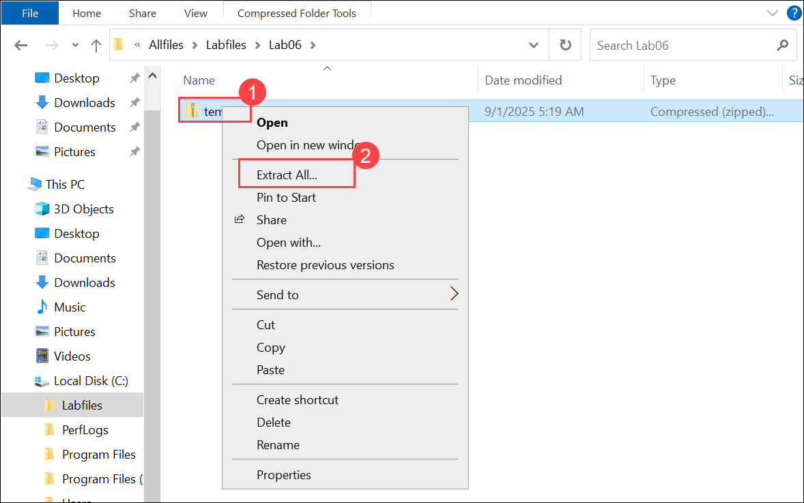

   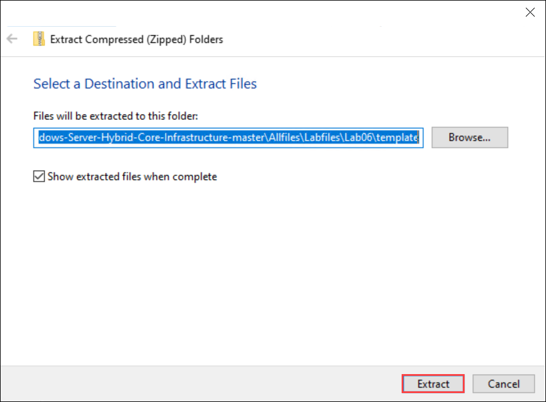

1. Open the **template.json (1)** file, select **Notepad (2)** as the editor, and click **OK (3)** to review its content. Keep the Notepad window open.  

   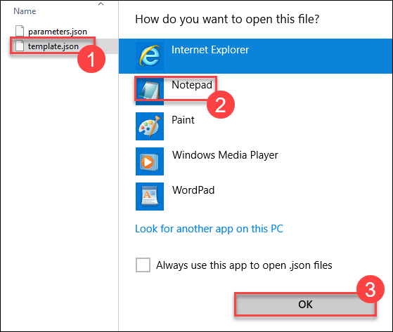

1. From File Explorer, open the **C:\Labfiles\AZ-800-Administering-Windows-Server-Hybrid-Core-Infrastructure-master\Allfiles\Labfiles\Lab06\\template\\parameters.json** file in Notepad and review its content.

1. Close the Notepad window displaying the **parameters.json** file.

### Task 2: Add an Azure VM extension section to the existing template

1. On **SEA-ADM1**, in the Notepad window displaying the content of the **template.json** file, insert the following code directly after the `    "resources": [` line):
   
   >**Note**: If you are using a tool that pastes the code in line by line, intellisense may add extra brackets causing validation errors. You may want to paste the code into notepad first and then paste it into the JSON file.

   ```json
   {
      "type": "Microsoft.Compute/virtualMachines/extensions",
      "name": "[concat(parameters('virtualMachineName'), '/customScriptExtension')]",
      "apiVersion": "2018-06-01",
      "location": "[resourceGroup().location]",
      "dependsOn": [
         "[concat('Microsoft.Compute/virtualMachines/', parameters('virtualMachineName'))]"
      ],
      "properties": {
         "publisher": "Microsoft.Compute",
         "type": "CustomScriptExtension",
         "typeHandlerVersion": "1.7",
         "autoUpgradeMinorVersion": true,
         "settings": {
               "commandToExecute": "powershell.exe Install-WindowsFeature -name Web-Server -IncludeManagementTools && powershell.exe remove-item 'C:\\inetpub\\wwwroot\\iisstart.htm' && powershell.exe Add-Content -Path 'C:\\inetpub\\wwwroot\\iisstart.htm' -Value $('Hello World from ' + $env:computername)"
         }
      }
   },
   ```

   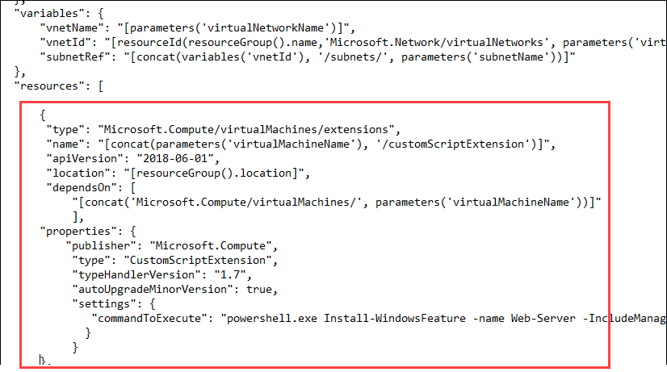

1. On the Notepad menu, click **File (1)**, select **Save (2)**, and then close the file.  

   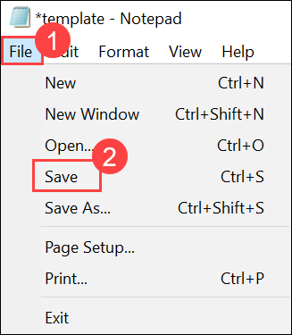

## Exercise 3: Deploying Azure VMs running Windows Server by using ARM templates

### Task 1: Deploy an Azure VM by using an ARM template

1. On **SEA-ADM1**, switch to the browser window displaying the Azure portal.

1. In the Azure portal, on the toolbar, in the **Search resources, services, and docs** text box, search **Deploy a Custom Template** and select **Deploy a custom template (2)** from the results.

   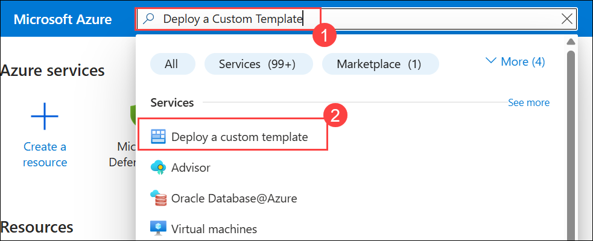

1. In the **Custom deployment** page, select **Build your own template in the editor**.

   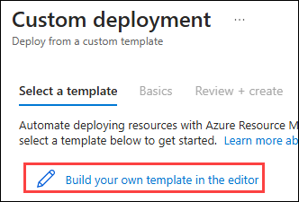

1. On the **Edit template** page, select **Load file**, upload the template file **template.json** that you edited in the previous exercise, and then select **Save**.

   

   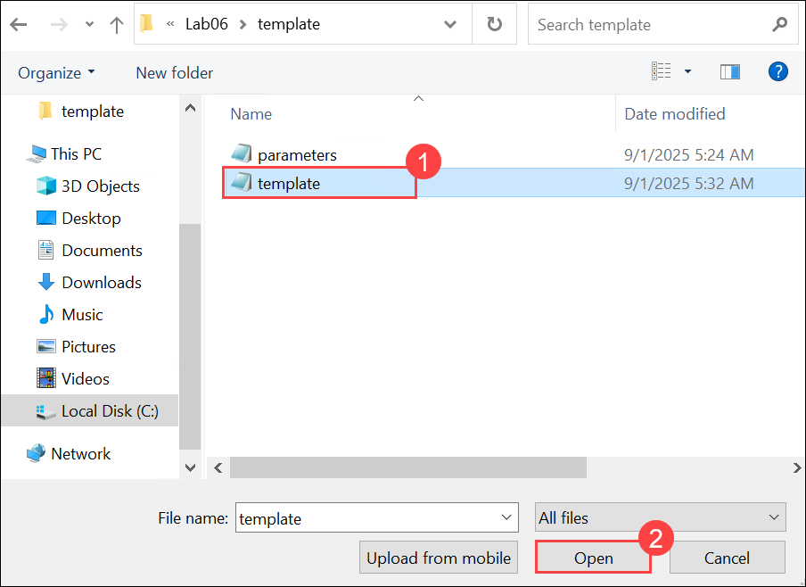

1. On the **Custom deployment** page, select **Edit parameters**.

   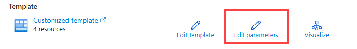

1. On the **Edit parameters** page, select **Load file**, upload the parameters file **parameters.json** that you reviewed in the previous exercise, and then select **Save**.

   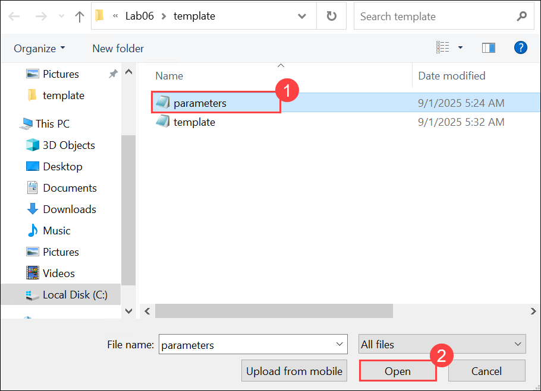

1. Back on the **Custom deployment** page, specify the following settings, and leave the other settings with their default values:

   |Setting|Value|
   |---|---|
   |Subscription|Leave the default value|
   |Resource group|Select **AZ800-L0601-RG (1)** resource group from the dropdown|
   |Region|Leave the default value|
   |Admin Password|**Pa55w.rd1234** **(2)**|

   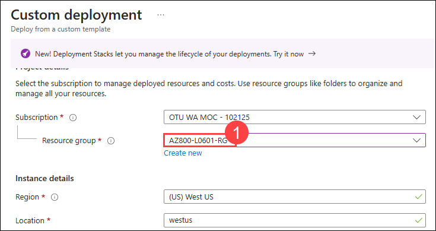

   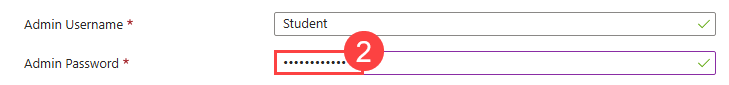

1. Select **Review + create**, and then select **Create**.

   

   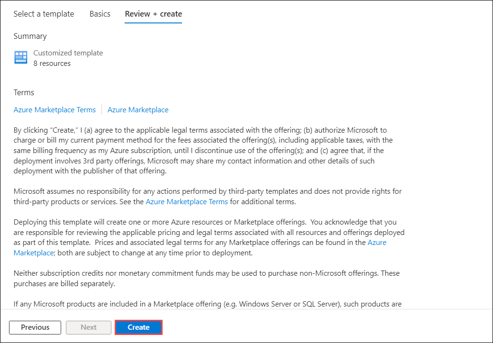

   >**Note**: The deployment might take about **10 minutes**.

1. Verify that the deployment completed successfully.

### Task 2: Review results of the Azure VM deployment

1. In the Azure portal, on the toolbar, in the **Search resources, services, and docs** text box, search for **Resource groups (1)** and select **Resource groups (2)** from the results.

    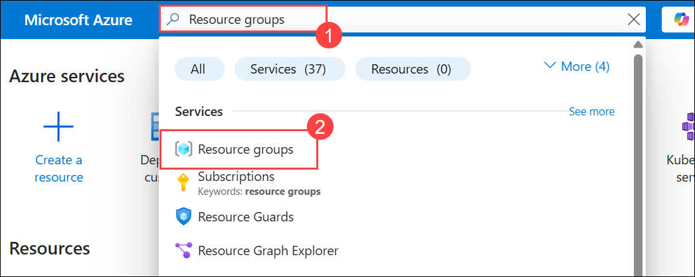

1. On the **Resource groups** page, select the **AZ800-L0601-RG** entry.

    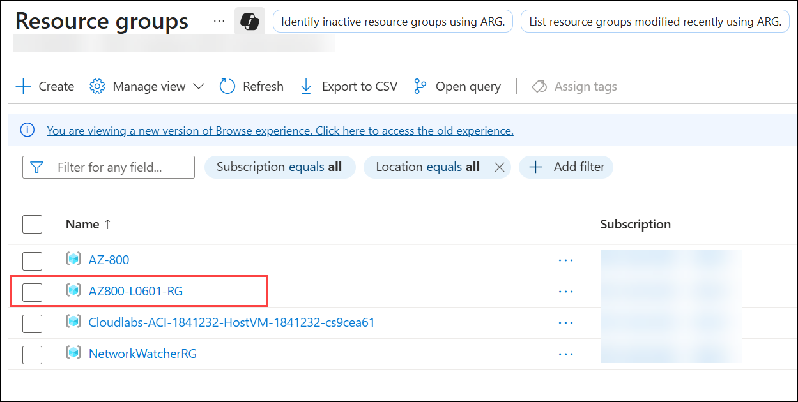

1. On the **AZ800-L0601-RG** page, on the **Overview** page, review the list of resources, including the Azure VM **az800l06-vm0**.

1. Within the list of resources, select the Azure VM **az800l06-vm0** entry. 

    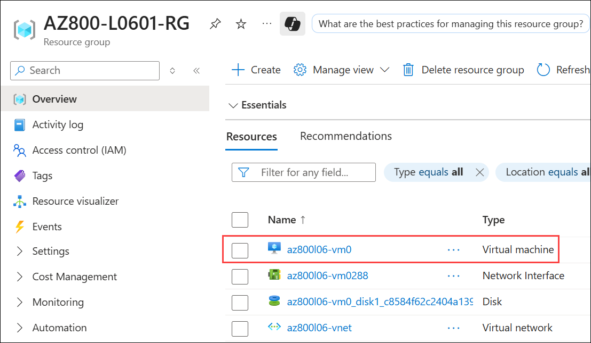

1. On the **az800l06-vm0** page, under **Settings (1)** section, select **Extensions + applications (2)**, and on the list of extensions, verify that the **customScriptExtension (3)** has been **provisioned successfully**.

    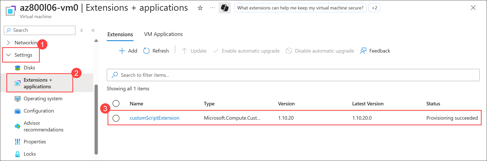

1. Browse back to the **AZ800-L0601-RG** page, and in the **Settings (1)** section, select **Deployments (2)**.

1. On the **AZ800-L0601-RG \| Deployments** page, select the **Microsoft.Template (3)** link.

   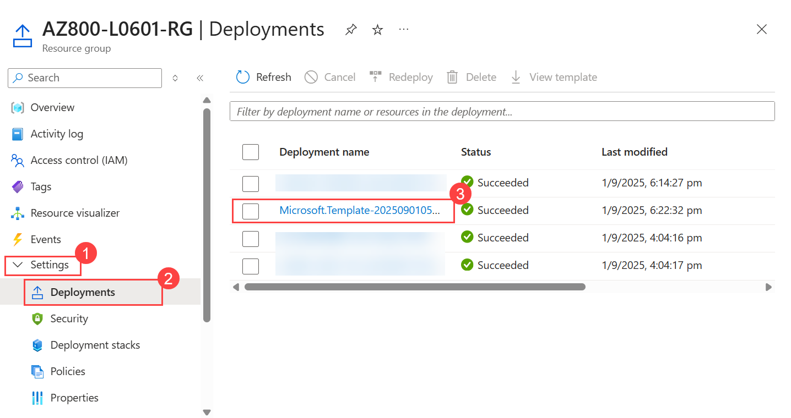

1. On the **Microsoft.Template \| Overview** page, select **Template**, and note that this is the same template you used for deployment.


> **Congratulations** on completing the task! Now, it's time to validate it. Here are the steps:
> - Hit the Validate button for the corresponding task. If you receive a success message, you can proceed to the next task. 
> - If not, carefully read the error message and retry the step, following the instructions in the lab guide.
> - If you need any assistance, please contact us at cloudlabs-support@spektrasystems.com. We are available 24/7 to help.

<validation step="b33341ed-9083-4c7b-83db-8ba4fab02d26" />
 
## Exercise 4: Configuring administrative access to Azure VMs running Windows Server

### Task 1: Verify the status of Azure Microsoft Defender for Cloud

1. In the Azure portal, on the toolbar, in the **Search resources, services, and docs** text box, search for and select **Microsoft Defender for Cloud**.

1. On the **Overview** page of Microsoft Defender for Cloud, on the vertical menu on the left side, in the **Management** section, select **Environment settings (1)**. 

1. On the **Environment settings** page, expand and select the entry representing your **Azure subscription (2)**.

    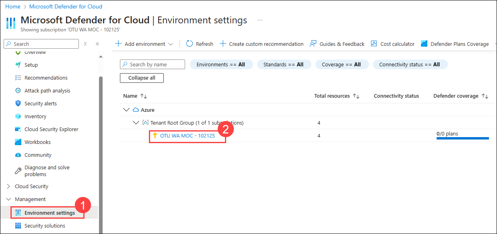

1. On the **Settings | Defender plans** page, ensure that the Servers plan is configured with **Microsoft Defender for Plan 2 (1)** and the status is set to **On** **(2)**. If not, update the pricing to Plan 2, enable the status by setting it to On, and then click **Save (3)**

    

### Task 2: Review the Just-in-time VM access settings

1. Browse back to the **Overview** page of Microsoft Defender for Cloud, and then, in the **Cloud Security (1)** section, select **Workload protections (2)**.

    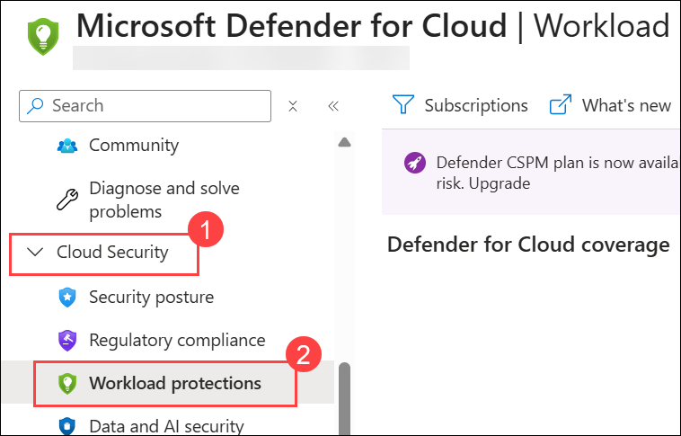

1. On the **Microsoft Defender for Cloud \| Workload protections** page, select **Just-in-time VM access**.

    

   >**Note**: If you see a pop-up to enable Microsoft Defender for cloud, please select the enable option and select **Upgrade** and refresh the page.

1. On the **Just-in-time VM access** page, review the **Configured**, **Not Configured**, and **Unsupported** tabs.

   >**Note**: If the newly created VM is not showing up in **Unsupported** tab, then it might take up to 24 hours for the newly deployed VM to appear on the **Unsupported** tab. Rather than wait, continue to the next exercise.

## Exercise 5: Configuring Windows Server security in Azure VMs

### Task 1: Create and configure an NSG

1. In the Azure portal, on the toolbar, in the **Search resources, services, and docs** text box, search for **Network security groups (1)** and select **Network security groups (2)** from results.

    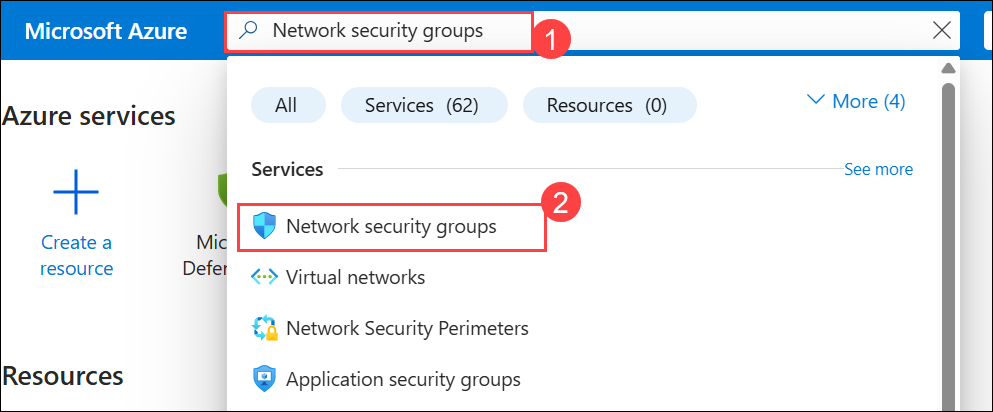

1. On the **Network security groups** page, select **+ Create**.

    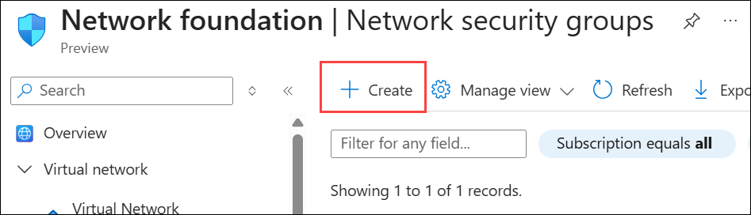

1. On the **Basics** tab of the **Create network security group** page, specify the following settings (leave others with their default values):

      |Setting|Value|
      |---|---|
      |Subscription|Leave the default value|
      |Resource group|Select **AZ800-L0601-RG (1)** resource group from drop down|
      |Name|**az800l06-vm0-nsg1 (2)**|
      |Region|the name of the Azure region into which you provisioned the Azure VM **az800l06-vm0**|

      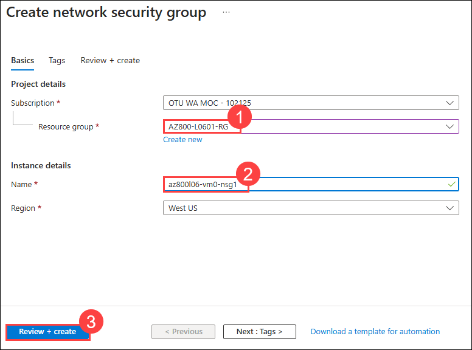

1. On the **Create network security group** page, on the **Basics** tab, select **Review + create (3)**, and then select **Create**.

    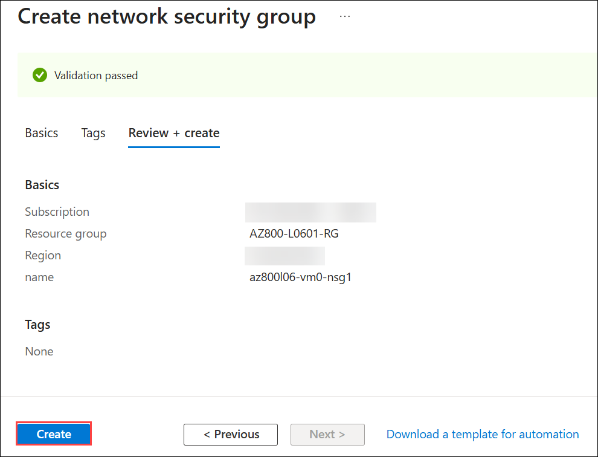

1. In the Azure portal, browse back to the **AZ800-L0601-RG** page, and then in the list of resources, select the entry representing the newly created network security group **az800l06-vm0-nsg1**.

    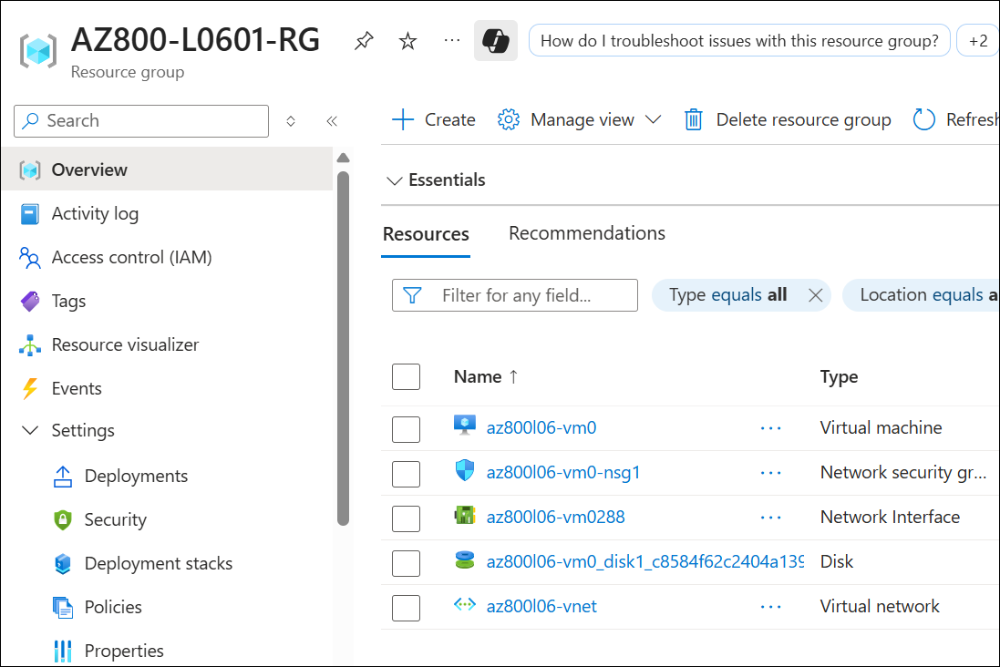

1. On the **az800l06-vm0-nsg1** page, review the listing of the default inbound and outbound security rules, and then in the **Settings** section, select **Inbound security rules**.

1. On the **az800l06-vm0-nsg1 \| Inbound security rules (1)** page, select **+ Add (2)**.

1. On the **Add inbound security rule** page, specify the following settings, leaving all others with their default values, and then select **Add (10)**:

      |Setting|Value|
      |---|---|
      |Source|**Any (3)**|
      |Source port ranges|* **(4)**|
      |Destination|**Any (5)**|
      |Service|**HTTP (6)**|
      |Action|**Allow (7)**|
      |Priority|**300 (8)**|
      |Name|**AllowHTTPInBound (9)**|

      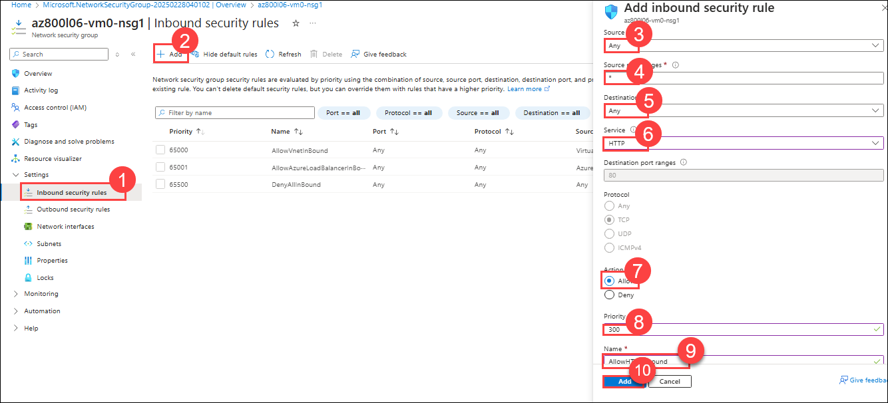

### Task 2: Configure Inbound HTTP access to an Azure VM

1. In the Azure portal, browse back to the **AZ800-L0601-RG** page, and then in the list of resources, select the entry representing the Azure VM **az800l06-vm0**.

    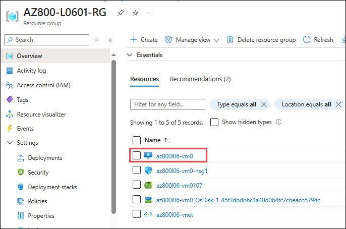

1. On the **az800l06-vm0** page, under **Networking** section select **Network settings (1)**.

1. On the **az800l06-vm0 \| Network settings** page, select the link designating the **network interface (2)** attached to **az800l06-vm0**.

    

1. On the page displaying the network interface properties, in the vertical menu on the left side, in the **Settings** section, select **Network security group**. 

1. On the **Network security group (1)** page, in the drop-down list, select **az800l06-vm0-nsg1 (2)**, and then select **Save (3)**.

    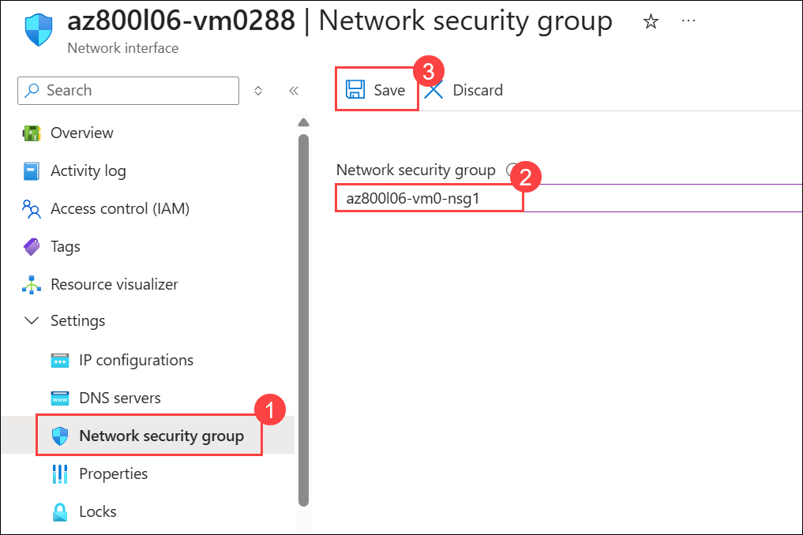

1. In the Azure portal, in the **Search resources, services, and docs** text box, on the toolbar, search for **Public IP addresses (1)** and select **Public IP addresses (2)** from results, click **Create**.

    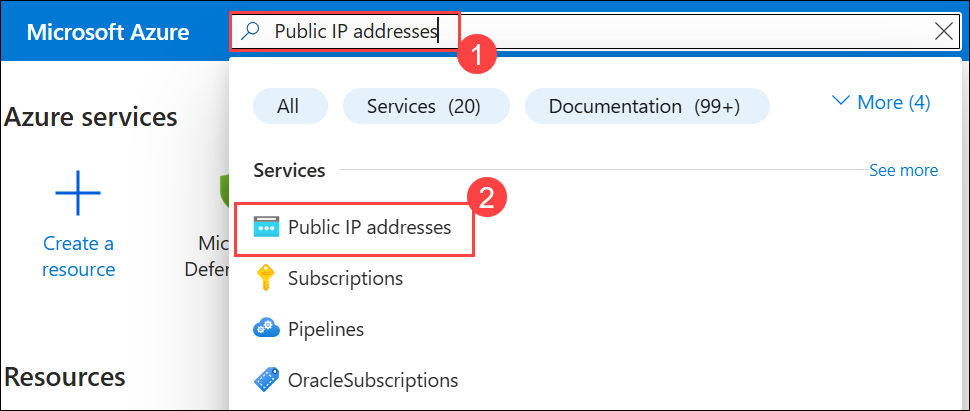

    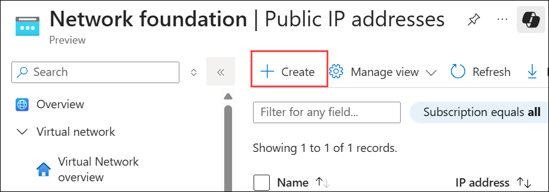

1. On Basis tab of create public ip address specify the following and select **Review + create (3)** and **Create**.
     
      |Setting|Value|
      |---|---|
      |Resource group|Select **A9Z800-L0601-RG (1)** resource group from the dropdown|
      |Name|**az800l06-vm0-pip1 (2)**|
      |SKU|**Standard**|

      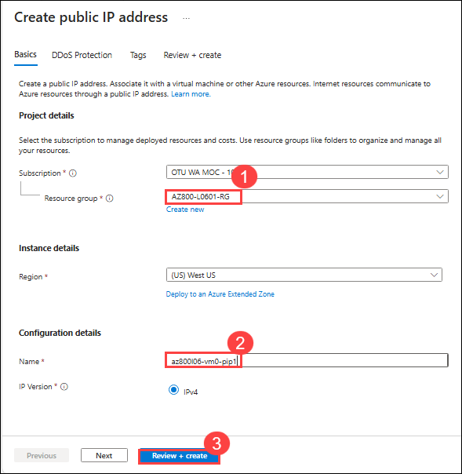
      
1. In the Azure portal, browse back to the **AZ800-L0601-RG** page, and then in the list of resources, select the entry representing the network interface, select **IP configurations (1)** under **Settings**, and then select the **ipconfig1 (2)** entry.

    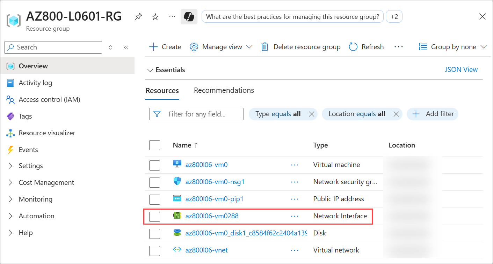

1. On the **Edit ip configuration** page, in the **Public IP address settings** section, select **Associate public ip address (3)**, and then, below the **Public IP address** drop-down list, select **az800l06-vm0-pip1 (4)** and click **Save (5)**.

    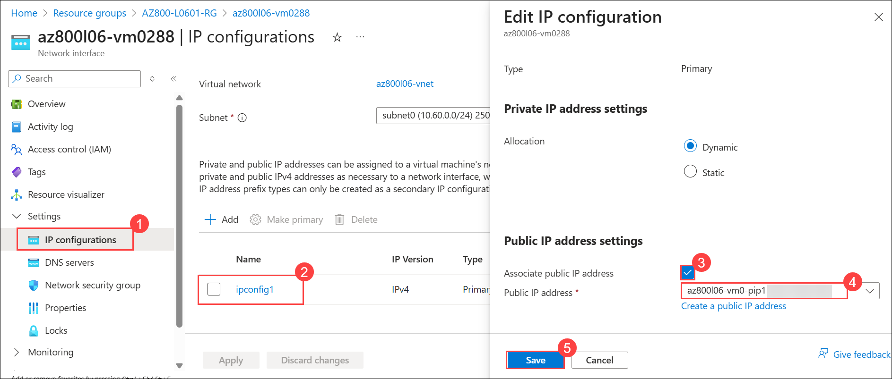

1. Browse back to the page displaying the network interface properties and select **Overview (1)**. Note the value of the **Public IP address (2)** assigned to the interface.

    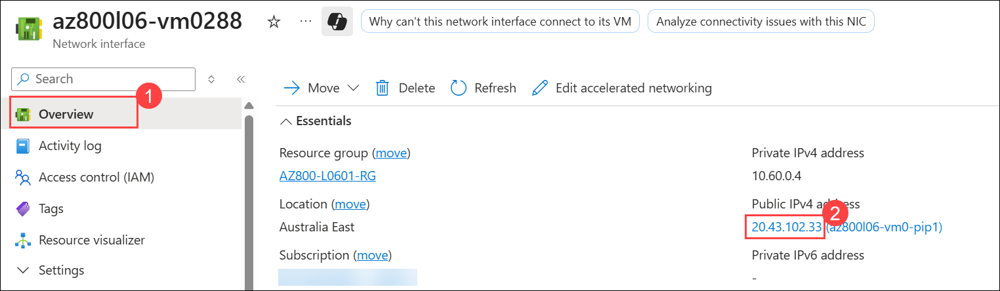

1. Open another browser tab, browse to that IP address, and verify that a webpage opens, displaying **Hello World from az800l06-vm0**.

    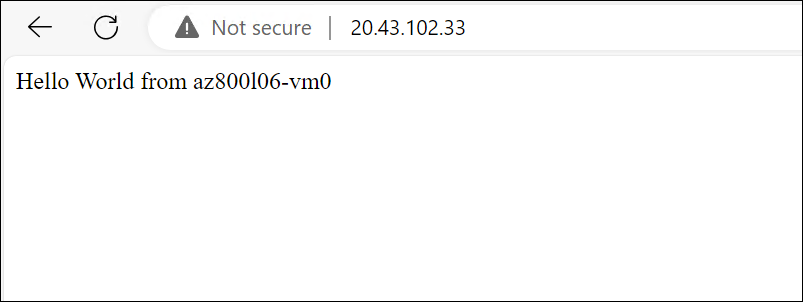

1. From the lab computer, start the Remote Desktop app, and try connecting to the same IP address. Verify that the connection fails.

   >**Note**: This is expected because the Azure VM is currently not accessible from the Internet via TCP port 3389. It is accessible only via TCP port 80.

### Task 3: Trigger re-evaluation of the JIT status of an Azure VM

>**Note**: This task is necessary to trigger re-evaluation of the JIT status of the Azure VM. By default, this might take up to 24 hours.

1. In the Azure portal, browse back to the **AZ800-L0601-RG** page, and then in the list of resources, select the entry representing the Azure VM **az800l06-vm0**.

1. On the **az800l06-vm0** page, under **Settings** section select **Configuration (1)**. 

1. On the **az800l06-vm0 \| Configuration** page, select **Enable just-in-time (2)** VM access and select the **Open Microsoft Defender for Cloud** link.

    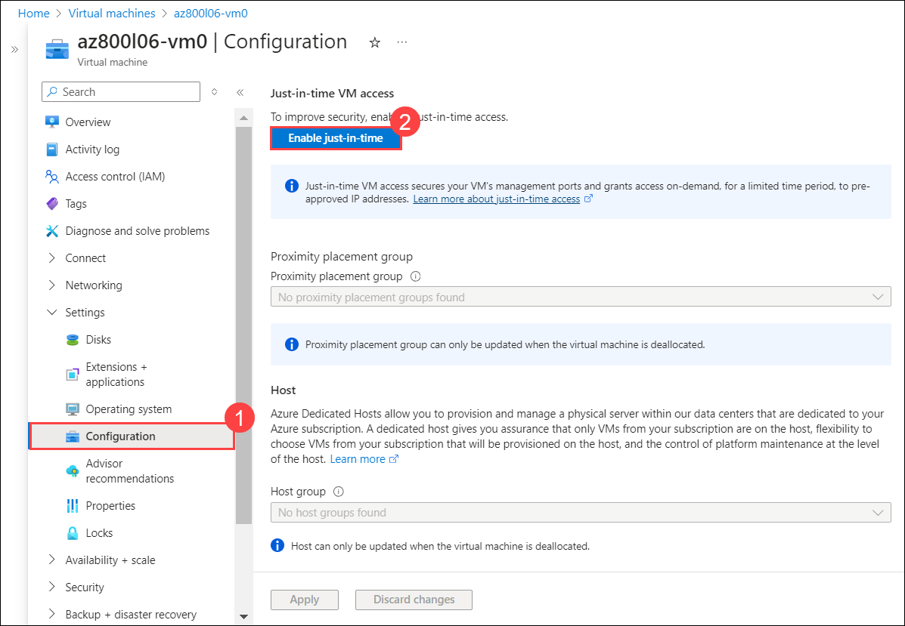

    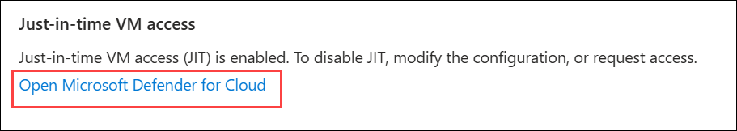

1. On the **Just-in-time VM access** page, verify that the entry representing the **az800l06-vm0 (2)** Azure VM appears on the **Configured (1)** tab.

   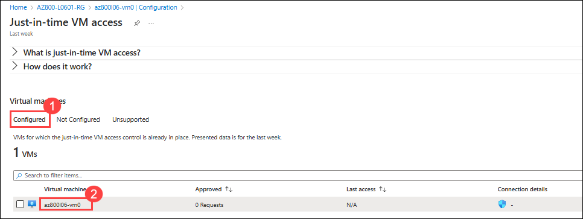

### Task 4: Connect to the Azure VM via JIT VM access

1. Browse back to the **az800l06-vm0** page, select **Connect (1)**, and then choose **Connect (2)** from the drop-down menu.  

   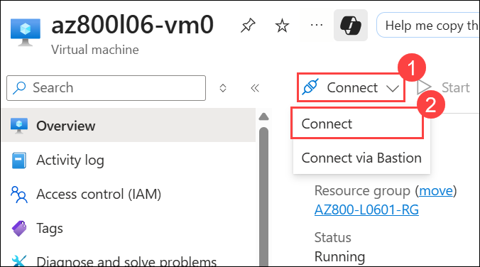

1. On the **az800l06-vm0 \| Connect** page, under the **Native RDP** section, click **Request JIT + Check access (1)**, and then select **Download RDP file (2)**

    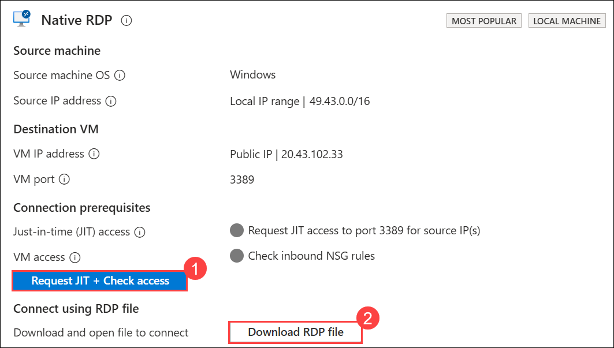

1. On **Native RDP**, select **Download RDP File**,  follow prompts to connect to the target Azure VM.

    >**Note**: If you receive a pop-up asking if you want to keep the file while downloading the RDP file, select the **Keep** option.

1. Open the RDP file you downloaded in the previous step and select the **Connect** option in the Remote Desktop Connection tab.

     

1. When **Enter your credentials** window prompted, click **More Choices** and select **Use a different acount**, specify the following values, and then select **OK** and then select **Yes** from the Remote Desktop Connection tab:

      |Setting|Value|
      |---|---|
      |Username|**.\Student**|
      |Password|**Pa55w.rd1234**|
   
      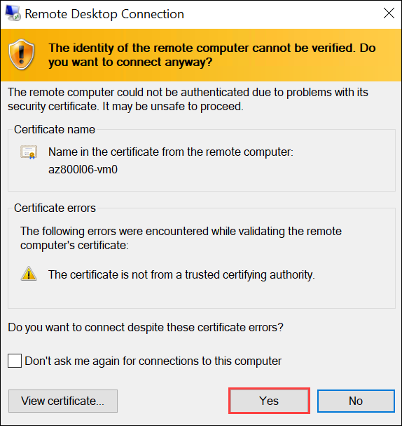

1. Verify that you can successfully access via Remote Desktop the operating system running in the Azure VM and close the Remote Desktop session.

> **Congratulations** on completing the task! Now, it's time to validate it. Here are the steps:
> - Hit the Validate button for the corresponding task. If you receive a success message, you can proceed to the next task. 
> - If not, carefully read the error message and retry the step, following the instructions in the lab guide.
> - If you need any assistance, please contact us at cloudlabs-support@spektrasystems.com. We are available 24/7 to help.

<validation step="e61e31af-224b-4ff6-94d4-b86acfa02071" />
 
### Review
In this lab, you have completed:
- Generate and download an ARM template and parameters files by using the Azure portal.
- Review the ARM template and parameters files for Azure VM deployment.
- Add an Azure VM extension section to the existing template.
- Deploy an Azure VM by using an ARM template.
- Verify the status of Azure Microsoft Defender for Cloud.
- Review Just in time VM access settings.
- Create and configure an NSG and inbound HTTP access to an Azure VM.
  Trigger re-evaluation of the JIT status of an Azure VM.
- Connect to the Azure VM via JIT VM access.

## You have successfully completed this lab.
