# Lab 08: Implementing hybrid networking infrastructure

## Lab scenario

You were tasked with building a test environment in Azure, consisting of Microsoft Azure virtual machines deployed into separate virtual networks configured in the hub and spoke topology. This testing must include implementing connectivity between spokes by using user-defined routes that force traffic to flow via the hub. You also need to implement DNS name resolution for Azure virtual machines between virtual networks by using Azure private DNS zones and evaluate the use of Azure DNS zones for external name resolution.

## Lab objectives

In this lab, you will perform:

- **Exercise 1:** Implement virtual network routing in Azure
- **Exercise 2:** Implement DNS name resolution in Azure

## Estimated time: 60 Minutes

## Architecture Diagram

     

## Exercise 1: Implement virtual network routing in Azure

### Task 1: Provision lab infrastructure resources

1. On the **HOSTVM (1)** dropdown menu, select **SEA-ADM1 (2)** to connect to the administrator VM.  

    

1. On the **SEA-ADM1** login screen, sign in as **CONTOSO\Administrator** with the password **Pa55w.rd**.  

    

1. On **SEA-ADM1**, double-click on Azure portal.

1. In the **Sign in** dialog box, copy and paste 
    - Email/Username: <inject key="AzureAdUserEmail"></inject> and then select **Next**.

      

1. In the **Enter password** dialog box, copy and paste 
    - Password: <inject key="AzureAdUserPassword"></inject> and then select **Sign in**.

        

1. If **Action Required** pop-up window appears, click on **Ask later**.
   
   

1. On the **Stay signed in?** dialog box, select the Don’t show this again check box and then select **No**.

     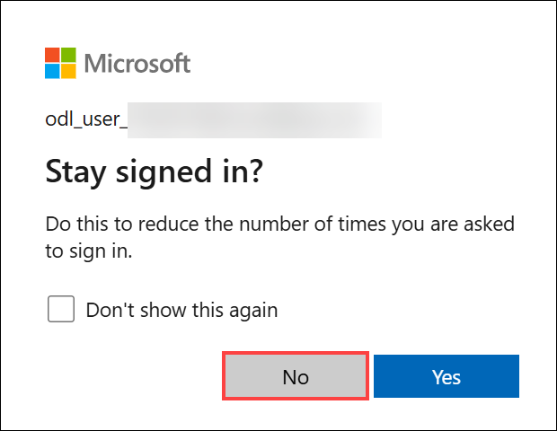

1. On the **Welcome to Microsoft Azure** page, select **Cancel**.

     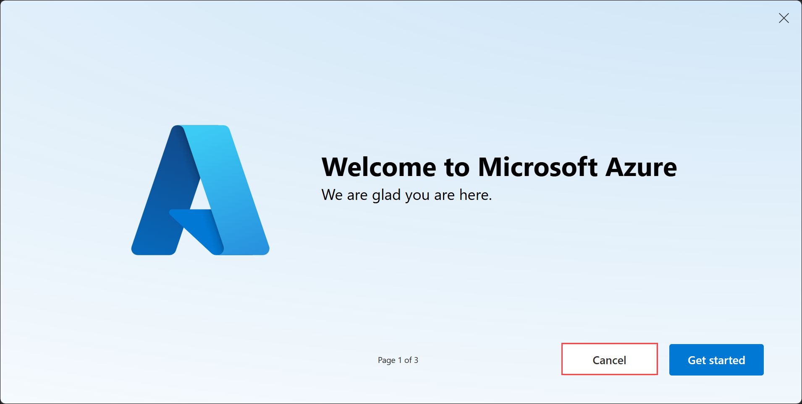

1. In the Azure portal, open the **Cloud Shell (1)** pane by selecting the toolbar icon next to the search text box.

   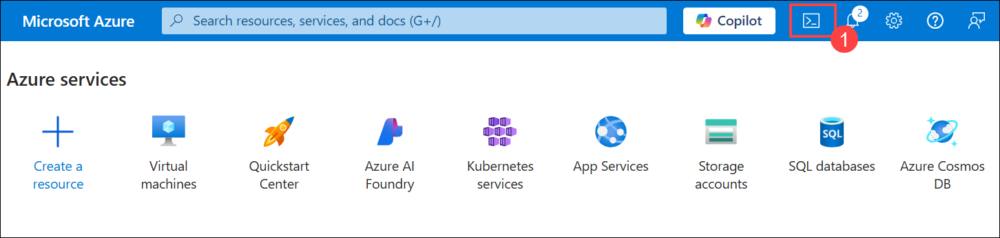

1. If prompted to select either **Bash** or **PowerShell**, select **PowerShell (2)**.

   

 1. Intially you dont have a Mount Storage account, So follow the below steps to create a **Storage account**.

      - Select the **Mount storage account (1)**
      - Select the available subscription from the drop down menu **(2)**.
      - Click on **Apply (3)**.

        

1. Select **I want to create a storage account (1)** and then click on **Next (2)**.

   

1. Now, fill out the details, and select **Create (5)**:-

   |Settings|Value|
   |--------|-----|
   |Resource group| **Use existing > AZ800-L0801-RG (1)**|
   |Storage account| **blob<inject key="DeploymentID" enableCopy="false"/> (2)**|
   |File share| **fs<inject key="DeploymentID" enableCopy="false"/> (3)**|
   |Region| **East US (4)**|

   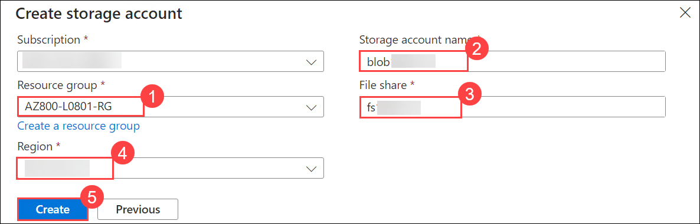

1. In the toolbar of the Cloud Shell pane, Click on the **Manage files** drop down menu, select **Upload**.

   

1. Upload the files **C:\Labfiles\AZ-800-Administering-Windows-Server-Hybrid-Core-Infrastructure-master\Allfiles\Labfiles\Lab08\L08-rg_template.json** and **C:\Labfiles\AZ-800-Administering-Windows-Server-Hybrid-Core-Infrastructure-master\Allfiles\Labfiles\Lab08\L08-rg_template.parameters.json** into the Cloud Shell home directory.

   

1. From the Cloud Shell pane, run the following command to create the three virtual networks and four Azure VMs into them by using the template and parameter files you uploaded:

   ```powershell
   $rgName = "AZ800-L0801-RG"
    New-AzResourceGroupDeployment `
   -ResourceGroupName $rgName `
   -TemplateFile $HOME/L08-rg_template.json `
   -TemplateParameterFile $HOME/L08-rg_template.parameters.json
   ```

   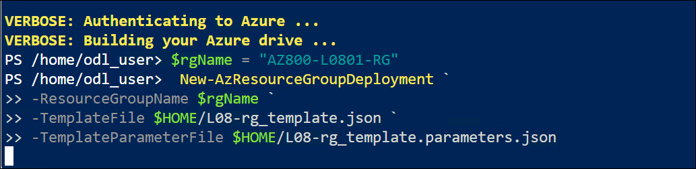

    >**Note**: Wait for the deployment to complete before proceeding to the next step. This should take about 3 minutes.

1. From the Cloud Shell pane, run the following commands to install the Network Watcher extension on the Azure VMs deployed in the previous step:

   ```powershell
   $rgName = 'AZ800-L0801-RG'
   $location = (Get-AzResourceGroup -ResourceGroupName $rgName).location
   $vmNames = (Get-AzVM -ResourceGroupName $rgName).Name

   foreach ($vmName in $vmNames) {
     Set-AzVMExtension `
     -ResourceGroupName $rgName `
     -Location $location `
     -VMName $vmName `
     -Name 'networkWatcherAgent' `
     -Publisher 'Microsoft.Azure.NetworkWatcher' `
     -Type 'NetworkWatcherAgentWindows' `
     -TypeHandlerVersion '1.4'
   }
   ```

    >**Note**: Do not wait for the deployment to complete, proceed to the next step. The installation of the Network Watcher extension should take about 5 minutes.

### Task 2: Configure the hub and spoke network topology

1. On **SEA-ADM1**, in the Microsoft Edge window displaying the Azure portal, open another tab and browse to the **[Azure portal](https://portal.azure.com)**.

1. In the Azure portal, in the **Search resources, services, and docs** text box in the toolbar, search for **Virtual networks (1)** and select **Virtual networks (2)** from Services.

     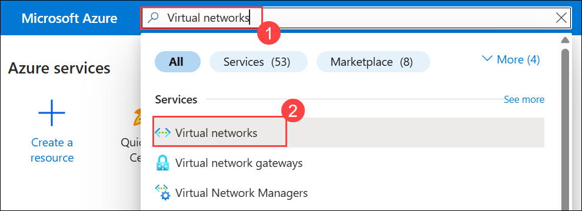

1. In the list of virtual networks, select **az800l08-vnet0**.

    

1. On the **az800l08-vnet0** virtual network page, from the left navigation pane, under the **Settings (1)** section, select **Peerings (2)**, and then select **+ Add (3)**.

     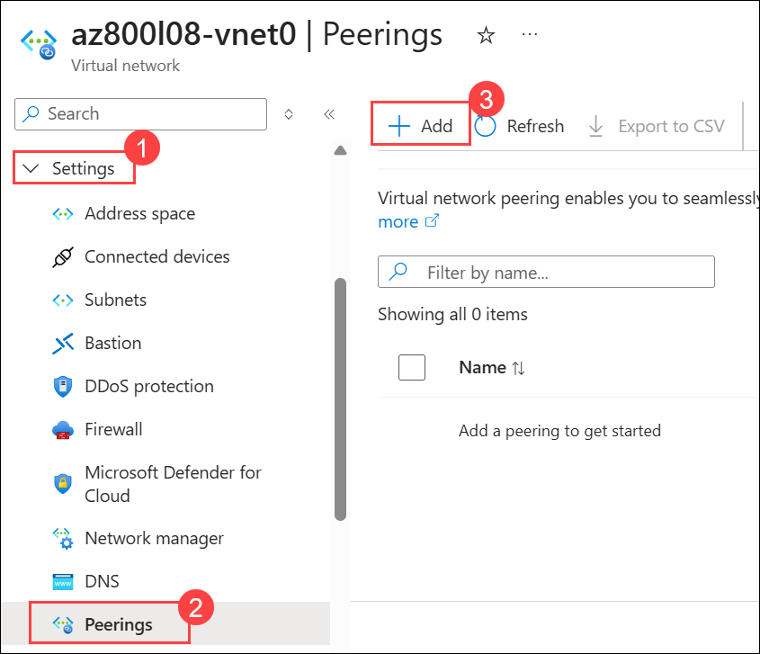

1. Specify the following settings for **Remote virtual network** (leave others with their default values)

    | Setting | Value |
    | --- | --- |
    | Peering link name | **az800l08-vnet1_to_az800l08-vnet0 (1)** |
    | Virtual network deployment model | **Resource manager (2)** |
    | Subscription | Leave the default subscription **(3)** |
    | Remote virtual network: Virtual network | **az800l08-vnet1(4)** |
    | Allow 'az800l08-vnet1' to access 'az800l08-vnet0' | **Select the checkbox (5)** |
    | Allow 'az800l08-vnet1' to receive forwarded traffic from 'az800l08-vnet0'| **Select the checkbox (6)** |

    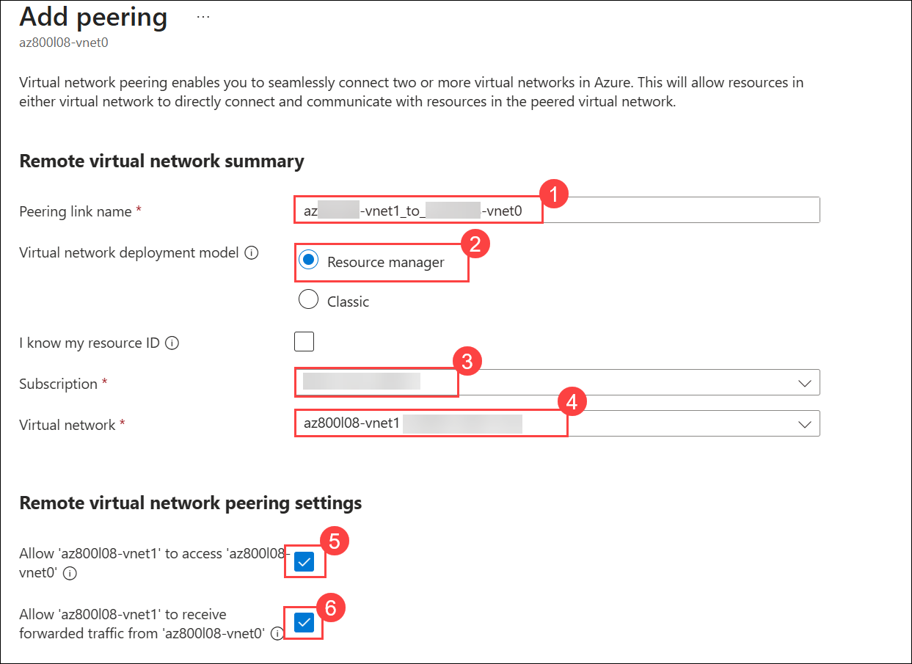

1. Specify the following settings for **Local virtual network** (leave others with their default values), and then select **Add (4)**:

    | Setting | Value |
    | --- | --- |
    | Peering link name | **az800l08-vnet0_to_az800l08-vnet1 (1)** |
    | Allow 'az800l08-vnet0' to access 'az800l08-vnet1' | **Select the checkbox (2)** |
    | Allow 'az800l08-vnet0' to receive forwarded traffic from 'az800l08-vnet1'| **Select the checkbox (3)** |
    
    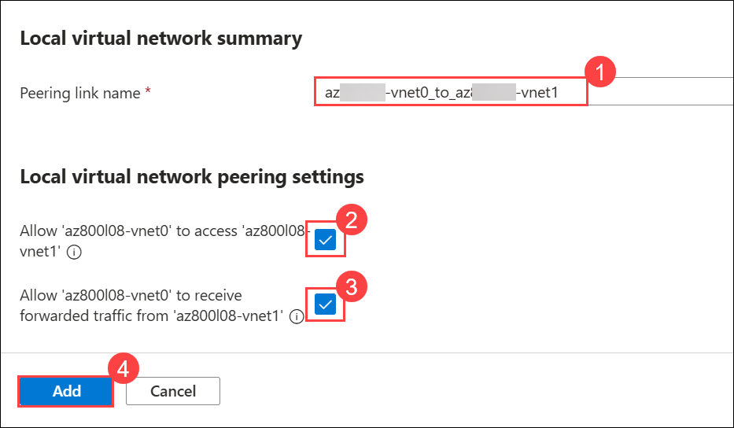

     >**Note**: Wait for the operation to complete.

     >**Note**: This step establishes two peerings - one from **az800l08-vnet0** to **az800l08-vnet1** and the other from **az800l08-vnet1** to **az800l08-vnet0**.

     >**Note**: **Allow forwarded traffic** needs to be enabled in order to facilitate routing between spoke virtual networks, which you will implement later in this lab.

1. On the **az800l08-vnet0 | Peerings** virtual network page, select **+ Add**.

    

1. Specify the following settings for **Remote virtual network** (leave others with their default values)

    | Setting | Value |
    | --- | --- |
    | Peering link name | **az800l08-vnet2_to_az800l08-vnet0** |
    | Virtual network deployment model | **Resource manager** |
    | Virtual network | **az800l08-vnet2** |    
    | Allow 'az800l08-vnet2' to access 'az800l08-vnet0' | **Select the checkbox**|
    | Allow 'az800l08-vnet2' to receive forwarded traffic from 'az800l08-vnet0'| **Select the checkbox** |

1. Specify the following settings for **Local virtual network** (leave others with their default values), and then select **Add**:

    | Setting | Value |
    | --- | --- |
    | Peering link name | **az800l08-vnet0_to_az800l08-vnet2** |
    | Allow 'az800l08-vnet0' to access 'az800l08-vnet2'| **Select the checkbox**|
    | Allow 'az800l08-vnet0' to receive forwarded traffic from 'az800l08-vnet2' | **Select the checkbox** |

    >**Note**: This step establishes two peerings - one from **az800l08-vnet0** to **az800l08-vnet2** and the other from **az800l08-vnet2** to **az800l08-vnet0**. This completes setting up the hub and spoke topology (with the **az800l08-vnet0** virtual network serving the role of the hub, while **az800l08-vnet1** and **az800l08-vnet2** are its spokes).

### Task 3: Test transitivity of virtual network peering

>**Note**: Before you start this task, make sure that the script you invoked in the first task of this exercise completed successfully.

1. In the Azure portal, in the **Search resources, services, and docs** text box in the toolbar, search for **Network Watcher (1)** and select **Network Watcher (2)** from Services.

   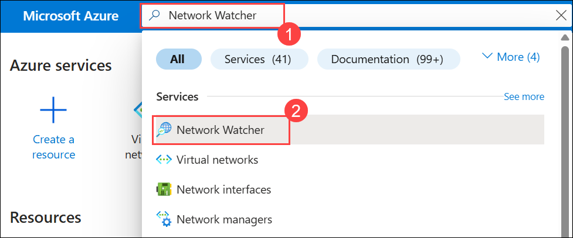

1. On the **Network Watcher** page, from the left navigation pane under **Network diagnostic tools (1)** section, select **Connection troubleshoot (2)**.

    

1. On the **Network Watcher | Connection troubleshoot** page, initiate a check with the following settings (leave others with their default values):

    | Setting | Value |
    | --- | --- |
    | Source type | **Virtual machine (1)** |
    | Virtual machine | **az800l08-vm0 (2)** |
    | Destination | **Specify manually (3)** |
    | URI, FQDN or IP address | **10.81.0.4 (4)** |
    | Protocol | **TCP (5)** |
    | Destination Port | **3389 (6)** |
    | Diagnostic tests | Select **Connectivity** and **Next hop** from the list **(7)** |

    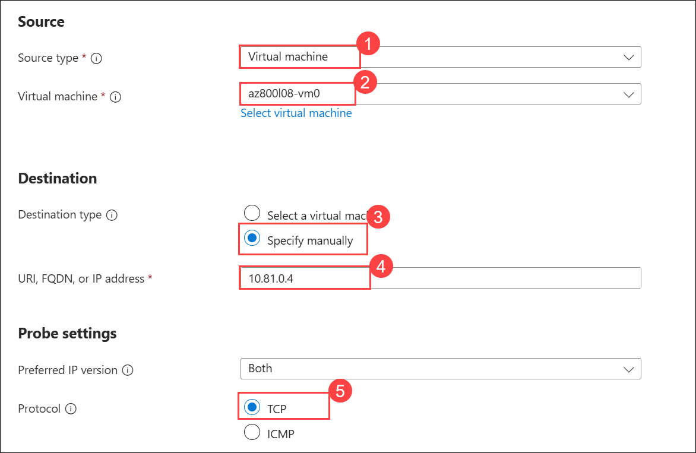

    

    > **Note**: **10.81.0.4** represents the private IP address of **az800l08-vm1**. The test uses the **TCP** port **3389** because Remote Desktop is by default enabled on Azure virtual machines and accessible within and between virtual networks.

1. Select **Run diagnostic tests (8)** and wait until results of the connectivity check are returned. Verify that the status is **Reachable (success)**. Review the network path and note that the connection was direct, with no intermediate hops in between the VMs.

    > **Note**: This is expected because the hub virtual network is peered directly with the first spoke virtual network.

    

1. On the **Network Watcher - Connection troubleshoot** page, initiate a check with the following settings (leave others with their default values):

    | Setting | Value |
    | --- | --- |
    | Source type | **Virtual machine** |
    | Virtual machine | **az800l08-vm0** |
    | Destination | **Specify manually** |
    | URI, FQDN or IP address | **10.82.0.4** |
    | Protocol | **TCP** |
    | Destination Port | **3389** |
    | Diagnostic tests | Select **Connectivity** and **Next hop** from the list |

    > **Note**: **10.82.0.4** represents the private IP address of **az800l08-vm2**. 

1. Select **Run diagnostic tests** and wait until results of the connectivity check are returned. Verify that the status is **Reachable (success)**. Review the network path and note that the connection was direct, with no intermediate hops in between the VMs.

     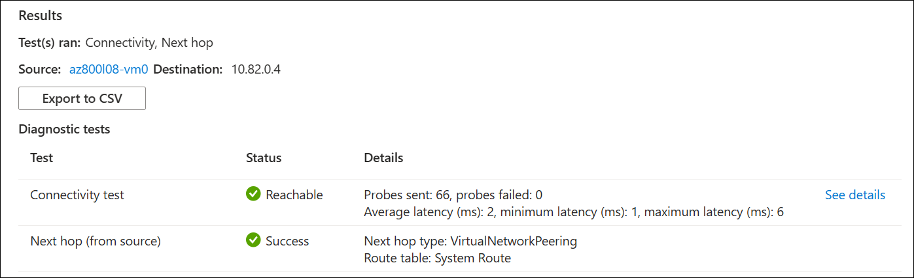

     > **Note**: This is expected because the hub virtual network is peered directly with the second spoke virtual network.

1. On the **Network Watcher - Connection troubleshoot** page, specify the following settings (leave others with their default values) and initiate another check:

    > **Note**: You might need to refresh the browser page for the virtual machine **az800l08-vm1** to appear in the **Virtual machine** drop-down list.

    | Setting | Value |
    | --- | --- |
    | Source type | **Virtual machine** |
    | Virtual machine | **az800l08-vm1** |
    | Destination | **Specify manually** |
    | URI, FQDN or IP address | **10.82.0.4** |
    | Protocol | **TCP** |
    | Destination Port | **3389** |
    | Diagnostic tests | Select **Connectivity** and **Next hop** from the list |

1. Select **Run diagnostic tests** and wait until results of the connectivity check are returned. Note that the status is **Unreachable**.

      

     > **Note**: This is expected because the two spoke virtual networks are not peered with each other and virtual network peering is not transitive.

### Task 4: Configure routing in the hub and spoke topology

1. In the Azure portal, in the **Search resources, services, and docs** text box in the toolbar, search for **Virtual machines (1)** and select **Virtual machines (2)** from Services.

     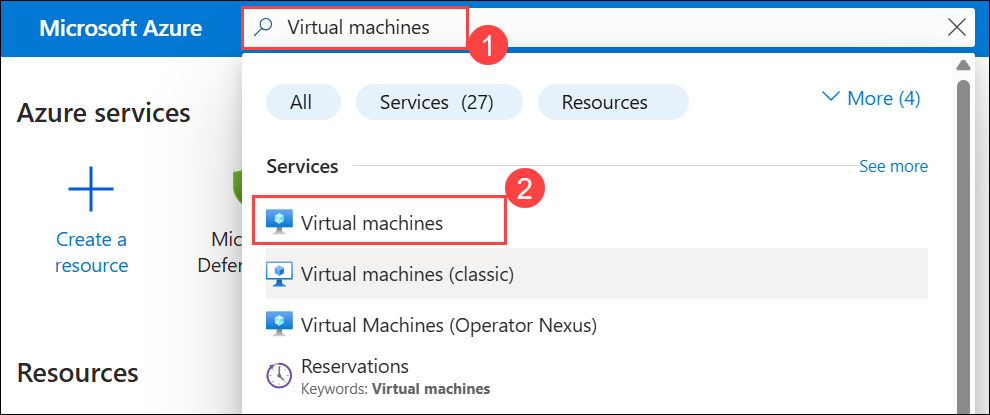

1. On the **Virtual machines** page, in the list of virtual machines, select **az800l08-vm0 (1)**.

1. On the **az800l08-vm0** virtual machine page, from the left navigation pane, under the **Networking (2)** section, select **Network settings (3)**.

1. Select the **az800l08-nic0(primary)/ipconfig1(primaty)** link under **Network interface/IP configurations (4)**.

   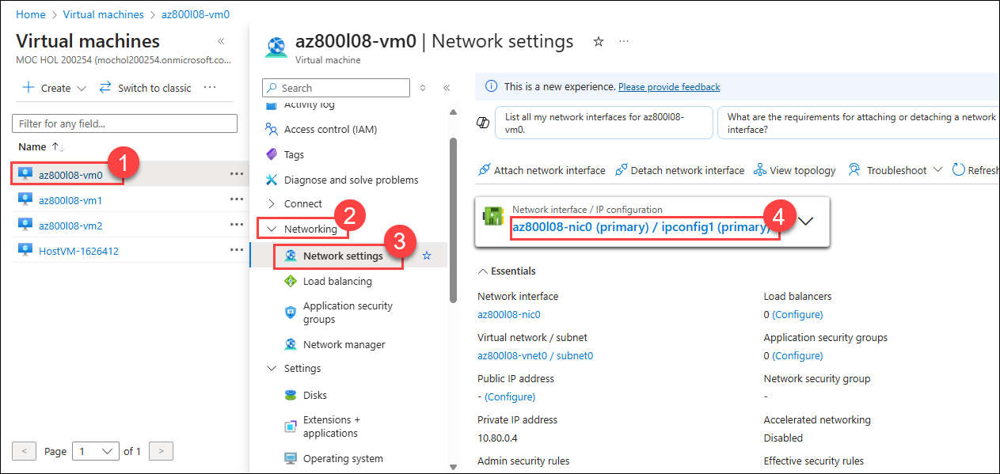

1. On the **IP configurations (1)** page, select checkbox **Enable IP forwarding (2)**  and select **Apply (3)** to save the change.

   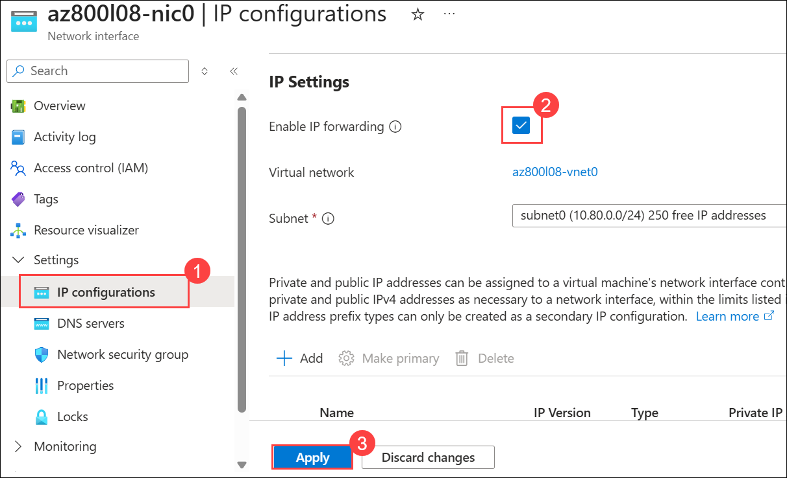

   >**Note**: This setting is required in order for **az800l08-vm0** to function as a router, which will route traffic between two spoke virtual networks.

1. In the Azure portal, browse back to the **az800l08-vm0** Azure virtual machine page.

1. On the **az800l08-vm0** page, from the left navigation pane, under the **Operations (1)** section, select **Run command (2)**, and then, in the list of commands, select **RunPowerShellScript (3)**.

   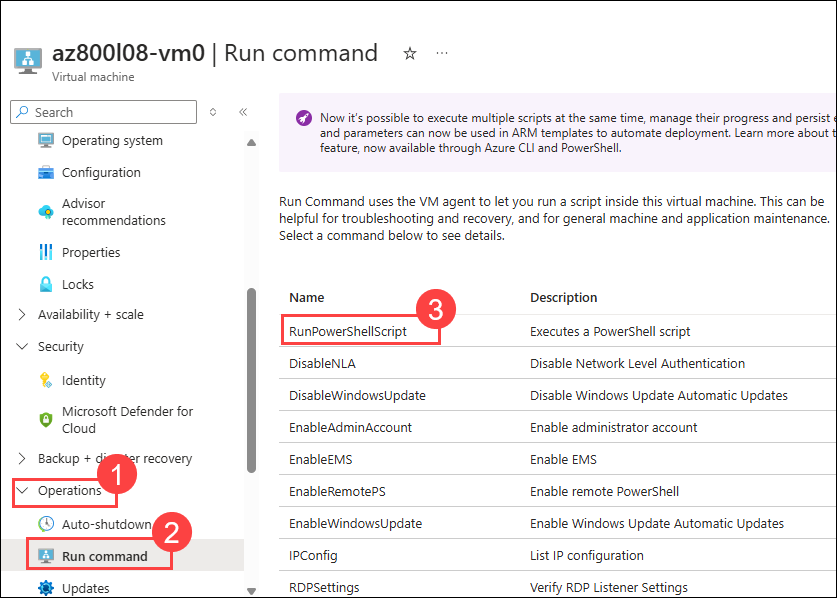

1. On the **Run Command Script** page, enter the following command **(1)**, and then select **Run (2)** to install the Remote Access Windows Server role.

   ```powershell
   Install-WindowsFeature RemoteAccess -IncludeManagementTools
   ```
   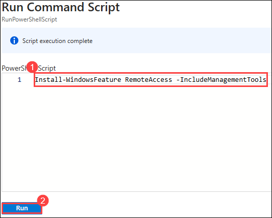

   > **Note**: Wait for the confirmation that the command completed successfully.

1. On the **Run Command Script** page, in the **PowerShell script** section, replace the previously entered command with the following commands **(1)**, and then select **Run (2)** to install the Routing role service.

   ```powershell
   Install-WindowsFeature -Name Routing -IncludeManagementTools -IncludeAllSubFeature
   Install-WindowsFeature -Name "RSAT-RemoteAccess-Powershell"
   Install-RemoteAccess -VpnType RoutingOnly
   Get-NetAdapter | Set-NetIPInterface -Forwarding Enabled
   ```

   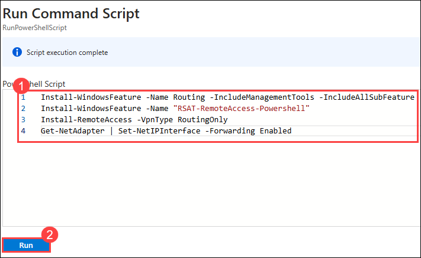

   > **Note**: Wait for the confirmation that the command completed successfully.

   > **Note**: Now you need to create and configure user-defined routes on the spoke virtual networks.

1. In the Azure portal, in the **Search resources, services, and docs** text box in the toolbar, search for **Route tables (1)** and select **Route tables (2)** from Services, and then, on the **Route tables** page, select **+ Create**.

   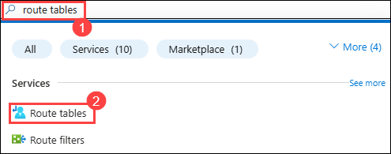

   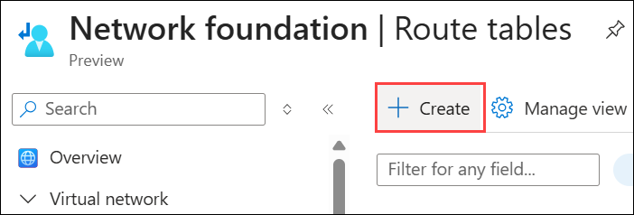

1. Create a route table with the following settings (leave others with their default values):

    | Setting | Value |
    | --- | --- |
    | Subscription | Leave the default subscription |
    | Resource group |  Select **AZ800-L0801-RG (1)** from the drop down list |
    | Location | the name of the Azure region in which you created the virtual networks |
    | Name | **az800l08-rt12 (2)** |
    | Propagate gateway routes | **No (3)** |

    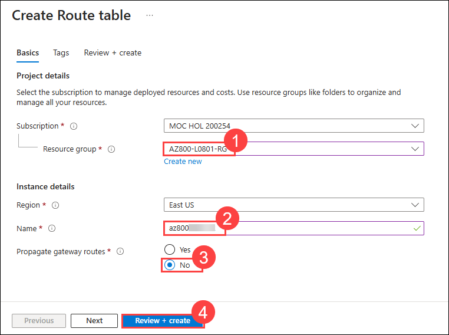

1. Select **Review + create (4)**, and then select **Create (5)**.

   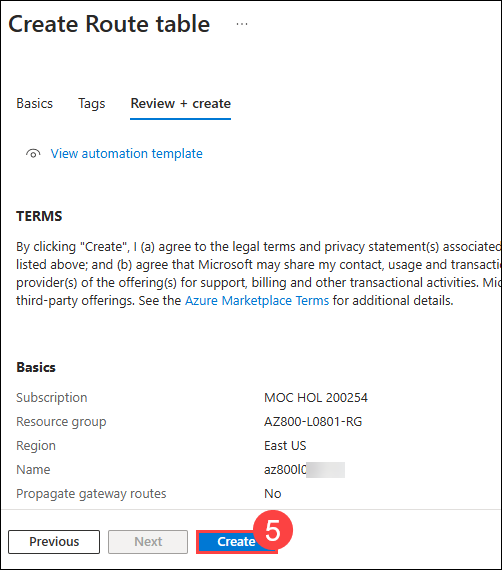

   > **Note**: Wait for the route table to be created. This should take about 1 minute.

1. Select **Go to resource**.

   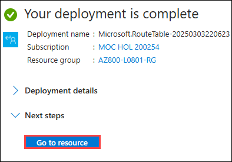

1. On the **az800l08-rt12** route table page, from the left-navigation menu, under the **Settings (1)** section, select **Routes (2)**, and then select **+ Add (3)**.

1. Add a new route with the following settings:

    | Setting | Value |
    | --- | --- |
    | Route name | **az800l08-route-vnet1-to-vnet2 (4)** |
    | Destination Type | **IP Addresses (5)** |
    | Destination IP Address/CIDR ranges | **10.82.0.0/20 (6)** |
    | Next hop type | **Virtual appliance (7)** |
    | Next hop address | **10.80.0.4 (8)** |

1. Select  **Add (9)**

    > **Note**: **10.80.0.4** represents the private IP address of **az800l08-vm0**. 

    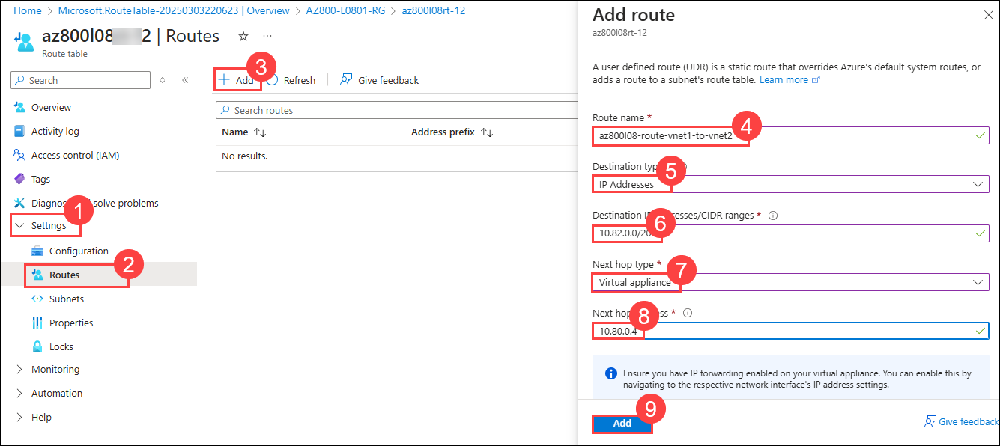

1. Back on the **az800l08-rt12** route table page, from the left-navigation menu, under the **Settings (1)** section, select **Subnets (2)**, and then select **+ Associate (3)**.

1. Associate the route table **az800l08-rt12** with the following subnet:

    | Setting | Value |
    | --- | --- |
    | Virtual network | **az800l08-vnet1 (4)** |
    | Subnet | **subnet0 (5)** |

1. Select **OK (6)**.

    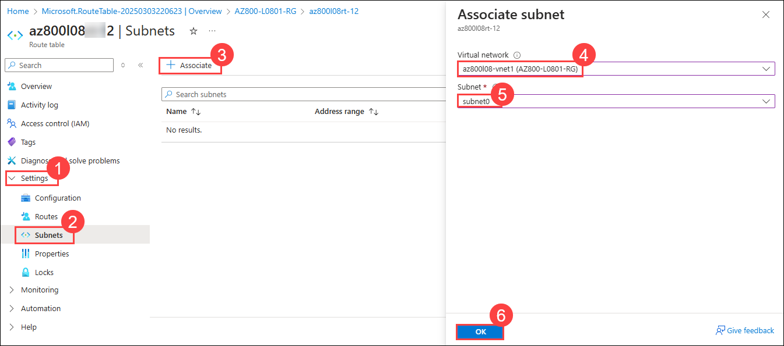

1. Browse back to **Route tables** page and select **+ Create**.

    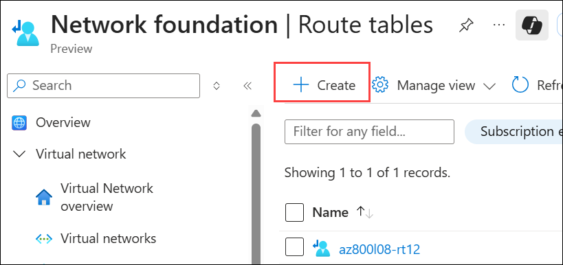

1. Create a route table with the following settings (leave others with their default values):

    | Setting | Value |
    | --- | --- |
    | Subscription | Leave the default subscription |
    | Resource group |  Select **AZ800-L0801-RG (1)** from the drop down list |
    | Region | the name of the Azure region in which you created the virtual networks |
    | Name | **az800l08-rt21 (2)** |
    | Propagate gateway routes | **No (3)** |

    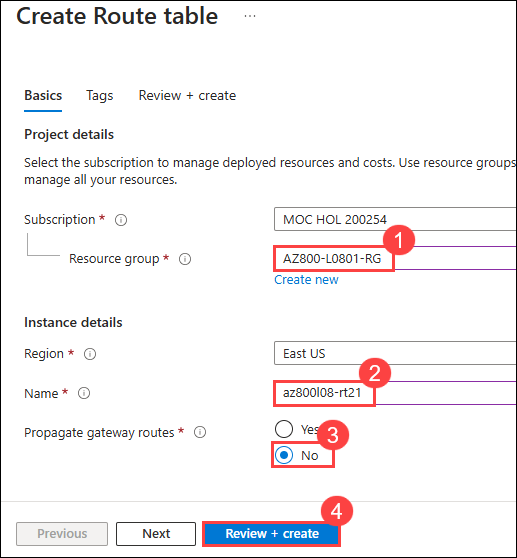

1. Select **Review + create (4)**, and then select **Create (5)**.

    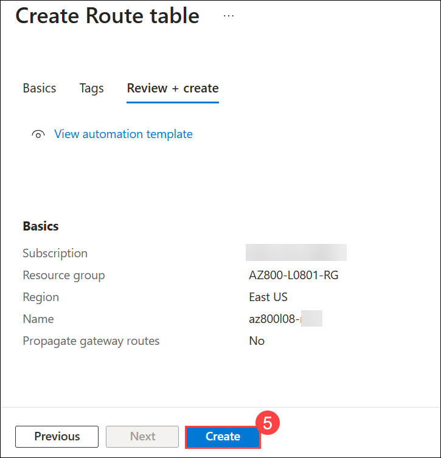

    > **Note**: Wait for the route table to be created. This should take about 3 minutes.

1. Select **Go to resource**.

     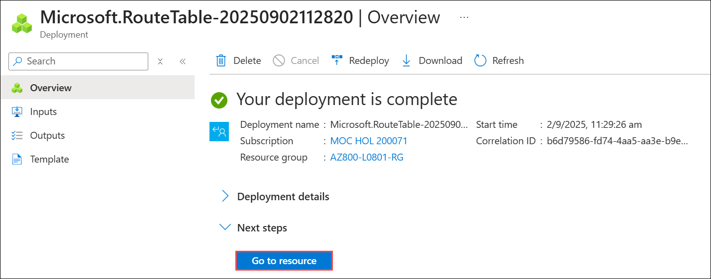

1. On the **az800l08-rt21** route table page, from the left-navigation pane, under the **Settings (1)** section, select **Routes (2)**, and then select **+ Add (3)**.

     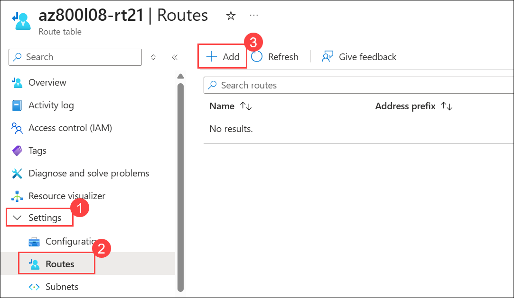

1. Add a new route with the following settings:

    | Setting | Value |
    | --- | --- |
    | Route name | **az800l08-route-vnet2-to-vnet1 (1)**|
    | Destination Type | **IP Addresses (2)** |
    | Destination IP Address/CIDR ranges | **10.81.0.0/20 (3)** |
    | Next hop type | **Virtual appliance (4)** |
    | Next hop address | **10.80.0.4 (5)** |

    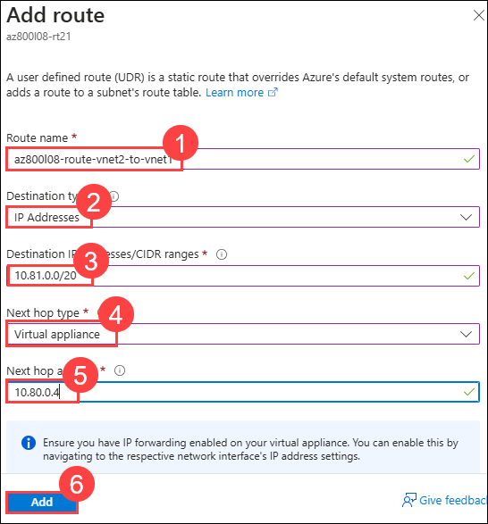

1. Select **Add (6)**.

1. Back on the **az800l08-rt21** route table page, from the left navigation pane, under the **Settings (1)** section, select **Subnets (2)**, and then select **+ Associate (3)**.

1. Associate the route table **az800l08-rt21** with the following subnet:

    | Setting | Value |
    | --- | --- |
    | Virtual network | **az800l08-vnet2 (4)** |
    | Subnet | **subnet0 (5)** |

    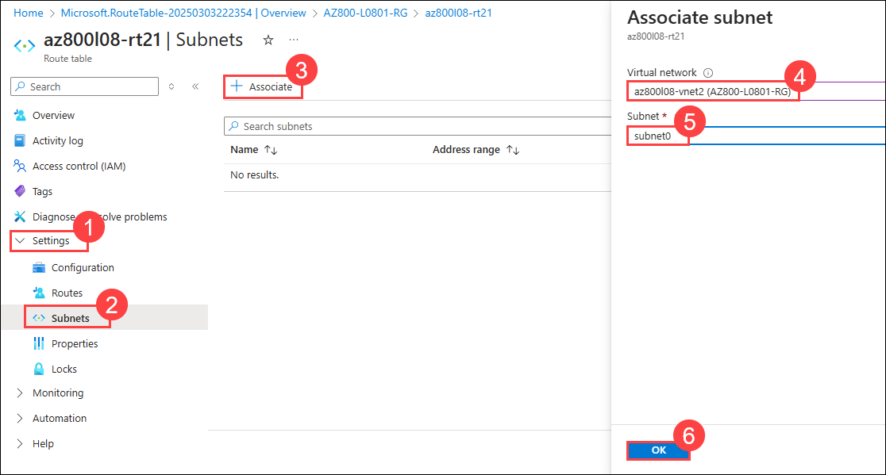

1. Select **OK (6)**.

1. In the Azure portal, browse back to the **Network Watcher - Connection troubleshoot** page.

1. On the **Network Watcher - Connection troubleshoot** page, initiate a check with the following settings (leave others with their default values):

    | Setting | Value |
    | --- | --- |
    | Source type | **Virtual machine (1)** |
    | Virtual machine | **az800l08-vm1 (2)** |
    | Destination | **Specify manually (3)** |
    | URI, FQDN or IP address | **10.82.0.4 (4)** |
    | Protocol | **TCP (5)** |
    | Destination Port | **3389 (6)** |
    | Diagnostic tests | Select **Connectivity** and **Next hop** from the list **(7)** |

     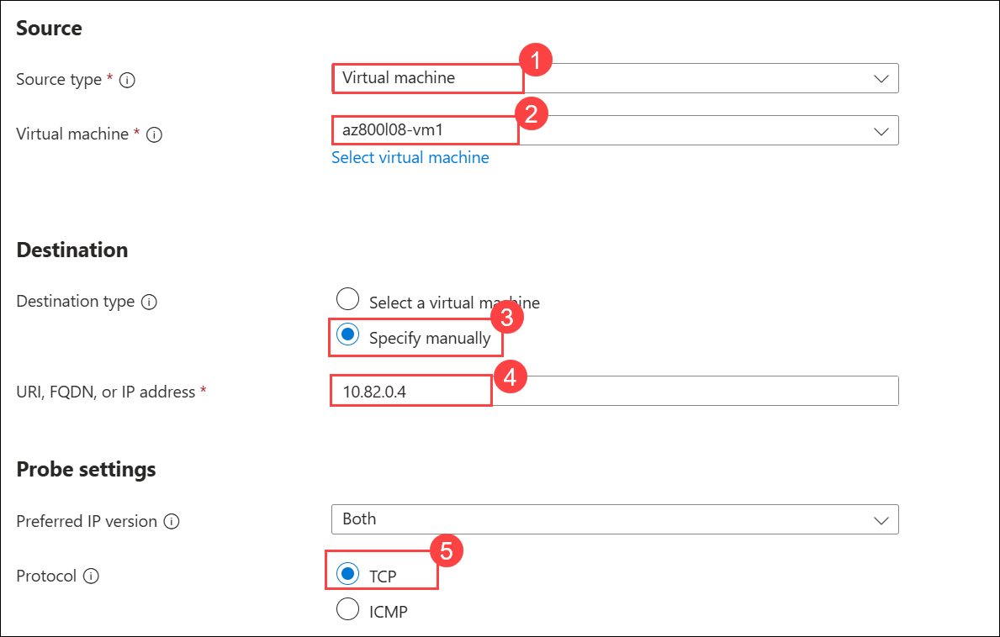

     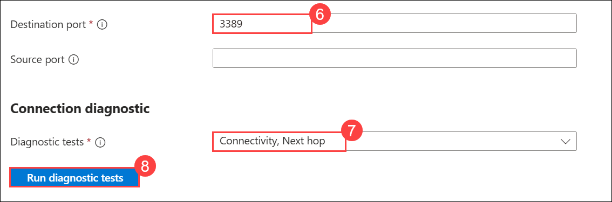

1. Select **Run diagnostic tests (8)** and wait until results of the connectivity check are returned. Verify that the status is **Reachable**. Review the network path and note that the traffic was routed via **10.80.0.4**, assigned to the **az800l08-nic0** network adapter. 

     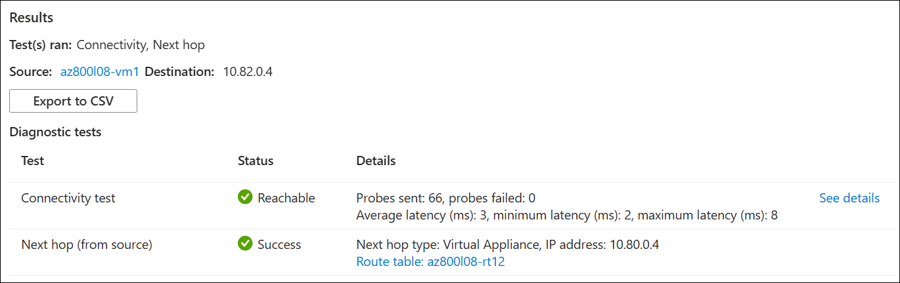

    >**Note**: This is expected because the traffic between spoke virtual networks is now routed via the virtual machine located in the hub virtual network, which functions as a router.

> **Congratulations** on completing the task! Now, it's time to validate it. Here are the steps:
> - Hit the Validate button for the corresponding task. If you receive a success message, you can proceed to the next task. 
> - If not, carefully read the error message and retry the step, following the instructions in the lab guide.
> - If you need any assistance, please contact us at cloudlabs-support@spektrasystems.com. We are available 24/7 to help.

<validation step="0ebb917b-c450-4512-b0e1-a353ee5517b8" />

## Exercise 2: Implement DNS name resolution in Azure

### Task 1: Configure Azure private DNS name resolution

1. On **SEA-ADM1**, in the Microsoft Edge window displaying the Azure portal, in the **Search resources, services, and docs** text box in the toolbar, search for **Private DNS (1)** and select **Private DNS zones (2)** from Services, and then, on the **Private DNS zones** page, select **+ Create**.

   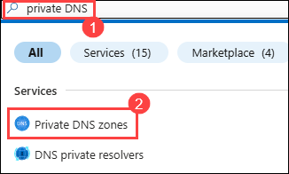

   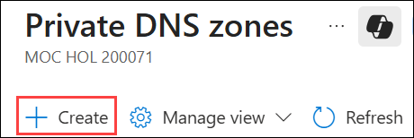

1. Create a private DNS zone with the following settings:

    | Setting | Value |
    | --- | --- |
    | Subscription | Leave the default value |
    | Resource group | select **AZ800-L0802-RG (1)** from the drop down list |
    | Name | **contoso.org (2)** |
    | Resource group location | Leave the default value |

1. Select **Review create (3)**, and then select **Create (4)**.

   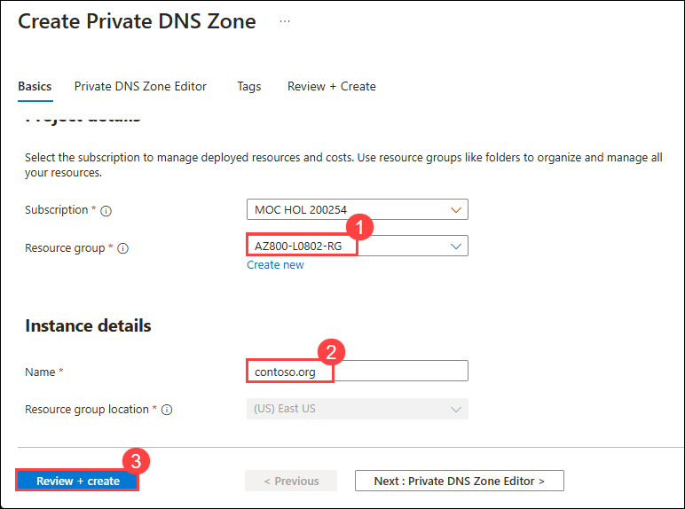

   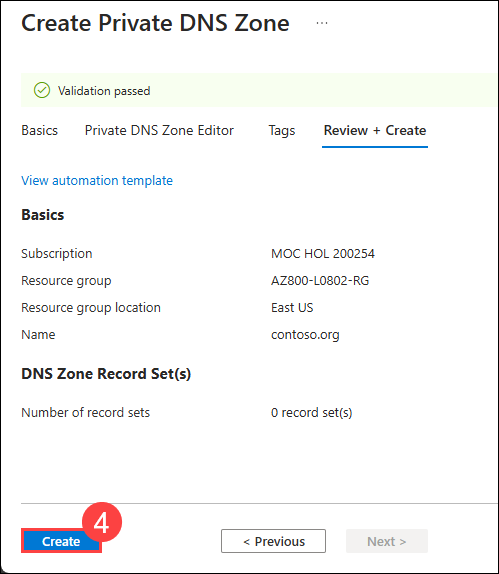

    >**Note**: Wait for the private DNS zone to be created. This should take about 2 minutes.

1. Select **Go to resource** to open the **contoso.org** DNS private zone page.

     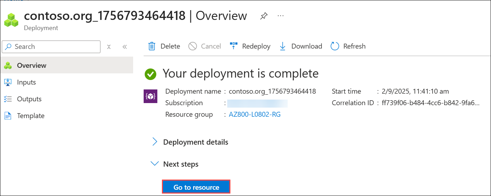

1. On the **contoso.org** private DNS zone page, in the **DNS Management (1)** section, select **Virtual network links (2)** and then Click on **Add (3)**.

   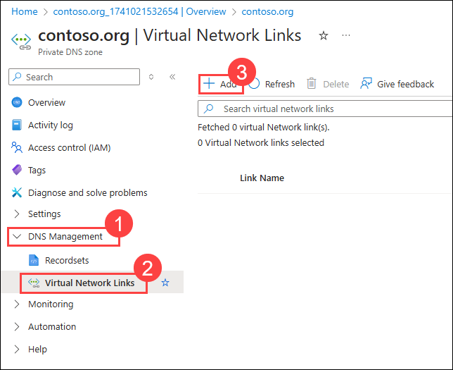

1. Specify the following settings (leave others with their default values), and select **Create (5)** to create a virtual network link for the first virtual network you created in the previous exercise:

    | Setting | Value |
    | --- | --- |
    | Link name | **az800l08-vnet0-link (1)** |
    | Subscription | the name of the Azure subscription you are using in this lab **(2)**|
    | Virtual network | **az800l08-vnet0 (AZ800-L0801-RG) (3)** |
    | Enable auto registration | selected **(4)**|

    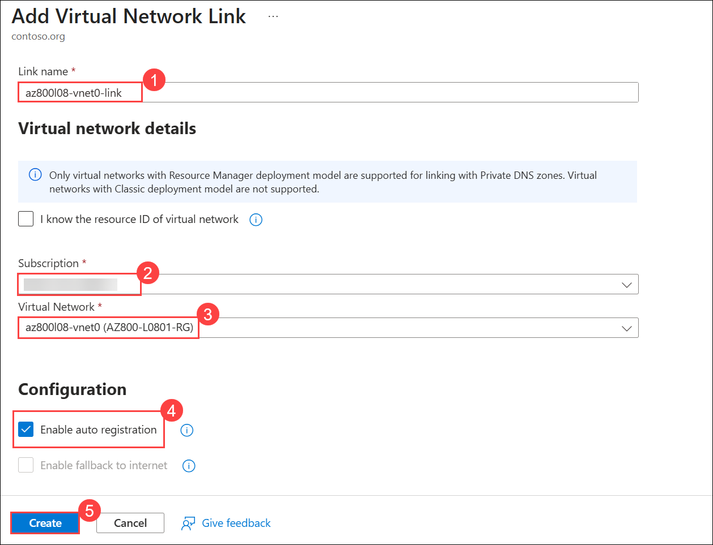

    >**Note:** Wait for the virtual network link to be created. This should take less than 1 minute.

1. Repeat the previous step to create virtual network links (with auto registration enabled) named **az800l08-vnet1-link** and **az800l08-vnet2-link** for the virtual networks **az800l08-vnet1** and **az800l08-vnet2**, respectively.

   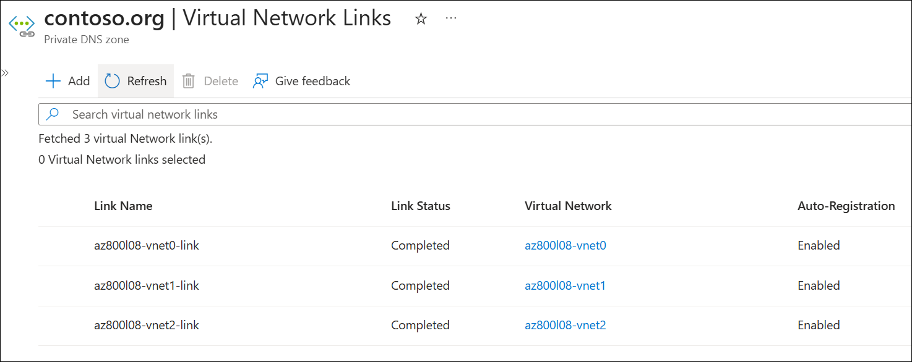

1. On the **contoso.org** private DNS zone page, in the vertical menu on the left, select **Overview (1)** and Click on **4 (2)** on the Recordsets.

    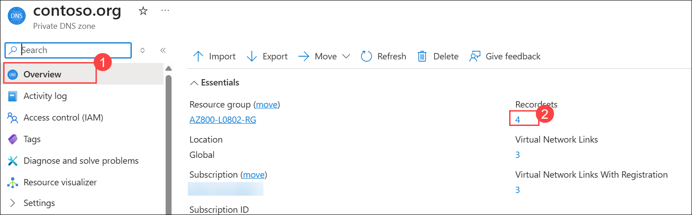

1. In the **Overview** section of the **contoso.org** private DNS zone page, review the listing of DNS record sets and verify that the **A** records of **az800l08-vm0**, **az800l08-vm1**, and **az800l08-vm2** appear in the list as **Auto registered**.

    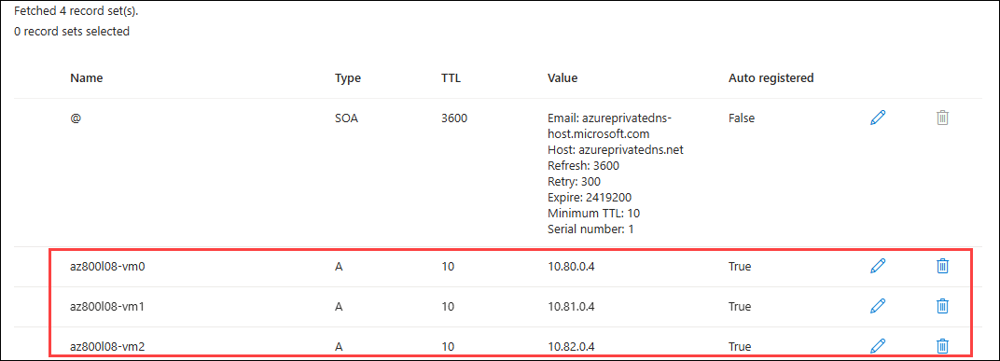

    >**Note:** You might need to wait a few minutes and refresh the page if the record sets are not listed.

### Task 2: Validate Azure private DNS name resolution

1. On **SEA-ADM1**, in the Microsoft Edge window displaying the Azure portal, browse back to the **Network Watcher** page.

1. On the **Network Watcher** under **Network diagnostic tools** section, select **Connection troubleshoot (1)** option, initiate a check with the following settings (leave others with their default values):

    | Setting | Value |
    | --- | --- |
    | Source type | **Virtual machine (2)** |
    | Virtual machine | **az800l08-vm1 (3)** |
    | Destination | **Specify manually (4)** |
    | URI, FQDN or IP address | **az800l08-vm2.contoso.org (5)** |
    | Preferred IP Version | **IPv4 (6)** |
    | Protocol | **TCP (7)** |
    | Destination Port | **3389 (8)** |
    | Diagnostic tests | Select **Connectivity** and **Next hop** **(9)** from the list |

    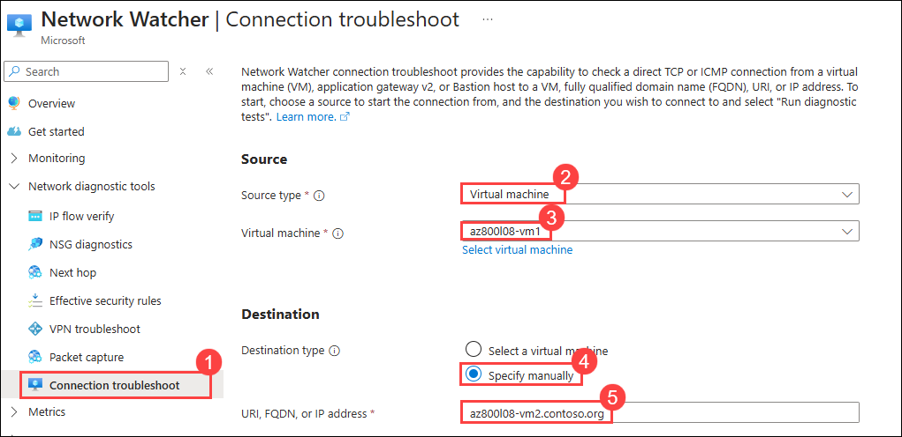

    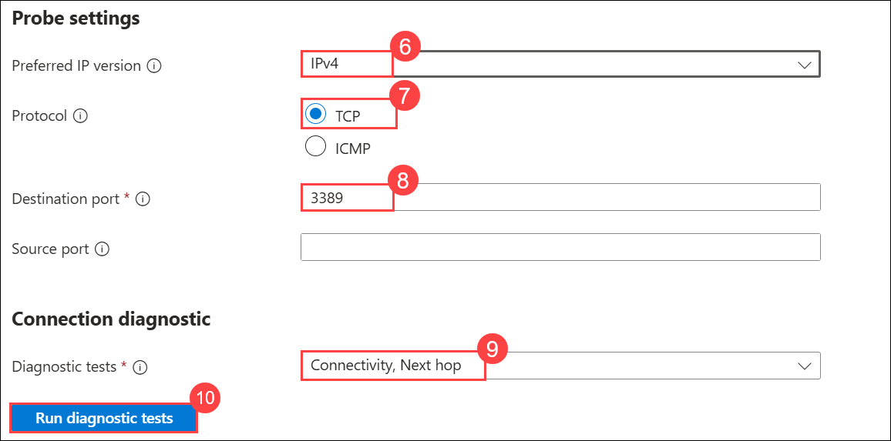

1. Select **Run diagnostic tests (10)** and wait until the results of the connectivity check are returned. Verify that the status is **Reachable**. 

     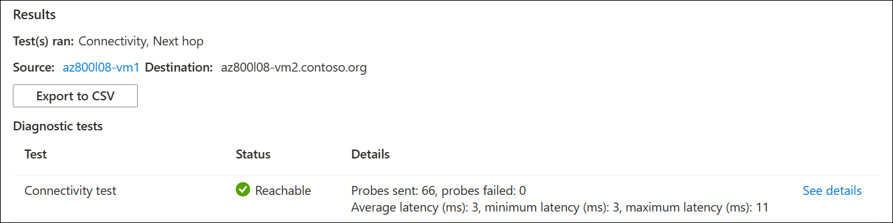

    >**Note**: This is expected because the target fully qualified domain name (FQDN) is resolvable via the Azure private DNS zone. 

### Task 3: Configure Azure public DNS name resolution

1. On **SEA-ADM1**, switch to the Microsoft Edge tab displaying the Azure portal, in the **Search resources, services, and docs** text box in the toolbar, search for **DNS zones (1)** and select **DNS zones (2)** from Services, and then, on the **DNS zones** page, select **+ Create**.

    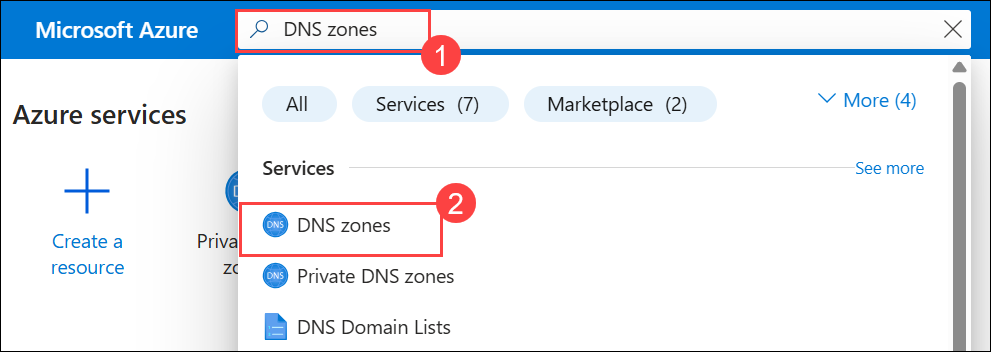

    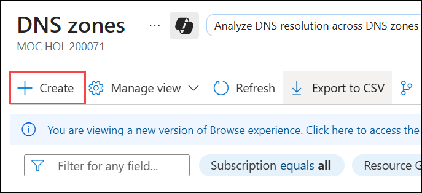

1. On the **Create DNS zone** page, specify the following settings (leave others with their default values):

    | Setting | Value |
    | --- | --- |
    | Subscription | Leave the default value |
    | Resource Group | Select **AZ800-L0802-RG (1)** from the drop-down list. |
    | Name | **mydns<inject key="DeploymentID" enableCopy="false"/>.com (2)** |

    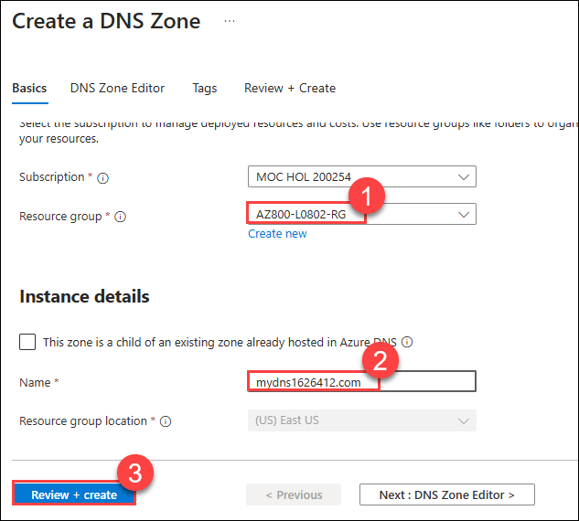

1. Select **Review + create (3)**, and then select **Create (4)**.

    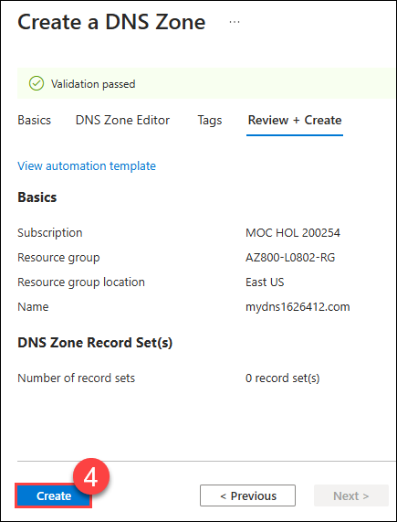

    >**Note**: Wait for the DNS zone to be created. This should take about 1 minute.

1. Select **Go to resource** to open the page of the newly created DNS zone.

1. On the DNS zone page, under **DNS management (1)**, select **Recordset (2)** and click on **+ Add (3)**.

    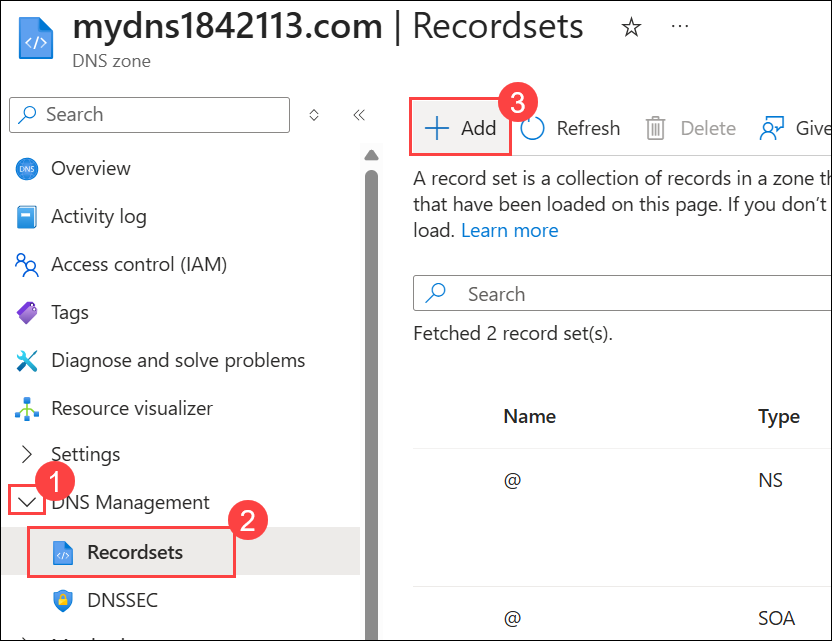     

1. In the Add a record set pane, specify the following settings (leave others with their default values):

    | Setting | Value |
    | --- | --- |
    | Name | **www (4)** |
    | Type | **A (5)** |
    | Alias record set | **No (6)** |
    | TTL | **1 (7)** |
    | TTL unit | **Hours (8)** |
    | IP address | **20.30.40.50** **(9)** |

    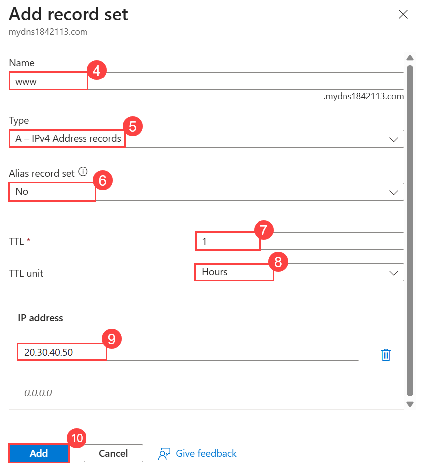 

    >**Note**: The IP address and the corresponding name are entirely arbitrary. They are meant to provide a very simple example illustrating implementing public DNS records, rather than emulate a real world scenario, which would require purchasing a namespace from a DNS registrar. 

1. Select **Add (10)**

1. On the DNS zone page, identify the full name of **Name server 1**.

    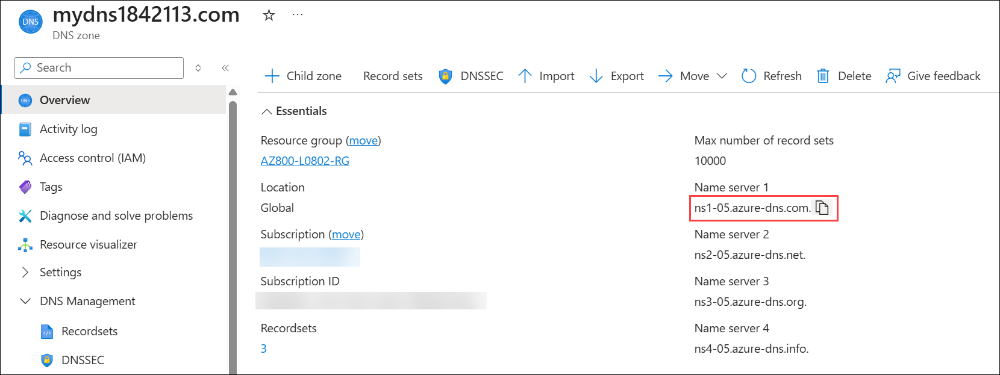 

    >**Note**: Record the full name of **Name server 1**. You will need it in the next task.

### Task 4: Validate Azure public DNS name resolution

1. On **SEA-ADM1**, on the **Start (1)** menu, select **Windows PowerShell (2)**.

    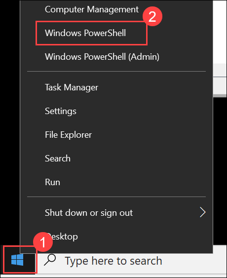 

1. In the **Windows PowerShell** console, enter the following command, and then press Enter to test external name resolution of the **www** DNS record set in the newly created DNS zone (replace the placeholder `<Name server 1>` with the name of **Name server 1** you noted earlier in this task and the `<domain name>` placeholder with the name of the DNS domain you created earlier in this task):

   ```powershell
   nslookup www.<domain name> <Name server 1>
   ```

1. Verify that the output of the command includes the public IP address of **20.30.40.50**.

     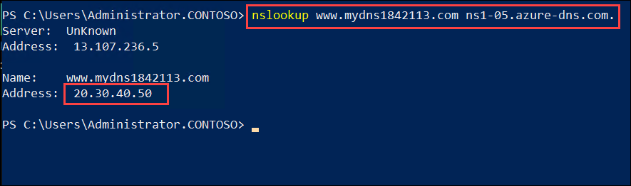 

    >**Note**: The name resolution works as expected because the **nslookup** command allows you to specify the IP address of the DNS server to query for a record (which, in this case, is `<Name server 1>`). For the name resolution to work when querying any publicly accessible DNS server, you would need to register the domain name with a DNS registrar and configure the name servers listed on the public DNS zone page in the Azure portal as authoritative for the namespace corresponding to that domain.

    <validation step="edd3aa60-ffd0-4fef-a34d-1e04368560db" />

### Review
In this lab, you have completed:
- Provisioned lab infrastructure resources.
- Configured the hub and spoke network topology.
- Test transitivity of virtual network peering.
- Configured routing in the hub and spoke topology.
- Configured Azure private and Azure public DNS name resolution.
- Validated Azure private and Azure public DNS name resolution.

### You have successfully completed the lab
