# Lab 9: Implementing storage solutions in Windows Server

## Lab scenario

At Contoso, Ltd., you need to implement the Storage Spaces feature on the Windows Server servers to simplify storage access and provide redundancy at the storage level. Management wants you to test Data Deduplication to save storage. They also want you to implement Internet Small Computer System Interface (iSCSI) storage to provide a simpler solution for deploying storage in the organization. Additionally, the organization is exploring options for making storage highly available and researching the requirements that it must meet for high availability. You want to test the feasibility of using highly available storage, specifically Storage Spaces Direct.

**Note:** An **[interactive lab simulation](https://mslabs.cloudguides.com/guides/AZ-800%20Lab%20Simulation%20-%20Implementing%20storage%20solutions%20in%20Windows%20Server)** is available that allows you to click through this lab at your own pace. You may find slight differences between the interactive simulation and the hosted lab, but the core concepts and ideas being demonstrated are the same. 

## Lab objectives

In this lab, you will perform:

- Exercise 1: Implement Data Deduplication.
- Exercise 2: Configure iSCSI storage.
- Exercise 3: Configure Storage Spaces.
- Exercise 4: Implement Storage Spaces Direct.

## Estimated time: 90 minutes

## Architecture Diagram

     

## Exercise 1: Implementing Data Deduplication

### Task 1: Install the Data Deduplication role service

1. Connect to **SEA-ADM1**, and then, if needed, sign in as **CONTOSO\Administrator** with a password of **Pa55w.rd**.

1. On **SEA-ADM1**, select **Start (1)**, and then select **Server Manager (2)**.

   

1. In Server Manager, select **Manage (1)**, and then select **Add Roles and Features (2)**.

   

1. In the **Add Roles and Features Wizard**, select **Next** twice.

1. On the **Select destination server** page , in the Server Pool pane, select **SEA-SVR3.Contoso.com (1)**, and then select **Next (2)**.

   

1. On the **Select server roles** page, in the Roles pane, expand the **File and Storage Services** item, and then expand the **File and iSCSI Services** item, select the **Data Deduplication (1)** item, and then select **Next (2)**.

   

1. On the **Select features** page, select **Next**, and then in the **Confirm installation selections** page, select **Install**.

   

1. While the role service is installing, on the taskbar, select the **File Explorer** icon.

1. In **File Explorer**, browse to drive **C**.

1. Select the **Labfiles (1)** directory, and then display the context-sensitive menu, right click and select **Give access to (2)**, and then, in the cascading menu, select **Specific people... (3)**.

   

1. In the **Network access** window, in the **Type a name and then click Add, or click the arrow to find someone** text box, type **Users (1)** and click **Add (2)**.

   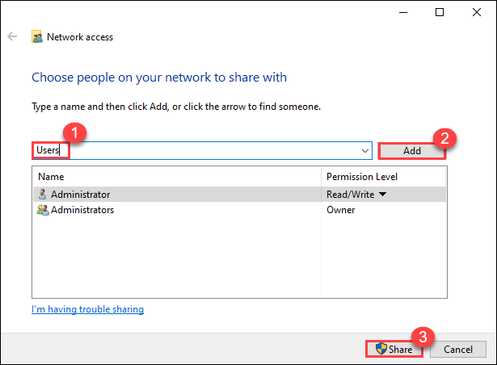

1. In the **Network access** window, select **Share (3)**, and once you are presented with the **Your folder is shared** window, select **Done**.

   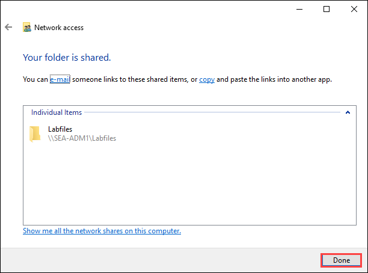

1. Switch back to the **Server Manager** window, and then, on the **Add Roles and Features Wizard installation succeeded** page, select **Close**.

   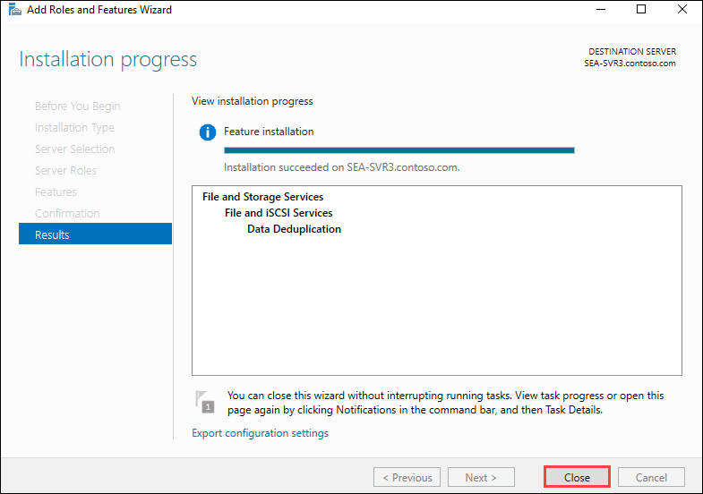

1. Switch to the **SEA-SVR3** console session, and then, if needed, sign in as **CONTOSO\Administrator** with a password of **Pa55w.rd**.

   > **Note:** Minimize the current VM window, then select and start **SEA-SVR3** from the **labVM** desktop.

   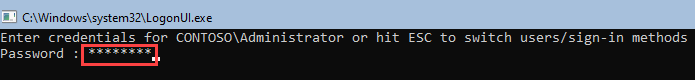

1. If presented with the **SConfig** menu, at **Enter number to select an option**, enter **15** and press Enter to exit to a **PowerShell** console session.
   
   > **Note**: To open Notepad from PowerShell, type **Notepad** and press enter.

   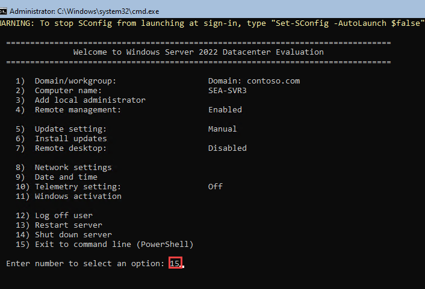

2. At the **Windows PowerShell** prompt, enter the following commands, and press Enter after each to create a new drive formatted with ReFS:

   ### 1. List all available disks  
   ```powershell
   Get-Disk
   ```	
   ### 2. Initialize the disk (replace `1` with the correct disk number)  
   ```powershell
   Initialize-Disk -Number 1
   ```	
   ### 3. Create a new partition using the entire disk space and assign a drive letter (M)  
   ```powershell
   New-Partition -DiskNumber 1 -UseMaximumSize -DriveLetter M
   ```	
   ### 4. Format the partition with the ReFS file system  
   ```powershell
   Format-Volume -DriveLetter M -FileSystem ReFS
   ```

3. At the **Windows PowerShell** prompt, enter the following commands, and press Enter after each to copy from **SEA-ADM1** a script that creates sample files to be deduplicated, execute it, and identify the outcome:

   ## PowerShell Commands for Drive Mapping and File Management

   ### 1. Map a network drive to `X:` pointing to `\\SEA-ADM1\Labfiles`
   ```powershell
   New-PSDrive -Name 'X' -PSProvider FileSystem -Root '\\SEA-ADM1\Labfiles'
   ```
   ### 2. Create a directory `M:\Data`
   ```powershell
   New-Item -Type Directory -Path 'M:\Data' -Force
   ```
   ### 3. Copy `CreateLabFiles.cmd` from the network drive to `M:\Data`
   ```powershell
   Copy-Item -Path X:\AZ-800-Administering-Windows-Server-Hybrid-Core-Infrastructure-master\Allfiles\Labfiles\Lab09\CreateLabFiles.cmd -Destination M:\Data\ -PassThru
   ```
   ### 4. Execute the copied script
   ```powershell
   Start-Process -FilePath M:\Data\CreateLabFiles.cmd -PassThru
   ```
   ### 5. Change the working directory to `M:\Data`
   ```powershell
   Set-Location -Path M:\Data
   ```
   ### 6. List the contents of `M:\Data`
   ```powershell
   Get-ChildItem -Path .
   ```
   ### 7. Verify the `M:` drive details
   ```powershell
   Get-PSDrive -Name M
   ```
   > **Note**: Record the free space on drive **M**. 

### Task 2: Enable and configure Data Deduplication

1. Switch back to the console session to **SEA-ADM1**, and then, within the console session, switch to **Server Manager**.

   > **Note:** Minimize the current VM window, then select **SEA-ADM1** from the taskbar.

1. In the **Server Manager** tree pane, select **File and Storage Services**, and then select **Disks**.

1. In the **Disks (1)** pane, browse to the list of disks of **SEA-SVR3** and select the entry representing the disk number **1** (2), which you configured in the previous task.

   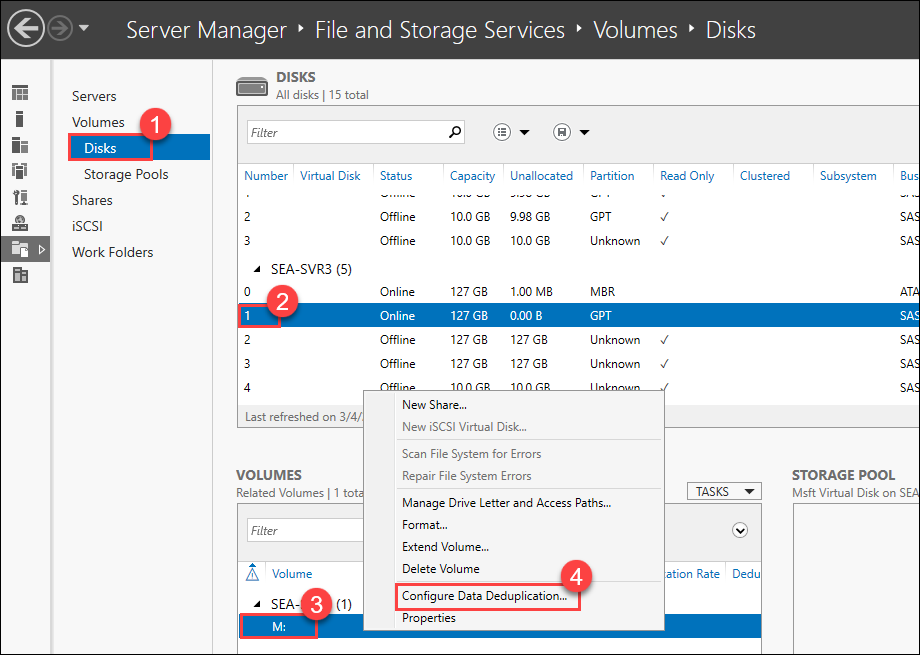

1. In the **Volumes** pane, display the context-sensitive menu of the **M:** volume, and by right clicking on **M: (3)** volume ,select **Configure Data Deduplication (4)**.

1. In the **Volume (M:\\) Deduplication Settings** window, in the **Data deduplication** drop-down list, select the **General purpose file server (1)** setting.

   

1. In the **Deduplicate files older than (in days):** text box, replace the default value of **3** with **0** (2).

1. Select the **Set Deduplication Schedule (3)** button.

1. In the **SEA-SVR3 Deduplication Schedule** window, select **Enable throughput optimization (1)**, and then select **OK (2)**.

   

1. Back in the **Volume (M:\\) Deduplication Settings** window, select **OK**.

### Task 3: Test Data Deduplication

1. On **SEA-ADM1**, start Microsoft Edge, and then browse to `https://SEA-ADM1.contoso.com`.
 
   >**Note**: If you get **NET::ERR_CERT_DATE_INVALID** error, select **Advanced** on the Edge browser page, at the bottom of page select **Continue to sea-adm1-contoso.com (unsafe)**.

   
   
1. If prompted, in the **Windows Security** dialog box, enter the following credentials, and then select **OK (3)**:

   - Username: **CONTOSO\Administrator (1)**
   - Password: **Pa55w.rd (2)**

   

1. In the All connections pane, select **+ Add (1)**.

   

1. In the Add or create resources pane, on the **Servers** tile, select **Add (2)**.

1. In the **Server name** text box, enter **sea-svr3.contoso.com** (1) and click on **Add** (2).  

   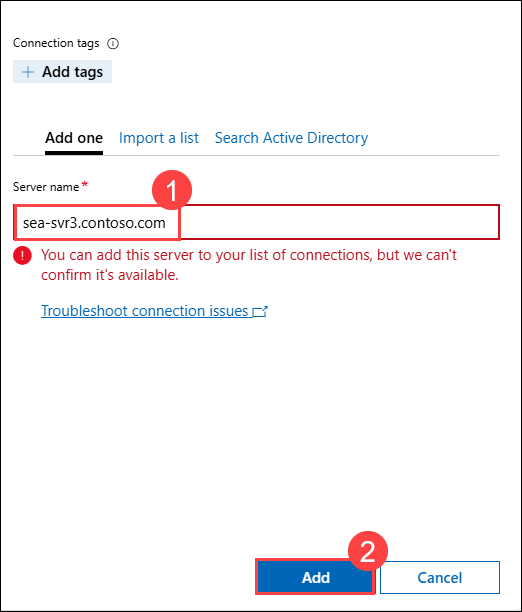  

   > **Note**: While performing the step, if you see an error message stating, **"You can add this server to your list of connections, but we can't confirm it's available."**, select **Add**.  

   - In the **All Connections** pane, select **sea-svr3.contoso.com** (1) and then click on **Manage as** (2).  
   - In the **Specify your credentials** dialog box:  
     - Ensure that **Use another account for this connection** (3) is selected.  
     - Enter the Administrator credentials:  
       - **Username**: **CONTOSO\Administrator** (4)  
       - **Password**: **Pa55w.rd** (5)  
     - Check the **Use this credential for all connections** checkbox (6).  
     - Click **Continue** (7).  

   

1. In **All connections** pane, select **sea-svr3.contoso.com**.

1. On the **sea-svr3.contoso.com (1)** page, in the **Tools** menu, select **PowerShell (2)**, and then, when prompted, sign in as the **CONTOSO\Administrator** user with **Pa55w.rd (3)** as its password and **Submit (4)**

   

1. In the **Windows PowerShell** console, enter the following command and then press Enter to trigger deduplication:

   ```powershell
   Start-DedupJob -Volume M: -Type Optimization –Memory 50
   ```
1. Switch back to the console session to **SEA-SVR3**.

   > **Note:** Minimize the current VM window, then select **SEA-SVR3** from the taskbar.

1. On **SEA-SVR3**, at the **Windows PowerShell** prompt, enter the following command and press Enter to identify the available space on the volume being deduplicated:

   ```powershell
   Get-PSDrive -Name M
   ```

   > **Note**: Compare the previously displayed values with the current ones. 

1. Wait for **five to ten minutes** to allow the deduplication job to complete and repeat the previous step.

1. Switch back to console session to **SEA-ADM1**.

   > **Note:** Minimize the current VM window, then select **SEA-ADM1** from the taskbar.

1. On **SEA-ADM1**, in the **Windows PowerShell** console within the **Microsoft Edge** window displaying Windows Admin Center connection to **sea-svr3.contoso.com**, enter the following commands and press Enter after each to determine the status of the deduplication job:

   ```powershell
   Get-DedupStatus –Volume M: | fl
   Get-DedupVolume –Volume M: |fl
   Get-DedupMetadata –Volume M: |fl
   ```
1. On **SEA-ADM1**, switch to the Disks pane in **Server Manager**, and then, in the **TASKS** menu in the upper right corner, select **Refresh**.

   

1. Select the **M:** volume in the **VOLUMES (1)** section, right-click and select **Properties (2)** from the menu.

   

1. In the **Volume (M:\\) Properties** window, review the values for **Deduplication rate** and **Deduplication savings**.

   

## Exercise 2: Configuring iSCSI storage

### Task 1: Install iSCSI and configure targets

1. On **SEA-ADM1**, switch to the **Windows PowerShell** window.

1. In the **Windows PowerShell** console, enter the following command and press Enter to establish a PowerShell Remoting session to **SEA-SVR3**:

   ```powershell
   Enter-PSSession -ComputerName SEA-SVR3
   ```

1. Enter the following command and press Enter to install iSCSI target on **SEA-SVR3**:

   ```powershell
   Install-WindowsFeature –Name FS-iSCSITarget-Server –IncludeManagementTools
   ```

1. Enter the following commands and after each, press Enter to create a new volume formatted with ReFS on disk 2:

   ```powershell
   Initialize-Disk -Number 2
   $partition2 = New-Partition -DiskNumber 2 -UseMaximumSize -AssignDriveLetter
   Format-Volume -DriveLetter $partition2.DriveLetter -FileSystem ReFS
   ```

1. Enter the following commands and after each, press Enter to create a new volume formatted with ReFS on disk 3:

   ```powershell
   Initialize-Disk -Number 3
   $partition3 = New-Partition -DiskNumber 3 -UseMaximumSize -AssignDriveLetter
   Format-Volume -DriveLetter $partition3.DriveLetter -FileSystem ReFS
   ```

1. Enter the following commands and after each, press Enter to configure Windows Defender Firewall with Advanced Security rules that allow iSCSI traffic:

   ```powershell
   New-NetFirewallRule -DisplayName "iSCSITargetIn" -Profile "Any" -Direction Inbound -Action Allow -Protocol TCP -LocalPort 3260
   New-NetFirewallRule -DisplayName "iSCSITargetOut" -Profile "Any" -Direction Outbound -Action Allow -Protocol TCP -LocalPort 3260
   ```

1. Enter the following command and press Enter to display the drive letters assigned to the newly created volumes:

   ```powershell
   $partition2.DriveLetter
   $partition3.DriveLetter
   ```

   > **Note**: The instructions assume that drive letters are **E** and **F** respectively. If your drive letter assignments are different, take this into account as you follow instructions in this exercise.

### Task 2: Connect to and configure iSCSI targets

1. On **SEA-ADM1**, switch to **Server Manager**.

1. On **SEA-ADM1**, switch to the Disks pane in **Server Manager**, and then, in the **TASKS** menu in the upper right corner, select **Refresh**.

1. In **Server Manager**, with **Disks** of **File and Storage Services** selected in the tree pane, in the **TASKS** menu in the upper right corner, select **Refresh**.

   

1. Review the updated **SEA-SVR3 (1)** disk configuration with disks 2 and 3 (2) online.

   

1. Browse to the **SEA-DC1** entry and review the disk configuration.

   

   > **Note**: **SEA-DC1** has only a single disk hosting the boot and system volumes.

1. In **Server Manager**, in **File and Storage Services**, select **iSCSI (1)**, select **Tasks (2)**, and then, in the drop-down menu, select **New iSCSI Virtual Disk (3)**.

   

   >**Note**: Kindly refresh the page if you don't find option.
   
1. In the **New iSCSI Virtual Disk Wizard**, on the **Select iSCSI virtual disk location (1)** page, under the **SEA-SVR3 (2)** server, select the **E: (3)** volume, and then select **Next (4)**.

   

1. In the **Specify iSCSI virtual disk name (1)** page, in the **Name (2)** text box, enter **iSCSIDisk1**, and then select **Next (3)**.

   

1. On the **Specify iSCSI virtual disk size (1)** page, in the **Size** text box, enter **5 (2)**. Leave all other settings with their default values and then select **Next (3)**.

   

1. On the **Assign iSCSI target** page, ensure the **New iSCSI target (1)** radio button is selected, and then select **Next (2)**.

   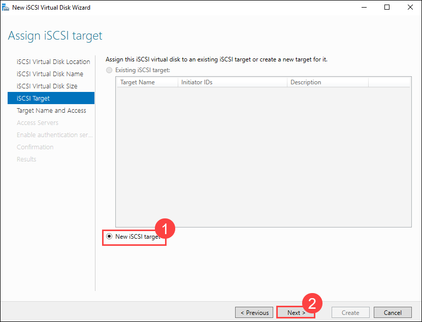

1. In the **Specify target name** page, in the **Name** field, enter **iSCSIFarm (1)**, and then select **Next (2)**.

   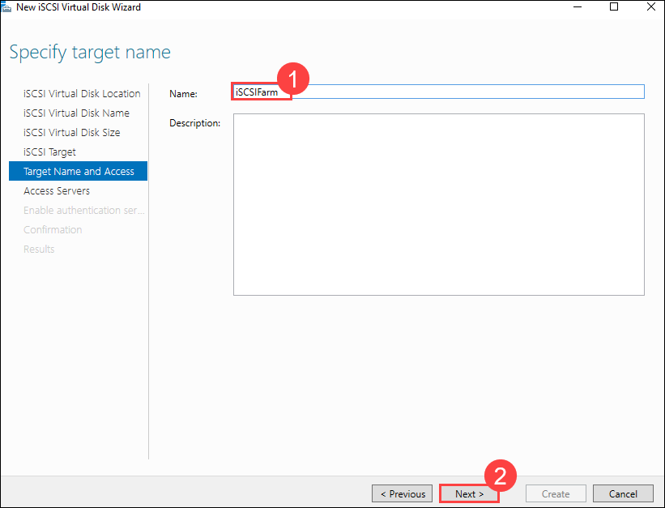

1. In the **Specify access servers** page, select the **Add (1)** button.

   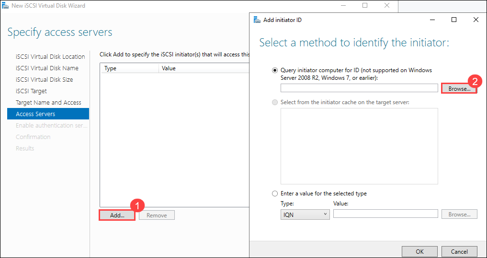

1. In the **Select a method to identify the initiator** window, select the **Browse (2)** button.

1. In the **Select Computer** window, in the **Enter the object name to select** text box, enter **SEA-DC1 (1)**, select **Check Names (2)**, and then select **OK (3)**.

   

1. In the **Select a method to identify the initiator** window, select **OK**.

   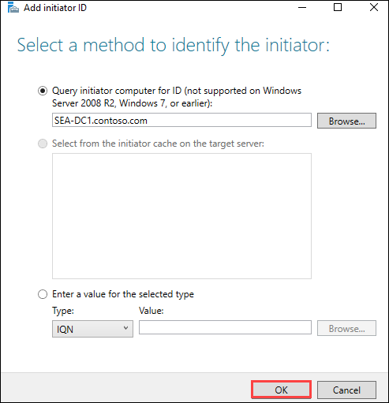

1. On the **Specify access servers (1)** page, select **Next (2)**.

   

1. On the **Enable Authentication** page, select **Next**.

1. On the **Confirm selections (1)** page, select **Create (2)**.

   

1. On the **View results** page, select **Close**.

1. Create the second iSCSI virtual disk (F:), by repeating steps 6 through 9, selecting the existing iSCSI target, and completing the wizard using step 18 through 19,
using the following settings:

   - Storage Location: **F:**
   - Name: **iSCSIDisk2**
   - Disk size: **5 GB**, **Dynamically Expanding**
   - iSCSI target: **iSCSIFarm**
   - On **Assign ISCSI Target**: select **Existing ISCSI target**
  
     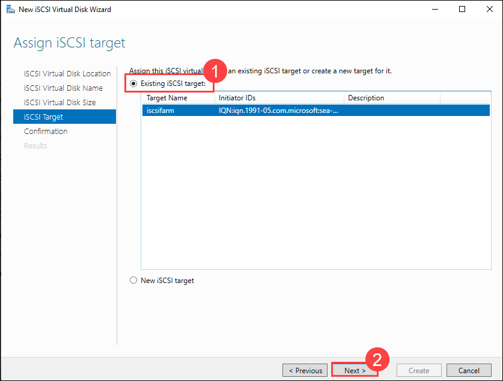
 
     
     
1. Switch to the **SEA-DC1** console session, and then, if needed, sign in as **CONTOSO\Administrator** with a password of **Pa55w.rd**.

1. If presented with the **SConfig** menu, at the **Enter number to select an option**, enter **15** and press Enter to exit to a **PowerShell** console session.

1. At the **Windows PowerShell** prompt, enter the following commands, and press Enter after each, to start the iSCSI Initiator service and display the iSCSI Initiator configuration:

   ```powershell
   Start-Service -Name MSiSCSI
   iscsicpl
   ```

   > **Note**: The **iscsicpl** command will open an **iSCSI Initiator Properties** window.

1. On **SEA-DC1**, in the **iSCSI Initiator Properties** dialog box, on the **Targets** tab, in the **Target** text box, type **SEA-SVR3.contoso.com**, and then select **Quick Connect**.

1. In the **Quick Connect** dialog box, note that the **Discovered target name** is **iqn.1991-05.com.microsoft:sea-svr3-iscscifarm-target**, and then select **Done**.

1. In the **iSCSI Initiator Properties** dialog box, select **OK**.

### Task 3: Verify iSCSI disk configuration

1. Switch back to the console session to **SEA-ADM1** with the **Server Manager** window active.

1. In **Server Manager**, switch from the iSCSI pane in **File and Storage Services** to the Disks pane, and then, in the **TASKS** menu in the upper right corner, select **Refresh**.

   

1. In disks (1) pane, Review the **SEA-DC1(2)** disk configuration and verify that it includes two **5 GB** disks with the **Offline (3)** status and the **iSCSI** bus type too.

   

1. Switch to the **SEA-DC1** console session. 

1. At the **Windows PowerShell** prompt, enter the following command and press Enter to list the disk configuration:

   ```powershell
   Get-Disk
   ```

   > **Note**: Both disks are present and healthy, but offline. To use them, you need to initialize and format them.

1. Enter the following commands, and press Enter after each to create a volume formatted with ReFS with the drive letter **E**.

   ```powershell
   Initialize-Disk -Number 1
   New-Partition -DiskNumber 1 -UseMaximumSize -DriveLetter E
   Format-Volume -DriveLetter E -FileSystem ReFS
   ```
1. Repeat the previous step to create a new drive formatted with ReFS but this time replace the disk number with **2** and the drive letter with **F**. It should look as below:

   ```powershell
   Initialize-Disk -Number 2
   New-Partition -DiskNumber 2 -UseMaximumSize -DriveLetter F
   Format-Volume -DriveLetter F -FileSystem ReFS
   ```
1. Switch back to the console session to **SEA-ADM1** with the **Server Manager** window active.

1. In **Server Manager**, refresh the Disks pane in **File and Storage Services** by selecting **Refresh** in the **TASKS** menu in the upper right corner of the window.

    

1. Review the **SEA-DC1 (1)** disk configuration and verify that both drives are now **Online (2)**.

   

### Task 4: Revert disk configuration 

1. Switch back to the console session to **SEA-SVR3**.

1. At the **Windows PowerShell** prompt, enter the following commands, and press Enter after each to reset disks on **SEA-SVR3** to their original state (when prompted to confirm execution of the **Clear-Disk** cmdlet, press the **Y** key and then press Enter prior to each loop iteration):

   ```powershell
   for ($num = 1;$num -le 4; $num++) {Clear-Disk -Number $num -RemoveData -RemoveOEM -ErrorAction SilentlyContinue}
   for ($num = 1;$num -le 4; $num++) {Set-Disk -Number $num -IsOffline $true}
   ```

   > **Note**: This is necessary in order to prepare for the next exercise.

## Exercise 3: Configuring redundant Storage Spaces

### Task 1: Create a storage pool

1. Switch back to the console session to **SEA-ADM1** with the **Server Manager** window active.

1. In **Server Manager**, refresh the Disks pane in **File and Storage Services** by selecting **Refresh** in the **TASKS** menu in the upper right corner of the window.

   

1. In the Disks pane, scroll down, and note that the **SEA-SVR3** disks 1 through 4 are listed with **Unknown** partitions and the **Offline** status. 

1. Select each of the four disks in sequence, display its context-sensitive menu by right clicking on disk and select the **Bring Online** option in the menu, and then in the **Bring Disk Online** window, select **Yes**.

1. Verify that all disks are listed with the **Online** status. In **Server Manager**, in the navigation pane, select **Storage Pools**.

1. In **Server Manager**, in the **Storage Pools (1)** area, in the **TASKS (2)** list, select **New Storage Pool (3)**.

   

1. In the **New Storage Pool Wizard**, on the **Before you begin** page, select **Next**.

1. On the **Specify a storage pool name and subsystem** page, in the **Name** text box, enter **SP1**. In the **Description** text box, enter **Storage Pool 1**. In the **Select the group of available disks (also known as a primordial pool) that you want to use** listing, select the **SEA-SVR3** entry, and then select **Next**.

   

1. On the **Select physical disks for the storage pool** page, select the check boxes next to the three disks of **127 GB** size, and then select **Next**.

   

   >**Note:** Ensure that all four disks have a storage capacity of 127 GB each. If the storage is not available, right-click on the specific disk and select "Reset" to make it available.

1. On the **Confirm selections** page, review the settings, and then select **Create**.

    

1. Select **Close**.

### Task 2: Create a volume based on a three-way mirrored disk 

1. On **SEA-ADM1**, in **Server Manager**, on the Storage Pools pane, select **SP1**.

1. In the **VIRTUAL DISKS** area, select **TASKS**, and then select **New Virtual Disk**.

   

1. In the **Select the storage pool** dialog box, select **SP1**, and then select **OK**.

1. In the **New Virtual Disk Wizard**, on the **Before you begin** page, select **Next**.

1. On the **Specify the virtual disk name** page, in the **Name** text box, enter **Three-Mirror**, and then select **Next**.

   

1. On the **Specify enclosure resiliency** page, select **Next**.

1. On the **Select the storage layout** page, select **Mirror**, and then select **Next**.

   

1. On the **Specify the provisioning type** page, select **Thin**, and then select **Next**.

   

1. On the **Specify the size of the virtual disk** page, in the **Specify size** text box, enter **25**, and then select **Next**.

   

1. On the **Confirm selections** page, review the settings, and then select **Create**.

   

1. On the **View results** page, **clear** the **Create a volume when this wizard closes** check box, and then select **Close**.

1. In **Server Manager**, in the navigation pane, ensure that the **Volumes** entry is selected.

1. In the **VOLUMES** area, select **TASKS**, and then select **New Volume**.

   

1. In the **New Volume Wizard**, on the **Before you begin** page, select **Next**.

1. On the **Select the server and disk** page, select **SEA-SVR3**, select **Three-Mirror**, and then select **Next**.

   

1. On the **Specify the size of the volume** page, select **Next**.

1. On the **Assign to a drive letter or folder** page, select **Drive letter**, select **T**, and then select **Next**.

   

1. On the **Select file system settings (1)** page, in the **File system** drop-down list, select **ReFS (2)**. In the **Volume label** text box, enter **TestData (3)**, and then select **Next (4)**.

   

1. On the **Enable Data Deduplication** page, select **Next**.

1. On the **Confirm selections** page, select **Create**.

   

1. On the **Completion** page, select **Close**.

### Task 3: Manage a volume in File Explorer

1. On **SEA-ADM1**, switch to the **Windows PowerShell** hosting PowerShell Remoting session to **SEA-SVR3**.

1. In the **Windows PowerShell** console, at the **[SEA-SVR3]** prompt, enter the following command and press Enter to enable all of the File and Printer Sharing rules of Windows Defender Firewall with Advanced Security:

   ```powershell
   Enable-NetFirewallRule -Group "@FirewallAPI.dll,-28502"
   ```

1. On **SEA-ADM1**, in the taskbar, select the **File Explorer** icon.

1. In the **File Explorer** window, in the **Address bar**, enter **\\\\SEA-SVR3.contoso.com\\t$**.

1. In File Explorer, in the Details pane, display the context-sensitive menu, and then, in the menu, select **New Folder**. Replace the default name assigned to the new folder with **TestData**, and then press Enter.

1. In File Explorer, double-click the newly created **TestData** folder.

1. In File Explorer, in the Details pane, display context-sensitive menu, and then, in the menu, select **New**, and then select **Text Document**. Replace the default name assigned to the new file with **TestDocument**, and then press Enter.

   

### Task 4: Disconnect a disk from the storage pool and verify volume availability 

1. On **SEA-ADM1**, switch to **Server Manager**. In the **File and Storage Services** tree pane, select **Storage Pools (1)**, and then select **SP1 (2)**.

   

1. In the Physical Disks pane, select the **TASKS** drop-down list, and then select **Add Physical Disk**.

   

1. In the **Add Physical Disk** dialog box, in the row representing the fourth disk to be added to the pool, select the check box next to the disk name. In the **Allocation** drop-down list, ensure that the **Automatic** entry is selected, and then select **OK**.

   

1. In the PHYSICAL DISKS pane, right-click the top disk in the list, and then select **Remove disk**.

   

1. In the **Remove Physical Disk** window, select **Yes**.

1. In the **Remove Physical Disk** dialog box, review the message stating that **Windows is repairing the affected virtual disk**, and then select **OK**.

1. Switch back to the **File Explorer** window displaying the content of the **TestData** folder.

1. Check **TestDocument.txt** and verify that it is still available.

   

### Task 5: Add a disk to the storage pool and verify volume availability 

1. On **SEA-ADM1**, switch to **Server Manager**. In **File and Storage Services** tree pane, with the **Storage Pools (1)** entry selected, in the **TASKS (2)** menu in the upper right corner, select **Rescan Storage (3)**.

   

1. When prompted, in the **Rescan Storage** dialog box, select **Yes**.

1. In the Physical Disks (1) pane, select **TASKS(2)**, and then, in the drop-down menu, select **Add Physical Disk (3)**.

   

1. In the **Add Physical Disk** window, in the row representing the fourth disk to be added to the pool, select the check box next to the disk name. In the **Allocation** drop-down list, ensure that the **Automatic (1)** entry is selected, and then select **OK (2)**.

   

1. On **SEA-ADM1**, switch to the **File Explorer** window and verify that the **TestData** folder and its content are still available.

   

### Task 6: Revert disk configuration 

1. Switch back to the console session to **SEA-SVR3**.

1. At the **Windows PowerShell** prompt, enter the following commands and press Enter after each, to reset disks on **SEA-SVR3** to their original state (when prompted to confirm execution of the **Remove-VirtualDisk**, **Remove-StoragePool**, and **Clear-Disk** cmdlet, press the **Y** key and then press Enter prior to each cmdlet execution):

   ```powershell
   Get-VirtualDisk -FriendlyName 'Three-Mirror' | Remove-VirtualDisk
   Get-StoragePool -FriendlyName 'SP1' | Remove-StoragePool
   for ($num = 1;$num -le 4; $num++) {Clear-Disk -Number $num -RemoveData -RemoveOEM -ErrorAction SilentlyContinue}
   for ($num = 1;$num -le 4; $num++) {Set-Disk -Number $num -IsOffline $true}
   ```

   > **Note**: This is necessary in order to prepare for the next exercise.

## Exercise 4: Implementing Storage Spaces Direct

### Task 1: Prepare for installation of Storage Spaces Direct 

1. Switch back to the console session to **SEA-ADM1** and select **All Servers**.

1. On **SEA-ADM1**, in **Server Manager**, in the console tree, select **All Servers**, and verify that **SEA-SVR1**, **SEA-SVR2**, and **SEA-SVR3** have the **Manageability** status of **Online – Performance counters not started** before continuing.

   

1. In **Server Manager**, in the navigation pane, select **File and Storage Services**, and then select **Disks**.

1. With the Disks pane selected, in its upper right corner, in the **TASKS** menu, select **Refresh**.

   

1. In the Disks pane, scroll down to the listing of **SEA-SVR3** disks 1 through 4, and verify that their respective entries in the **Partition** column are listed as **Unknown**.

   

1. Select each of the four disks in sequence, and right-click. In the menu, select the **Bring Online** option, and then in the **Bring Disk Online** window, select **Yes**.

   

1. Use the same method to bring online all disks of **SEA-SVR1** and **SEA-SVR2**.

   

1. On **SEA-ADM1**, select **Start (1)**, and in the Start menu, select **Windows PowerShell ISE (2)**.

   

1. In **Windows PowerShell ISE**, select the **File** menu. In the **File** menu, select **Open**, and then, in the **Open** dialog box, go to **C:\Labfiles\AZ-800-Administering-Windows-Server-Hybrid-Core-Infrastructure-master\Allfiles\Labfiles\Lab09**.

1. Select **Implement-StorageSpacesDirect.ps1 (1)**, and then select **Open (2)**.

   

   > **Note**: The script is divided into numbered steps. There are eight steps, and each step has a number of commands. To execute an individual line, you can place the cursor anywhere within that line and press F8 or select the **Run Selection** in the toolbar of the **Windows PowerShell ISE** window. To execute multiple lines, select all of them in their entirety, and then use either F8 or the **Run Selection** toolbar icon. The sequence of steps is described in the instructions of this exercise. Ensure that each step completes before starting the next one.

1. Select the first line in step 1, and then press F8 to install the **File Server role and Failover Clustering** feature on **SEA-SVR1**, **SEA-SVR2**, and **SEA-SVR3**.

   > **Note**: Wait until the installation finishes. This should take about 2 minutes. Verify that, in the output of each command, the **Success** property is set to **True**.

1. Select the second line in step 1, and then press F8 to restart **SEA-SVR1**, **SEA-SVR2**, and **SEA-SVR3**.

   > **Note**: Once you invoke the second command to restart the servers, you can run the third command to install the Failover Clustering management tools without waiting for the restarts to finish.

1. Select the third line in step 1, starting with **Install**, and then press F8 to install **Failover Cluster Manager** tool on **SEA-ADM1**.

   > **Note**: Wait a few minutes while the servers restart and the **Failover Cluster Manager** tool is installed on **SEA-ADM1**.

### Task 2: Create and validate a failover cluster 

1. On **SEA-ADM1**, switch to the **Server Manager** window.

1. In **Server Manager**,on **Dashboard (1)** pane, select **Tools (2)**, and then select **Failover Cluster Manager (3)** to verify that its installation completed successfully.

   

1. On **SEA-ADM1**, switch to the **Administrator: Windows PowerShell ISE** window, select the line in step 2 starting with **Test-Cluster**, and then press F8 to invoke cluster validation tests.

   >**Note**: Wait until the tests complete. This should take about 2 minutes. Verify that none of the tests fail. Ignore any warnings since these are expected. 

1. In the **Administrator: Windows PowerShell ISE** window, select the line in step 3 starting with **New-Cluster**, and then press F8 to create a cluster.

   >**Note**: Wait until the step completes. This should take about 2 minutes.
   
   >**Note**: if cluster creation fail switch to **SEA-SVR1**, **SEA-SVR2**, and **SEA-SVR3**, run **clean-ClusterNodes** command and then switch back to **SEA-ADM1** open new powershell ISE open as administrator and run step 2 and step 3 of script again. 
   
1. On **SEA-ADM1**, switch to the **Failover Cluster Manager** window. In the Actions pane, select **Connect to Cluster (1)**, enter **S2DCluster.Contoso.com (2)**, and then select **OK (3)**.

   

### Task 3: Enable Storage Spaces Direct

1. On **SEA-ADM1**, switch to the **Administrator: Windows PowerShell ISE** window, select the line in step 4 starting with **Invoke-Command**, and then press F8 to enable Storage Spaces Direct on the newly installed cluster.

   > **Note**: Wait until the step completes. This should take about 1 minute.

1. In the **Administrator: Windows PowerShell ISE** window, select the line in step 5 starting with **Invoke-Command**, and then press F8 to create **S2DStoragePool**.

   > **Note**: Wait until the step completes. This should take less than 1 minute. In the output of the command, verify that the **FriendlyName** attribute has a value of **S2DStoragePool**.

1. Switch to the **Failover Cluster Manager** window, expand **S2DCluster.Contoso.com**, expand **Storage**, and then select **Pools**.

1. Verify the existence of **Cluster Pool 1**.

   

1. In the **Administrator: Windows PowerShell ISE** window, select the line in step 6 starting with **Invoke-Command**, and then press F8 to create virtual disks.

   > **Note**: Wait until the step completes. This should take less than 1 minute. 

1. Switch to the **Failover Cluster Manager** window, and then, within the **Storage** node, select **Disks (1)**.

1. Verify the existence of **Cluster Virtual Disk (CSV) (2)**.

   

### Task 4: Create a storage pool, a virtual disk, and a share

1. In the **Administrator: Windows PowerShell ISE** window, select the line in step 7 starting with **Invoke-Command**, and then press F8 to create a File Server cluster role.

   > **Note**: Wait until the step completes. This should take less than 1 minute. 

1. Verify that the output of the command includes the role definition, with the attribute **FriendlyName** set to **S2D-SOFS**. This validates that the command was successful.

1. Switch to the **Failover Cluster Manager** window and select **Roles (1)**.

1. Verify the existence of the S2D-SOFS (2) role. This also verifies that the command completed successfully.

   

1. In the **Administrator: Windows PowerShell ISE** window, select the three lines in step 8, starting with **Invoke-Command**, and then press F8 to create a file share.

   > **Note**: Wait until the step completes. This should take less than 1 minute. 

1. Verify that the output of the command includes definition of a file share, with the attribute **Path** set to **C:\\ClusterStorage\\CSV\\VM01**. This validates that the command completed successfully.

1. In the **Failover Cluster Manager** window, in the **Roles (1)** pane, select **S2D-SOFS (2)** under the **Name** column, and then select the **Shares (3)** tab below.
     
1. Verify the existence of the share named **VM01 (4)**. This also verifies that the command completed successfully.

   

### Task 5: Verify Storage Spaces Direct functionality

1. On **SEA-ADM1**, on the taskbar, select the **File Explorer** icon.

1. In **File Explorer**, in the address bar, enter **\\\\S2D-SOFS.contoso.com\\VM01** **(1)**, and then press Enter to open the target file share.

1. In **File Explorer**, in the details pane, display the context-sensitive menu, and then, in the menu, select **New Folder**. Replace the default name assigned to the new folder with **VMFolder (2)**, and then press Enter.

   

1. On **SEA-ADM1**, switch to the **Administrator: Windows PowerShell ISE** window.

1. In the console pane of **Administrator: Windows PowerShell ISE** window, enter the following command, and then press Enter to shut down **SEA-SVR3**:

   ```powershell
   Stop-Computer -ComputerName SEA-SVR3 -Force
   ```

1. On **SEA-ADM1**, switch to the **Server Manager** window, select **All Servers**, and then, in the **TASKS** menu in the upper right corner, select **Refresh**.

   

1. Verify that the **SEA-SVR3** entry has the **Target computer not accessible** entry in the **Manageability** column.

   

1. Switch back to the **File Explorer** window and verify that the **VMFolder** remains accessible.

   

1. Switch to **Failover Cluster Manager**, select **Disks (1)**, and then select **Cluster Virtual Disk (CSV) (2)**.

1. Verify that for the **Cluster Virtual Disk (CSV)**, the **Health Status** is set to **Warning** and **Operational Status** to **Degraded** (**Operational Status** might also be listed as **Incomplete**.)

   

1. On **SEA-ADM1**, switch to the **Microsoft Edge** window displaying Windows Admin Center. 

1. Browse to the All connections pane and select **+ Add (1)**.

1. In the **Add or create resources** pane, in the **Server clusters(2)** pane, select **Add (3)**.

   

1. In the **Cluster name** text box, enter **S2DCluster.Contoso.com (1)** and click on **Add (2)**

   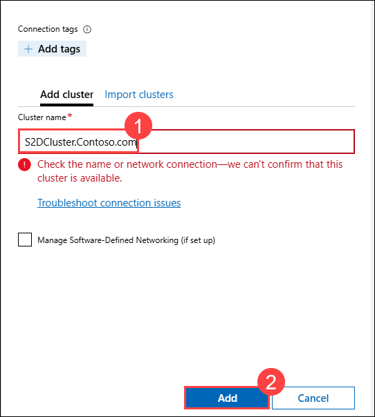  

   > **Note**: While performing the step, if you see an error message stating, **check the name or network connection, but we can't confirm that this cluster is available."**, select **Add**.  

   - In the **All Connections** pane, select **S2DCluster.Contoso.com** (1) and then click on **Manage as** (2).  
   - In the **Specify your credentials** dialog box:  
     - Ensure that **Use another account for this connection** (3) is selected.  
     - Enter the Administrator credentials:  
       - **Username**: **CONTOSO\Administrator** (4)  
       - **Password**: **Pa55w.rd** (5)  
     - Check the **Use this credential for all connections** checkbox (6).  
     - Click **Continue** (7).  

   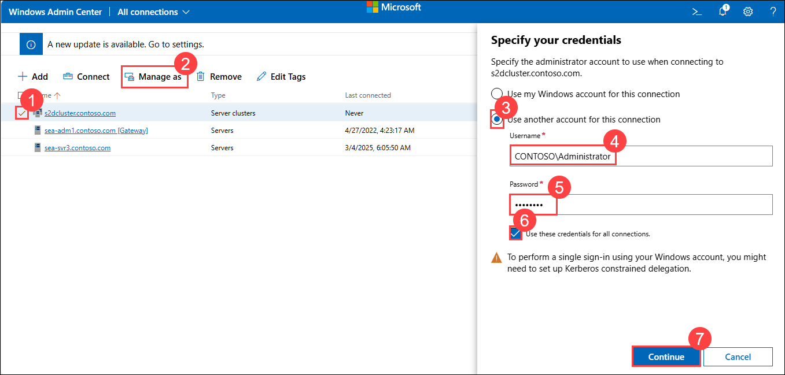

1. Back on the **All connections** page, select **s2dcluster.contoso.com (1)**.

1. Verify that when the page loads, the Dashboard (2) pane has an alert indicating that **SEA-SVR3 (3)** is not reachable.

   

1. Switch to the console session to **SEA-SVR3** and start it. 

   > **Note**: It may take a few minutes for the alert to be automatically removed.

1. Refresh the browser page displaying Windows Admin Center and verify that all servers are healthy.

## Summary

In this lab, you have completed:
- Tested the implementation of Data Deduplication
- Installed and configured iSCSI storage
- Configured redundant Storage Spaces
- Tested the implementation of Storage Spaces Direct

## You have successfully completed this lab.
